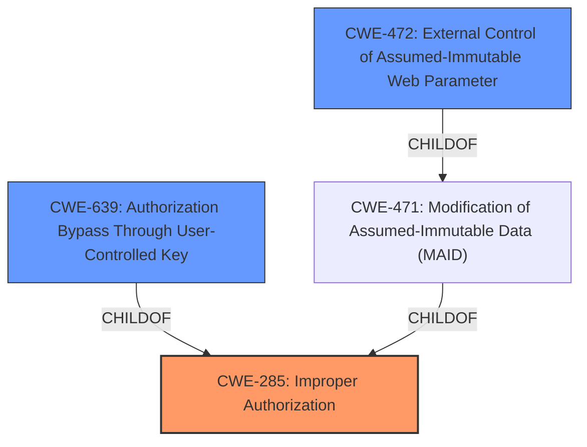

# Enhanced Analysis for CVE-2025-3537

# Summary
| CWE ID | CWE Name | Confidence | CWE Abstraction Level | CWE Vulnerability Mapping Label | CWE-Vulnerability Mapping Notes |
|---|---|---|---|---|---|
| CWE-285 | Improper Authorization | 0.9 | Class | Primary | Allowed-with-Review |
| CWE-639 | Authorization Bypass Through User-Controlled Key | 0.8 | Base | Secondary | Allowed |
| CWE-472 | External Control of Assumed-Immutable Web Parameter | 0.7 | Base | Secondary | Allowed |

## Evidence and Confidence

*   **Confidence Score:** 0.9
*   **Evidence Strength:** HIGH

## Relationship Analysis
The primary CWE is CWE-285, which is a Class-level CWE, indicating a general authorization problem. CWE-639 and CWE-472 are Base-level CWEs providing more specific details about the nature of the authorization bypass. CWE-639 describes how authorization is bypassed by modifying a user-controlled key. CWE-472 describes how an externally controlled parameter assumed to be immutable is not properly verified. These CWEs have a parent-child relationship with more general access control CWEs but are more specific and relevant to the vulnerability.



## Vulnerability Chain
The vulnerability chain starts with **improper authorization** in the `/admin/update-user.php` file, leading to the possibility of manipulating the `ID` argument. This results in **Insecure Direct Object Reference (IDOR)**. The attacker can then achieve unauthorized data access, data manipulation, account takeover, and privilege escalation. The root cause is the **improper authorization**, which allows the IDOR to occur.

## Summary of Analysis
The initial analysis focused on the **improper authorization** vulnerability in the `/admin/update-user.php` file, which allows manipulation of the `ID` argument and leads to IDOR.

The evidence includes:
- Vulnerability Description Key Phrases: "**rootcause:** **improper authorization**"
- CVE Reference Links Content Summary: "The /admin/update-user.php file is vulnerable to IDOR." and "Directly accessing /admin/update-user.php and manipulating the `user_id` parameter to modify other user accounts, including escalating privileges to administrator."

The graph relationships helped to refine the CWE selection by showing how the more specific CWEs like CWE-639 and CWE-472 relate to the general CWE-285. This helped to select the most appropriate CWEs based on the available evidence.

CWE-285 is a Class, but it is used here because the vulnerability description indicates a general authorization problem. Although it is a Class-level CWE, it is still appropriate because the provided document focuses on the **improper authorization**, and does not provide specific technical details. CWE-639 and CWE-472 provide additional context for this vulnerability and are included to show the detailed weaknesses present.

Other CWEs Considered:
- CWE-284 (Improper Access Control): This was considered but not selected because the vulnerability description specifically mentions **improper authorization**, making CWE-285 a more suitable choice.
- CWE-306 (Missing Authentication for Critical Function): This was not selected because the issue is related to authorization, not authentication.
- CWE-862 (Missing Authorization): This was not selected because CWE-285 is a more general category for authorization flaws, and the specific details of the missing authorization checks are not provided.
- CWE-863 (Incorrect Authorization): This was not selected because the description focuses on the high-level problem of **improper authorization**, and not the specifics of the incorrect checks.
- CWE-89 (Improper Neutralization of Special Elements used in an SQL Command ('SQL Injection')): This was not selected because it is specific to SQL injection, which is not mentioned in the vulnerability description.
- CWE-79 (Improper Neutralization of Input During Web Page Generation ('Cross-site Scripting')): This was not selected because it is specific to Cross-site scripting, which is not mentioned in the vulnerability description.
- CWE-434 (Unrestricted Upload of File with Dangerous Type): This was not selected because it is specific to file uploads, which is not mentioned in the vulnerability description.

# Enhanced Context (25 CWEs)
The following CWEs were identified as potentially relevant to this vulnerability:

## CWE-472: External Control of Assumed-Immutable Web Parameter
**Abstraction Level**: Base
**Similarity Score**: 0.79
**Source**: dense

**Description**:
The web application does not sufficiently verify inputs that are assumed to be immutable but are actually externally controllable, such as hidden form fields.

**Mapping Guidance**:
- Usage: Allowed
- Rationale: This CWE entry is at the Base level of abstraction, which is a preferred level of abstraction for mapping to the root causes of vulnerabilities.

## CWE-639: Authorization Bypass Through User-Controlled Key
**Abstraction Level**: Base
**Similarity Score**: 0.77
**Source**: dense

**Description**:
The system's authorization functionality does not prevent one user from gaining access to another user's data or record by modifying the key value identifying the data.

**Mapping Guidance**:
- Usage: Allowed
- Rationale: This CWE entry is at the Base level of abstraction, which is a preferred level of abstraction for mapping to the root causes of vulnerabilities.

## CWE-425: Direct Request ('Forced Browsing')
**Abstraction Level**: Base
**Similarity Score**: 0.77
**Source**: dense

**Description**:
The web application does not adequately enforce appropriate authorization on all restricted URLs, scripts, or files.

**Mapping Guidance**:
- Usage: Allowed
- Rationale: This CWE entry is at the Base level of abstraction, which is a preferred level of abstraction for mapping to the root causes of vulnerabilities.

## CWE-41: Improper Resolution of Path Equivalence
**Abstraction Level**: Base
**Similarity Score**: 0.76
**Source**: dense

**Description**:
The product is vulnerable to file system contents disclosure through path equivalence. Path equivalence involves the use of special characters in file and directory names. The associated manipulations are intended to generate multiple names for the same object.

**Mapping Guidance**:
- Usage: Allowed
- Rationale: This CWE entry is at the Base level of abstraction, which is a preferred level of abstraction for mapping to the root causes of vulnerabilities.

## CWE-807: Reliance on Untrusted Inputs in a Security Decision
**Abstraction Level**: Base
**Similarity Score**: 0.76
**Source**: dense

**Description**:
The product uses a protection mechanism that relies on the existence or values of an input, but the input can be modified by an untrusted actor in a way that bypasses the protection mechanism.

**Mapping Guidance**:
- Usage: Allowed
- Rationale: This CWE entry is at the Base level of abstraction, which is a preferred level of abstraction for mapping to the root causes of vulnerabilities.

## CWE-267: Privilege Defined With Unsafe Actions
**Abstraction Level**: Base
**Similarity Score**: 0.76
**Source**: dense

**Description**:
A particular privilege, role, capability, or right can be used to perform unsafe actions that were not intended, even when it is assigned to the correct entity.

**Mapping Guidance**:
- Usage: Allowed
- Rationale: This CWE entry is at the Base level of abstraction, which is a preferred level of abstraction for mapping to the root causes of vulnerabilities.

## CWE-74: Improper Neutralization of Special Elements in Output Used by a Downstream Component ('Injection')
**Abstraction Level**: Class
**Similarity Score**: 0.76
**Source**: dense

**Description**:
The product constructs all or part of a command, data structure, or record using externally-influenced input from an upstream component, but it does not neutralize or incorrectly neutralizes special elements that could modify how it is parsed or interpreted when it is sent to a downstream component.

**Mapping Guidance**:
- Usage: Discouraged
- Rationale: CWE-74 is high-level and often misused when lower-level weaknesses are more appropriate.

## CWE-668: Exposure of Resource to Wrong Sphere
**Abstraction Level**: Class
**Similarity Score**: 0.75
**Source**: dense

**Description**:
The product exposes a resource to the


## CWE Relationship Analysis

Current CWEs represent these abstraction levels: .


### Vulnerability Chain Analysis

**Chain starting from CWE-471:**
- 471 (Modification of Assumed-Immutable Data (MAID)) - ROOT


**Chain starting from CWE-863:**
- 863 (Incorrect Authorization) - ROOT


### CWE Relationship Diagram

```mermaid
graph TD
    classDef primary fill:#f96,stroke:#333,stroke-width:2px
    classDef secondary fill:#69f,stroke:#333
    classDef tertiary fill:#9e9,stroke:#333
```