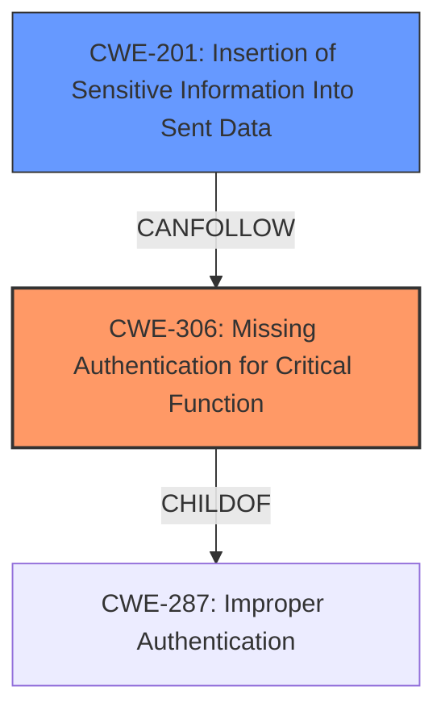

# Analysis Report for CVE-2025-3627

# Vulnerability Analysis Report: CVE-2025-3627

## Description

A security vulnerability was discovered in Moodle that allows some users to access sensitive information about other students before they finish verifying their identities using two-factor authentication (2FA).

## Vulnerability Description Key Phrases

- **Impact:** access sensitive information about other students
- **Attacker:** some users
- **Product:** Moodle

## Analysis (with Relationship Data)

# Summary
| CWE ID | CWE Name | Confidence | CWE Abstraction Level | CWE Vulnerability Mapping Label | CWE-Vulnerability Mapping Notes |
|---|---|---|---|---|---|
| CWE-306 | Missing Authentication for Critical Function | 0.9 | Base | Primary | Allowed |
| CWE-201 | Insertion of Sensitive Information Into Sent Data | 0.5 | Base | Secondary Candidate | Allowed |

## Evidence and Confidence

*   **Confidence Score:** 0.9
*   **Evidence Strength:** HIGH

## Relationship Analysis
The primary relationship that influenced the decision was the parent-child relationship between CWE-287 (Improper Authentication) and CWE-306 (Missing Authentication for Critical Function). Since the vulnerability specifically involves a *missing* authentication step for accessing sensitive information after the first factor, CWE-306 was chosen as a more precise classification. The other relationships such as peer and chain relationships were considered but were not directly relevant to this particular vulnerability's root cause.



## Vulnerability Chain
The vulnerability chain starts with the **missing** second factor authentication (CWE-306), leading to the **impact** of exposing sensitive information about other students (CWE-201).
  - Root Cause: CWE-306 Missing Authentication for Critical Function
  - Impact: CWE-201 Insertion of Sensitive Information Into Sent Data

## Summary of Analysis
The initial analysis considered several CWEs, particularly those related to authentication and authorization. However, the key factor in selecting CWE-306 was the explicit mention in the CVE description and the Red Hat Bugzilla report that the vulnerability stemmed from a **missing** authentication step, specifically the second factor in multi-factor authentication.

The evidence from the CVE Reference Links Content Summary clearly states: "The vulnerability allows a user to access some of their data after passing only the first factor of authentication... The user should be required to complete *all* authentication factors before gaining access." This directly supports the classification of CWE-306, which describes situations where authentication is completely **missing** for critical functions.

CWE-201 was considered a secondary impact since the **impact** of the missing authentication is the insertion of sensitive information into the user's view or sent data.

The graph relationships influenced the decision by highlighting the child-of relationship between CWE-287 and CWE-306, emphasizing that CWE-306 is a more specific case of improper authentication where authentication is entirely **missing**.

The selected CWEs are at the optimal level of specificity because CWE-306 directly addresses the root cause (missing authentication), and CWE-201 describes the resulting **impact** (information exposure).

Relevant CWE Information:

# Enhanced Context (25 CWEs)
The following CWEs were identified as potentially relevant to this vulnerability:

## CWE-472: External Control of Assumed-Immutable Web Parameter
**Abstraction Level**: Base
**Similarity Score**: 0.76
**Source**: dense

**Description**:
The web application does not sufficiently verify inputs that are assumed to be immutable but are actually externally controllable, such as hidden form fields.

**Mapping Guidance**:
- Usage: Allowed
- Rationale: This CWE entry is at the Base level of abstraction, which is a preferred level of abstraction for mapping to the root causes of vulnerabilities.

*Not Used:* This is not the root cause of the vulnerability. The root cause is the **missing** MFA enforcement, not external control of parameters.

## CWE-639: Authorization Bypass Through User-Controlled Key
**Abstraction Level**: Base
**Similarity Score**: 0.76
**Source**: dense

**Description**:
The system's authorization functionality does not prevent one user from gaining access to another user's data or record by modifying the key value identifying the data.

**Mapping Guidance**:
- Usage: Allowed
- Rationale: This CWE entry is at the Base level of abstraction, which is a preferred level of abstraction for mapping to the root causes of vulnerabilities.

*Not Used:* The issue is not related to user-controlled keys. The vulnerability exists because the system allows partial access before full authentication.

## CWE-1390: Weak Authentication
**Abstraction Level**: Class
**Similarity Score**: 0.75
**Source**: dense

**Description**:
The product uses an authentication mechanism to restrict access to specific users or identities, but the mechanism does not sufficiently prove that the claimed identity is correct.

**Mapping Guidance**:
- Usage: Allowed-with-Review
- Rationale: This CWE entry is a Class and might have Base-level children that would be more appropriate

*Not Used:* While related to authentication, CWE-1390 is too general. CWE-306, Missing Authentication for Critical Function, is a more precise description because it specifically addresses the case where authentication is entirely **missing** for a critical function.

## CWE-303: Incorrect Implementation of Authentication Algorithm
**Abstraction Level**: Base
**Similarity Score**: 0.75
**Source**: dense

**Description**:
The requirements for the product dictate the use of an established authentication algorithm, but the implementation of the algorithm is incorrect.

**Mapping Guidance**:
- Usage: Allowed
- Rationale: This CWE entry is at the Base level of abstraction, which is a preferred level of abstraction for mapping to the root causes of vulnerabilities.

*Not Used:* There's no evidence of an incorrectly implemented algorithm. The vulnerability is due to the **missing** enforcement of the second authentication factor.

## CWE-1391: Use of Weak Credentials
**Abstraction Level**: Class
**Similarity Score**: 0.74
**Source**: dense

**Description**:
The product uses weak credentials (such as a default key or hard-coded password) that can be calculated, derived, reused, or guessed by an attacker.

**Mapping Guidance**:
- Usage: Allowed-with-Review
- Rationale: This CWE entry is a Class and might have Base-level children that would be more appropriate

*Not Used:* This is not related to weak credentials. The vulnerability stems from the **missing** second factor of authentication.

## CWE-288: Authentication Bypass Using an Alternate Path or Channel
**Abstraction Level**: Base
**Similarity Score**: 0.74
**Source**: dense

**Description**:
The product requires authentication, but the product has an alternate path or channel that does not require authentication.

**Mapping Guidance**:
- Usage: Allowed
- Rationale: This CWE entry is at the Base level of abstraction, which is a preferred level of abstraction for mapping to the root causes of vulnerabilities.

*Not Used:* There's no alternate path; the user is using the intended login path, but the second factor is not enforced before granting access.

## CWE-807: Reliance on Untrusted Inputs in a Security Decision
**Abstraction Level**: Base
**Similarity Score**: 0.74
**Source**: dense

**Description**:
The product uses a protection mechanism that relies on the existence or values of an input, but the input can be modified by an untrusted actor in a way that bypasses the protection mechanism.

**Mapping Guidance**:
- Usage: Allowed
- Rationale: This CWE entry is at the Base level of abstraction, which is a preferred level of abstraction for mapping to the root causes of vulnerabilities.

*Not Used:* Not relevant; the vulnerability is not about relying on untrusted inputs.

## CWE-212: Improper Removal of Sensitive Information Before Storage or Transfer
**Abstraction Level**: Base
**Similarity Score**: 0.74
**Source**: dense

**Description**:
The product stores, transfers, or shares a resource that contains sensitive information, but it does not properly remove that information before the product makes the resource available to unauthorized actors.

**Mapping Guidance**:
- Usage: Allowed
- Rationale: This CWE entry is at the Base level of abstraction, which is a preferred level of abstraction for mapping to the root causes of vulnerabilities.

*Not Used:* This CWE does not describe the vulnerability.

## CWE-345: Insufficient Verification of Data Authenticity
**Abstraction Level**: Class
**Similarity Score**: 0.73
**Source**: dense

**Description**:
The product does not sufficiently verify the origin or authenticity of data, in a way that causes it to accept invalid data.

**Mapping Guidance**:
- Usage: Discouraged
- Rationale: This CWE entry is a level-1 Class (i.e., a child of a Pillar). It might have lower-level children that would be more appropriate

*Not Used:* This vulnerability isn't about data authenticity; it's about **missing** MFA enforcement.

## CWE-42


## CWE Relationship Analysis

Current CWEs represent these abstraction levels: .


### Vulnerability Chain Analysis

**Chain starting from CWE-1390:**
- 1390 (Weak Authentication) - ROOT


**Chain starting from CWE-288:**
- 288 (Authentication Bypass Using an Alternate Path or Channel) - ROOT


### CWE Relationship Diagram

```mermaid
graph TD
    classDef primary fill:#f96,stroke:#333,stroke-width:2px
    classDef secondary fill:#69f,stroke:#333
    classDef tertiary fill:#9e9,stroke:#333
```


*Report generated on 2025-07-14 20:57:25*
