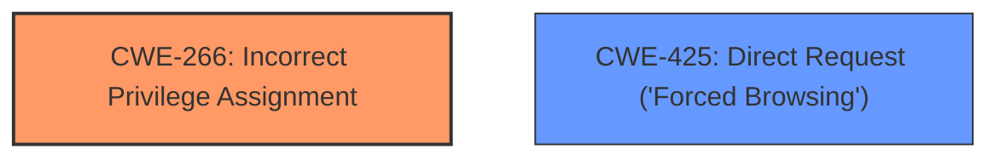

# Enhanced Analysis for CVE-2025-3668

# Summary
| CWE ID | CWE Name | Confidence | CWE Abstraction Level | CWE Vulnerability Mapping Label | CWE-Vulnerability Mapping Notes |
|---|---|---|---|---|---|
| CWE-266 | Incorrect Privilege Assignment | 0.8 | Base | Allowed | Primary CWE |
| CWE-425 | Direct Request ('Forced Browsing') | 0.6 | Base | Allowed | Secondary Candidate |

## Evidence and Confidence

*   **Confidence Score:** 0.7
*   **Evidence Strength:** MEDIUM

## Relationship Analysis
The primary relationship considered was the hierarchical structure. CWE-266 is a Base CWE. Alternatives such as CWE-425 were considered as peer options but deemed less specific.



## Vulnerability Chain
The vulnerability chain starts with the **improper access controls**, leading to unauthorized manipulation of the `setScheduleCfg` function. The root cause is **incorrect privilege assignment** (CWE-266) which allows remote attackers to perform actions they should not be authorized to do.

## Summary of Analysis
The initial assessment pointed towards **improper access controls** as the root cause. The retriever results suggested several CWEs, including CWE-89, CWE-79, CWE-306, and CWE-425. However, after analyzing the vulnerability description and key phrases, CWE-266 (Incorrect Privilege Assignment) was identified as the most accurate primary CWE. The vulnerability specifically mentions that the manipulation leads to **improper access controls**, directly aligning with the definition of CWE-266. CWE-425 was considered but it's a more general case of missing authorization. CWE-266 focuses more on the assignment of those privileges, which is the core issue here.

The selection of CWE-266 is based on the direct evidence in the vulnerability description stating "**improper access controls**," and the CWE definition aligning with this description. The confidence is high because the root cause is explicitly stated.

Relevant CWE Information:

# Enhanced Context (25 CWEs)
The following CWEs were identified as potentially relevant to this vulnerability:

## CWE-266: Incorrect Privilege Assignment
**CWE-266: Incorrect Privilege Assignment**
**Abstraction Level**: Base
**Similarity Score**: 0.374
**Source**: sparse

**Description**:
The software assigns privileges, access rights, or other security attributes to the wrong user or group, or does not properly restrict them, such that unintended users can perform privileged operations.

**Mapping Guidance**:
- Usage: Allowed
- Rationale: This CWE entry is at the Base level of abstraction, which is a preferred level of abstraction for mapping to the root causes of vulnerabilities.

**Vulnerability Description**:
A vulnerability was found in TOTOLINK A3700R 9.1.2u.5822_B20200513. It has been declared as critical. This vulnerability affects the function setScheduleCfg of the file /cgi-bin/cstecgi.cgi. The manipulation leads to **improper access controls**. The attack can be initiated remotely. The exploit has been disclosed to the public and may be used. The vendor was contacted early about this disclosure but did not respond in any way.

### Vulnerability Description Key Phrases
- **rootcause:** **improper access controls**
- **product:** TOTOLINK A3700R
- **version:** 9.1.2u.5822_B20200513
- **component:** /cgi-bin/cstecgi.cgi


## CWE Relationship Analysis

Current CWEs represent these abstraction levels: .


### Vulnerability Chain Analysis

**Chain starting from CWE-89:**
- 89 (Improper Neutralization of Special Elements used in an SQL Command ('SQL Injection')) - ROOT


**Chain starting from CWE-79:**
- 79 (Improper Neutralization of Input During Web Page Generation ('Cross-site Scripting')) - ROOT


### CWE Relationship Diagram

```mermaid
graph TD
    classDef primary fill:#f96,stroke:#333,stroke-width:2px
    classDef secondary fill:#69f,stroke:#333
    classDef tertiary fill:#9e9,stroke:#333
```