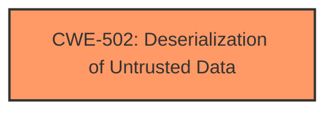

# Enhanced Analysis for CVE-2025-3677

# Summary

| CWE ID | CWE Name | Confidence | CWE Abstraction Level | CWE Vulnerability Mapping Label | CWE-Vulnerability Mapping Notes |
|---|---|---|---|---|---|
| CWE-502 | Deserialization of Untrusted Data | 1.0 | Base | Primary | Allowed |

## Evidence and Confidence

*   **Confidence Score:** 1.0
*   **Evidence Strength:** HIGH

## Relationship Analysis

The primary relationship is that CWE-502 stands alone as the root cause. It's a base level CWE, which is the preferred level. There are no clear child or parent relationships that are essential to this analysis, as CWE-502 is a specific and accurate description of the vulnerability.



## Vulnerability Chain

The vulnerability chain starts with the **deserialization** of untrusted data, which directly leads to arbitrary code execution.

## Summary of Analysis

The initial assessment strongly points towards CWE-502 as the primary weakness, which is supported by the "Vulnerability Description Key Phrases" identifying the **rootcause** as **deserialization**, and the "CVE Reference Links Content Summary" which highlights the use of `torch.load` without proper safeguards, directly leading to the **deserialization** of untrusted data. The mitigation focuses on using `weights_only=True`, which is a direct countermeasure for insecure **deserialization**. The "Retriever Results" also lists CWE-502 with a high score.

The evidence from the vulnerability description, the CVE reference summary, and the retriever results all converge on **CWE-502: Deserialization of Untrusted Data** as the most appropriate classification. No other CWEs are necessary to describe the vulnerability. This CWE is at the optimal level of specificity (Base).


## CWE Relationship Analysis

Current CWEs represent these abstraction levels: .


### Vulnerability Chain Analysis

**Chain starting from CWE-502:**
- 502 (Deserialization of Untrusted Data) - ROOT


### CWE Relationship Diagram

```mermaid
graph TD
    classDef primary fill:#f96,stroke:#333,stroke-width:2px
    classDef secondary fill:#69f,stroke:#333
    classDef tertiary fill:#9e9,stroke:#333
```