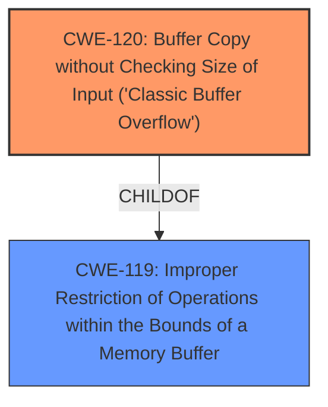

# Analysis for CVE-2025-3763

# Summary
| CWE ID | CWE Name | Confidence | CWE Abstraction Level | CWE Vulnerability Mapping Label | CWE-Vulnerability Mapping Notes |
|---|---|---|---|---|---|
| CWE-120 | Buffer Copy without Checking Size of Input ('Classic Buffer Overflow') | 1.0 | Base | Allowed-with-Review | Primary CWE |

## Evidence and Confidence

*   **Confidence Score:** 1.0
*   **Evidence Strength:** HIGH

## Relationship Analysis
The primary identified weakness is CWE-120, which is a base-level CWE. The retriever results listed CWE-119, Improper Restriction of Operations within the Bounds of a Memory Buffer, as the top candidate, but since the vulnerability description mentions "buffer overflow" and specifically states the manipulation of an argument leads to it, CWE-120, Buffer Copy without Checking Size of Input ('Classic Buffer Overflow'), is a better fit because it is more specific. CWE-120 is a child of CWE-119.

## Vulnerability Chain
The vulnerability chain begins with the **buffer overflow** due to manipulation of argument 's', leading to potential compromise of the system.

## Summary of Analysis
The analysis is based on the vulnerability description, which explicitly mentions a **buffer overflow** due to the manipulation of argument 's' in the `main` function of the Password Handler component. This directly corresponds to CWE-120 (Buffer Copy without Checking Size of Input).

The provided text says "The manipulation of the argument s leads to **buffer overflow**".
The relationships show that CWE-120 is a child of CWE-119, but CWE-120 is more specific. The retriever results confirm that CWE-120 is a relevant weakness.

Relevant CWE Information:

# Enhanced Context (25 CWEs)
The following CWEs were identified as potentially relevant to this vulnerability:

## CWE-131: Incorrect Calculation of Buffer Size
**Abstraction Level**: Base
**Similarity Score**: 0.75

## CWE-472: External Control of Assumed-Immutable Web Parameter
**Abstraction Level**: Base
**Similarity Score**: 0.74

## CWE-434: Unrestricted Upload of File with Dangerous Type
**Abstraction Level**: Base
**Similarity Score**: 0.73

## CWE-754: Improper Check for Unusual or Exceptional Conditions
**Abstraction Level**: Class
**Similarity Score**: 0.73

## CWE-134: Use of Externally-Controlled Format String
**Abstraction Level**: Base
**Similarity Score**: 0.73

## CWE-425: Direct Request ('Forced Browsing')
**Abstraction Level**: Base
**Similarity Score**: 0.73

## CWE-1391: Use of Weak Credentials
**Abstraction Level**: Class
**Similarity Score**: 0.73

## CWE-704: Incorrect Type Conversion or Cast
**Abstraction Level**: Class
**Similarity Score**: 0.72

## CWE-129: Improper Validation of Array Index
**Abstraction Level**: Variant
**Similarity Score**: 0.72

## CWE-89: Improper Neutralization of Special Elements used in an SQL Command ('SQL Injection')
**Abstraction Level**: Base
**Similarity Score**: 0.72

## CWE-190: Integer Overflow or Wraparound
**Abstraction Level**: Base
**Similarity Score**: 534.16

## CWE-125: Out-of-bounds Read
**Abstraction Level**: Base
**Similarity Score**: 516.49

## CWE-89: Improper Neutralization of Special Elements used in an SQL Command ('SQL Injection')
**Abstraction Level**: Base
**Similarity Score**: 483.69

## CWE-434: Unrestricted Upload of File with Dangerous Type
**Abstraction Level**: Base
**Similarity Score**: 480.39

## CWE-122: Heap-based Buffer Overflow
**Abstraction Level**: Variant
**Similarity Score**: 478.91

## CWE-128: Wrap-around Error
**Abstraction Level**: base
**Similarity Score**: 5.03

## CWE-190: Integer Overflow or Wraparound
**Abstraction Level**: base
**Similarity Score**: 5.03

## CWE-120: Buffer Copy without Checking Size of Input ('Classic Buffer Overflow')
**Abstraction Level**: base
**Similarity Score**: 3.65

## CWE-79: Improper Neutralization of Input During Web Page Generation ('Cross-site Scripting')
**Abstraction Level**: base
**Similarity Score**: 3.16

## CWE-1339: Insufficient Precision or Accuracy of a Real Number
**Abstraction Level**: base
**Similarity Score**: 2.91

## CWE-131: Incorrect Calculation of Buffer Size
**Abstraction Level**: Base
**Similarity Score**: 2.90

## CWE-123: Write-what-where Condition
**Abstraction Level**: base
**Similarity Score**: 2.87

## CWE-822: Untrusted Pointer Dereference
**Abstraction Level**: base
**Similarity Score**: 2.87

## CWE-823: Use of Out-of-range Pointer Offset
**Abstraction Level**: base
**Similarity Score**: 2.87

## CWE-824: Access of Uninitialized Pointer
**Abstraction Level**: base
**Similarity Score**: 2.87