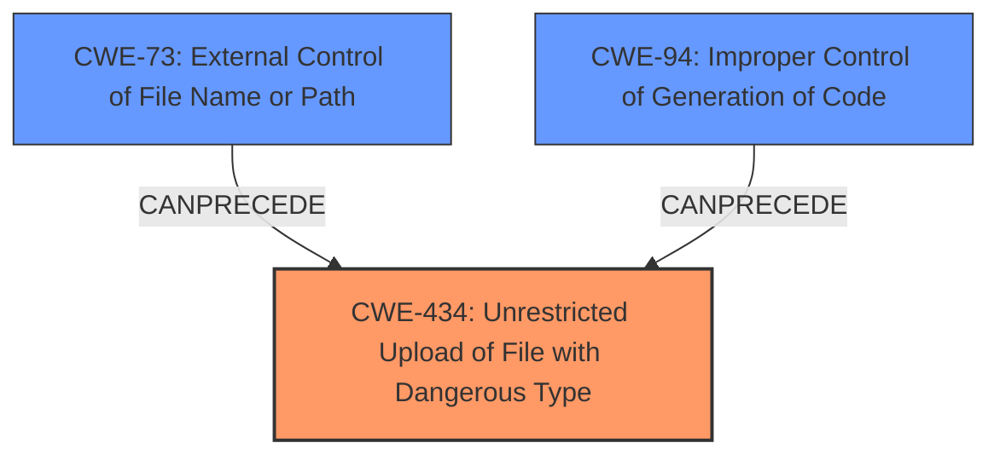

# Analysis for CVE-2025-3764

# Summary
| CWE ID | CWE Name | Confidence | CWE Abstraction Level | CWE Vulnerability Mapping Label | CWE-Vulnerability Mapping Notes |
|---|---|---|---|---|---|
| CWE-434 | Unrestricted Upload of File with Dangerous Type | 1.0 | Base | Allowed | Primary CWE |

## Evidence and Confidence

*   **Confidence Score:** 1.0
*   **Evidence Strength:** HIGH

## Relationship Analysis
The primary relationship influencing the decision is the direct match between the vulnerability description and the definition of CWE-434. While other CWEs like CWE-73 (External Control of File Name or Path) and CWE-94 (Improper Control of Generation of Code) could be related in a broader context, CWE-434 directly addresses the **unrestricted upload** aspect, making it the most specific and relevant choice. The abstraction level of Base is appropriate as it represents the core weakness.

## Vulnerability Chain
The vulnerability chain starts with the **unrestricted upload** of a file via the Avatar argument in `/edit-product.php`. This leads directly to the ability to upload dangerous file types, potentially resulting in code execution or other malicious activities. The chain is relatively short and directly maps to CWE-434.

## Summary of Analysis
The analysis is based on the provided vulnerability description, which explicitly states that the manipulation of the Avatar argument in `/edit-product.php` leads to an **unrestricted upload**. This directly corresponds to the definition of CWE-434, "Unrestricted Upload of File with Dangerous Type." The phrase "**unrestricted upload**" is strong evidence.

The retriever results also support this, listing CWE-434 as a top candidate. The graph relationships show that CWE-434 can be preceded by CWE-73 (External Control of File Name or Path) or CWE-94 (Improper Control of Generation of Code), but the direct evidence points to CWE-434 as the primary weakness.

The selected CWE is at the optimal level of specificity, as it accurately describes the core weakness without being overly broad or narrow.

Relevant CWE Information:

# Enhanced Context (25 CWEs)
The following CWEs were identified as potentially relevant to this vulnerability:

## CWE-434: Unrestricted Upload of File with Dangerous Type
**Abstraction Level**: Base
**Similarity Score**: 0.81
**Source**: dense

**Description**:
The product allows the upload or transfer of dangerous file types that are automatically processed within its environment.

**Mapping Guidance**:
- Usage: Allowed
- Rationale: This CWE entry is at the Base level of abstraction, which is a preferred level of abstraction for mapping to the root causes of vulnerabilities.

### Other CWEs Considered and Rejected:

*   **CWE-89: Improper Neutralization of Special Elements used in an SQL Command ('SQL Injection')**: This CWE is related to SQL injection vulnerabilities, which are not evident in the provided description.
*   **CWE-79: Improper Neutralization of Input During Web Page Generation ('Cross-site Scripting')**: This CWE is related to cross-site scripting vulnerabilities, which are not evident in the provided description.
*   **CWE-73: External Control of File Name or Path**: While potentially related, this CWE is less specific than CWE-434, which directly addresses the **unrestricted upload** aspect.
*   **CWE-94: Improper Control of Generation of Code ('Code Injection')**:  Code injection might be a *consequence* of the **unrestricted upload**, but the root cause is the lack of restrictions on the file upload itself.