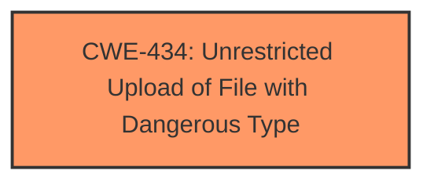

# Raw Analyzer Response for CVE-2025-3765

# Summary

| CWE ID | CWE Name | Confidence | CWE Abstraction Level | CWE Vulnerability Mapping Label | CWE-Vulnerability Mapping Notes |
|---|---|---|---|---|---|
| CWE-434 | Unrestricted Upload of File with Dangerous Type | 0.9 | Base | Allowed | Primary CWE |

## Evidence and Confidence

*   **Confidence Score:** 0.9
*   **Evidence Strength:** HIGH

## Relationship Analysis
The primary identified CWE is CWE-434 (Unrestricted Upload of File with Dangerous Type), which is a Base level CWE. No parent-child or peer relationships significantly influenced the selection in this case. The analysis focused on directly matching the vulnerability description to the CWE definition.

## Vulnerability Chain
The vulnerability chain is straightforward: **unrestricted upload** (CWE-434) leads directly to potential execution or other impacts depending on the file type uploaded and how it's processed by the system.

## Summary of Analysis
The vulnerability description clearly indicates an **unrestricted upload** vulnerability in the SourceCodester Web-based Pharmacy Product Management System. The manipulation of the Avatar argument in `/edit-photo.php` allows for uploading files without proper restrictions.

The most relevant CWE, based on the description and retriever results, is CWE-434: Unrestricted Upload of File with Dangerous Type. This CWE perfectly matches the **weakness** described in the vulnerability.

The retriever results confirm this assessment, with CWE-434 being among the top candidates. The description of CWE-434, "The product allows the upload or transfer of dangerous file types that are automatically processed within its environment," aligns directly with the vulnerability.

I considered other CWEs from the retriever results, but they were not as directly relevant. For example:
*   CWE-79 (Improper Neutralization of Input During Web Page Generation ('Cross-site Scripting')) and CWE-89 (Improper Neutralization of Special Elements used in an SQL Command ('SQL Injection')) would be relevant if the uploaded file's content was improperly handled leading to injection, but the vulnerability description does not suggest that.
*   CWE-73 (External Control of File Name or Path) is a related weakness, but the primary issue is the lack of restrictions on the file type itself, not the path where it's stored.
*   CWE-1336 (Improper Neutralization of Special Elements Used in a Template Engine) is not applicable since there is no mention of template engine usage.
*   CWE-425 (Direct Request ('Forced Browsing')) could be a contributing factor if the upload functionality isn't properly protected by authentication/authorization, but the main problem is the lack of file type restrictions.

Based on the available evidence and the CWE definitions, CWE-434 is the most accurate and specific representation of the vulnerability. It's a Base level CWE, which is preferred, and the mapping guidance allows its usage.