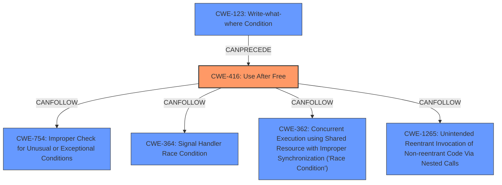

# Analysis Report for CVE-2025-37738

# Vulnerability Analysis Report: CVE-2025-37738

## Description

In the Linux kernel, the following vulnerability has been resolved ext4 ignore xattrs past end Once inside ext4_xattr_inode_dec_ref_all we should ignore xattrs entries past the end entry. This fixes the following KASAN reported issue ================================================================== BUG KASAN **slab-use-after-free** in ext4_xattr_inode_dec_ref_all+0xb8c/0xe90 Read of size 4 at addr ffff888012c120c4 by task repro/2065 CPU 1 UID 0 PID 2065 Comm repro Not tainted 6.13.0-rc2+ #11 Hardware name QEMU Standard PC (Q35 + ICH9, 2009), BIOS rel-1.16.3-0-ga6ed6b701f0a-prebuilt.qemu.org 04/01/2014 Call Trace dump_stack_lvl+0x1fd/0x300 ? tcp_gro_dev_warn+0x260/0x260 ? _printk+0xc0/0x100 ? read_lock_is_recursive+0x10/0x10 ? irq_work_queue+0x72/0xf0 ? __virt_addr_valid+0x17b/0x4b0 print_address_description+0x78/0x390 print_report+0x107/0x1f0 ? __virt_addr_valid+0x17b/0x4b0 ? __virt_addr_valid+0x3ff/0x4b0 ? __phys_addr+0xb5/0x160 ? ext4_xattr_inode_dec_ref_all+0xb8c/0xe90 kasan_report+0xcc/0x100 ? ext4_xattr_inode_dec_ref_all+0xb8c/0xe90 ext4_xattr_inode_dec_ref_all+0xb8c/0xe90 ? ext4_xattr_delete_inode+0xd30/0xd30 ? __ext4_journal_ensure_credits+0x5f0/0x5f0 ? __ext4_journal_ensure_credits+0x2b/0x5f0 ? inode_update_timestamps+0x410/0x410 ext4_xattr_delete_inode+0xb64/0xd30 ? ext4_truncate+0xb70/0xdc0 ? ext4_expand_extra_isize_ea+0x1d20/0x1d20 ? __ext4_mark_inode_dirty+0x670/0x670 ? ext4_journal_check_start+0x16f/0x240 ? ext4_inode_is_fast_symlink+0x2f2/0x3a0 ext4_evict_inode+0xc8c/0xff0 ? ext4_inode_is_fast_symlink+0x3a0/0x3a0 ? do_raw_spin_unlock+0x53/0x8a0 ? ext4_inode_is_fast_symlink+0x3a0/0x3a0 evict+0x4ac/0x950 ? proc_nr_inodes+0x310/0x310 ? trace_ext4_drop_inode+0xa2/0x220 ? _raw_spin_unlock+0x1a/0x30 ? iput+0x4cb/0x7e0 do_unlinkat+0x495/0x7c0 ? try_break_deleg+0x120/0x120 ? 0xffffffff81000000 ? __check_object_size+0x15a/0x210 ? strncpy_from_user+0x13e/0x250 ? getname_flags+0x1dc/0x530 __x64_sys_unlinkat+0xc8/0xf0 do_syscall_64+0x65/0x110 entry_SYSCALL_64_after_hwframe+0x67/0x6f RIP 00330x434ffd Code 66 2e 0f 1f 84 00 00 00 00 00 0f 1f 00 f3 0f 1e fa 48 89 f8 48 89 f7 48 89 d6 48 89 ca 4d 89 c2 4d 89 c8 8 RSP 002b00007ffc50fa7b28 EFLAGS 00000246 ORIG_RAX 0000000000000107 RAX ffffffffffffffda RBX 00007ffc50fa7e18 RCX 0000000000434ffd RDX 0000000000000000 RSI 0000000020000240 RDI 0000000000000005 RBP 00007ffc50fa7be0 R08 0000000000000000 R09 0000000000000000 R10 0000000000000000 R11 0000000000000246 R12 0000000000000001 R13 00007ffc50fa7e08 R14 00000000004bbf30 R15 0000000000000001 The buggy address belongs to the object at ffff888012c12000 which belongs to the cache filp of size 360 The buggy address is located 196 bytes inside of freed 360-byte region [ffff888012c12000, ffff888012c12168) The buggy address belongs to the physical page page refcount1 mapcount0 mapping0000000000000000 index0x0 pfn0x12c12 head order1 mapcount0 entire_mapcount0 nr_pages_mapped0 pincount0 flags 0x40(head|node=0|zone=0) page_type f5(slab) raw 0000000000000040 ffff888000ad7640 ffffea0000497a00 dead000000000004 raw 0000000000000000 0000000000100010 00000001f5000000 0000000000000000 head 0000000000000040 ffff888000ad7640 ffffea0000497a00 dead000000000004 head 0000000000000000 0000000000100010 00000001f5000000 0000000000000000 head 0000000000000001 ffffea00004b0481 ffffffffffffffff 0000000000000000 head 0000000000000002 0000000000000000 00000000ffffffff 0000000000000000 page dumped because kasan bad access detected Memory state around the buggy address ffff888012c11f80 00 00 00 00 00 00 00 00 00 00 00 00 00 00 00 00 ffff888012c12000 fa fb fb fb fb fb fb fb fb fb fb fb fb fb fb fb > ffff888012c12080 fb fb fb fb fb fb fb fb fb fb fb fb fb fb fb fb ^ ffff888012c12100 fb fb fb fb fb fb fb fb fb fb fb fb fb fc fc fc ffff888012c12180 fc fc fc fc fc fc fc fc fc ---truncated---

## Vulnerability Description Key Phrases

- **Rootcause:** slab-use-after-free
- **Product:** Linux kernel
- **Version:** 6.13.0-rc2
- **Component:** ext4

## Analysis (with Relationship Data)

# Summary
| CWE ID  | CWE Name                                                                           | Confidence | CWE Abstraction Level | CWE Vulnerability Mapping Label | CWE-Vulnerability Mapping Notes |
| :-------- | :--------------------------------------------------------------------------------- | :---------- | :---------------------- | :------------------------------ | :------------------------------ |
| CWE-416 | Use After Free                                                                    | 0.9         | Variant                 | Allowed                         | Primary CWE                    |

## Evidence and Confidence

*   **Confidence Score:** 0.9
*   **Evidence Strength:** HIGH

## Relationship Analysis
The primary identified CWE is CWE-416 (Use After Free), which is a variant-level CWE. There are several "CANFOLLOW" relationships which could indicate steps that happen after a Use-After-Free condition. There are also "CANPRECEDE" relationships for CWE-123.



## Vulnerability Chain
The vulnerability chain starts with a **slab-use-after-free** condition, leading to a read operation on freed memory.

## Summary of Analysis
The vulnerability description clearly indicates a **slab-use-after-free** condition in the ext4 file system code of the Linux kernel. This directly corresponds to CWE-416 (Use After Free).

The evidence is strong, with the KASAN report explicitly mentioning "slab-use-after-free" and providing details about the memory access. The retriever results also strongly suggest CWE-416 as the primary candidate.

The selection of CWE-416 is at the appropriate level of specificity (Variant), as it precisely describes the type of memory error occurring in the vulnerability.

Relevant CWE Information:

# Enhanced Context (25 CWEs)
The following CWEs were identified as potentially relevant to this vulnerability:

## CWE-667: Improper Locking
**Abstraction Level**: Class
**Similarity Score**: 0.78
**Source**: dense

**Description**:
The product does not properly acquire or release a lock on a resource, leading to unexpected resource state changes and behaviors.

**Mapping Guidance**:
- Usage: Allowed-with-Review
- Rationale: This CWE entry is a Class and might have Base-level children that would be more appropriate

*Not Selected:* This is a class-level CWE, not specific enough. The vulnerability description doesn't mention locking issues.

## CWE-362: Concurrent Execution using Shared Resource with Improper Synchronization ('Race Condition')
**Abstraction Level**: Class
**Similarity Score**: 0.76
**Source**: dense

**Description**:
The product contains a concurrent code sequence that requires temporary, exclusive access to a shared resource, but a timing window exists in which the shared resource can be modified by another code sequence operating concurrently.

**Mapping Guidance**:
- Usage: Allowed-with-Review
- Rationale: This CWE entry is a Class and might have Base-level children that would be more appropriate

*Not Selected:* While race conditions can lead to use-after-free, the primary weakness is the use of freed memory, not the race condition itself.

## CWE-754: Improper Check for Unusual or Exceptional Conditions
**Abstraction Level**: Class
**Similarity Score**: 0.75
**Source**: dense

**Description**:
The product does not check or incorrectly checks for unusual or exceptional conditions that are not expected to occur frequently during day to day operation of the product.

**Mapping Guidance**:
- Usage: Allowed-with-Review
- Rationale: This CWE entry is a Class and might have Base-level children that would be more appropriate

*Not Selected:* This is a class-level CWE, not specific enough. The description points to the **slab-use-after-free** condition.

## CWE-252: Unchecked Return Value
**Abstraction Level**: Base
**Similarity Score**: 0.75
**Source**: dense

**Description**:
The product does not check the return value from a method or function, which can prevent it from detecting unexpected states and conditions.

**Mapping Guidance**:
- Usage: Allowed
- Rationale: This CWE entry is at the Base level of abstraction, which is a preferred level of abstraction for mapping to the root causes of vulnerabilities.

*Not Selected:* The vulnerability description doesn't mention unchecked return values.

## CWE-824: Access of Uninitialized Pointer
**Abstraction Level**: Base
**Similarity Score**: 0.75
**Source**: dense

**Description**:
The product accesses or uses a pointer that has not been initialized.

**Mapping Guidance**:
- Usage: Allowed
- Rationale: This CWE entry is at the Base level of abstraction, which is a preferred level of abstraction for mapping to the root causes of vulnerabilities.

*Not Selected:* The vulnerability is about using memory after it has been freed, not about uninitialized pointers.

## CWE-909: Missing Initialization of Resource
**Abstraction Level**: Class
**Similarity Score**: 0.75
**Source**: dense

**Description**:
The product does not initialize a critical resource.

**Mapping Guidance**:
- Usage: Allowed-with-Review
- Rationale: This CWE entry is a Class and might have Base-level children that would be more appropriate

*Not Selected:* The vulnerability is about using memory after it has been freed, not about missing initialization.

## CWE-703: Improper Check or Handling of Exceptional Conditions
**Abstraction Level**: Pillar
**Similarity Score**: 0.75
**Source**: dense

**Description**:
The product does not properly anticipate or handle exceptional conditions that rarely occur during normal operation of the product.

**Mapping Guidance**:
- Usage: Discouraged
- Rationale: This CWE entry is extremely high-level, a Pillar.

*Not Selected:* This is a pillar-level CWE and too generic.

## CWE-131: Incorrect Calculation of Buffer Size
**Abstraction Level**: Base
**Similarity Score**: 0.75
**Source**: dense

**Description**:
The product does not correctly calculate the size to be used when allocating a buffer, which could lead to a buffer overflow.

**Mapping Guidance**:
- Usage: Allowed
- Rationale: This CWE entry is at the Base level of abstraction, which is a preferred level of abstraction for mapping to the root causes of vulnerabilities.

*Not Selected:* The vulnerability description doesn't mention buffer size calculations.

## CWE-125: Out-of-bounds Read
**Abstraction Level**: Base
**Similarity Score**: 0.75
**Source**: dense

**Description**:
The product reads data past the end, or before the beginning, of the intended buffer.

**Mapping Guidance**:
- Usage: Allowed
- Rationale: This CWE entry is at the Base level of abstraction, which is a preferred level of abstraction for mapping to the root causes of vulnerabilities.

*Not Selected:* The root cause is that the memory was freed, even though a read is happening, the freed memory is the root cause.

## CWE-908: Use of Uninitialized Resource
**Abstraction Level**: Base
**Similarity Score**: 0.74
**Source**: dense

**Description**:
The product uses or accesses a resource that has not been initialized.

**Mapping Guidance**:
- Usage: Allowed
- Rationale: This CWE entry is at the Base level of abstraction, which is a preferred level of abstraction for mapping to the root causes of vulnerabilities.

*Not Selected:* The vulnerability is about using memory after it has been freed, not about uninitialized resources.

## CWE-294: Authentication Bypass by Capture-replay
**Abstraction Level**: Base
**Similarity Score**: 512.77
**Source**: sparse

**Description**:
A capture-replay flaw exists when the design of the product makes it possible for a malicious user to sniff network traffic and bypass authentication by replaying it to the server in question to the same effect as the original message (or with minor changes).

**Mapping Guidance**:
- Usage: Allowed
- Rationale: This CWE entry is at the Base level


## CWE Relationship Analysis

Current CWEs represent these abstraction levels: .


### Vulnerability Chain Analysis

**Chain starting from CWE-123:**
- 123 (Write-what-where Condition) - ROOT


**Chain starting from CWE-416:**
- 416 (Use After Free) - ROOT


### CWE Relationship Diagram

```mermaid
graph TD
    classDef primary fill:#f96,stroke:#333,stroke-width:2px
    classDef secondary fill:#69f,stroke:#333
    classDef tertiary fill:#9e9,stroke:#333
```


*Report generated on 2025-07-14 21:13:51*
