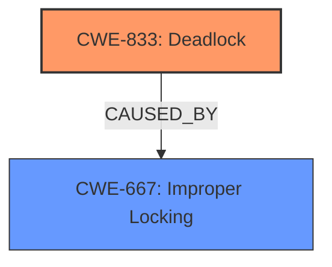

# Analysis Report for CVE-2025-37741

# Vulnerability Analysis Report: CVE-2025-37741

## Description

In the Linux kernel, the following vulnerability has been resolved jfs Prevent copying of nlink with value 0 from disk inode syzbot report a **deadlock** in diFree. [1] When calling ioctl$LOOP_SET_STATUS64, the offset value passed in is 4, which does not match the mounted loop device, causing the mapping of the mounted loop device to be invalidated. When creating the directory and creating the inode of iag in diReadSpecial(), read the page of fixed disk inode (AIT) in raw mode in read_metapage(), the metapage data it returns is corrupted, which causes the nlink value of 0 to be assigned to the iag inode when executing copy_from_dinode(), which ultimately causes a **deadlock** when entering diFree(). To avoid this, first check the nlink value of dinode before setting iag inode. [1] WARNING possible recursive locking detected 6.12.0-rc7-syzkaller-00212-g4a5df3796467 #0 Not tainted -------------------------------------------- syz-executor301/5309 is trying to acquire lock ffff888044548920 (&(imap->im_aglock[index])){+.+.}-{33}, at diFree+0x37c/0x2fb0 fs/jfs/jfs_imap.c889 but task is already holding lock ffff888044548920 (&(imap->im_aglock[index])){+.+.}-{33}, at diAlloc+0x1b6/0x1630 other info that might help us debug this Possible unsafe locking scenario CPU0 ---- lock(&(imap->im_aglock[index])) lock(&(imap->im_aglock[index])) *** DEADLOCK *** May be due to missing lock nesting notation 5 locks held by syz-executor301/5309 #0 ffff8880422a4420 (sb_writers#9){.+.+}-{00}, at mnt_want_write+0x3f/0x90 fs/namespace.c515 #1 ffff88804755b390 (&type->i_mutex_dir_key#6/1){+.+.}-{33}, at inode_lock_nested include/linux/fs.h850 [inline] #1 ffff88804755b390 (&type->i_mutex_dir_key#6/1){+.+.}-{33}, at filename_create+0x260/0x540 fs/namei.c4026 #2 ffff888044548920 (&(imap->im_aglock[index])){+.+.}-{33}, at diAlloc+0x1b6/0x1630 #3 ffff888044548890 (&imap->im_freelock){+.+.}-{33}, at diNewIAG fs/jfs/jfs_imap.c2460 [inline] #3 ffff888044548890 (&imap->im_freelock){+.+.}-{33}, at diAllocExt fs/jfs/jfs_imap.c1905 [inline] #3 ffff888044548890 (&imap->im_freelock){+.+.}-{33}, at diAllocAG+0x4b7/0x1e50 fs/jfs/jfs_imap.c1669 #4 ffff88804755a618 (&jfs_ip->rdwrlock/1){++++}-{33}, at diNewIAG fs/jfs/jfs_imap.c2477 [inline] #4 ffff88804755a618 (&jfs_ip->rdwrlock/1){++++}-{33}, at diAllocExt fs/jfs/jfs_imap.c1905 [inline] #4 ffff88804755a618 (&jfs_ip->rdwrlock/1){++++}-{33}, at diAllocAG+0x869/0x1e50 fs/jfs/jfs_imap.c1669 stack backtrace CPU 0 UID 0 PID 5309 Comm syz-executor301 Not tainted 6.12.0-rc7-syzkaller-00212-g4a5df3796467 #0 Hardware name QEMU Standard PC (Q35 + ICH9, 2009), BIOS 1.16.3-debian-1.16.3-2~bpo12+1 04/01/2014 Call Trace __dump_stack lib/dump_stack.c94 [inline] dump_stack_lvl+0x241/0x360 lib/dump_stack.c120 print_**deadlock**_bug+0x483/0x620 kernel/locking/lockdep.c3037 check_**deadlock** kernel/locking/lockdep.c3089 [inline] validate_chain+0x15e2/0x5920 kernel/locking/lockdep.c3891 __lock_acquire+0x1384/0x2050 kernel/locking/lockdep.c5202 lock_acquire+0x1ed/0x550 kernel/locking/lockdep.c5825 __mutex_lock_common kernel/locking/mutex.c608 [inline] __mutex_lock+0x136/0xd70 kernel/locking/mutex.c752 diFree+0x37c/0x2fb0 fs/jfs/jfs_imap.c889 jfs_evict_inode+0x32d/0x440 fs/jfs/inode.c156 evict+0x4e8/0x9b0 fs/inode.c725 diFreeSpecial fs/jfs/jfs_imap.c552 [inline] duplicateIXtree+0x3c6/0x550 fs/jfs/jfs_imap.c3022 diNewIAG fs/jfs/jfs_imap.c2597 [inline] diAllocExt fs/jfs/jfs_imap.c1905 [inline] diAllocAG+0x17dc/0x1e50 fs/jfs/jfs_imap.c1669 diAlloc+0x1d2/0x1630 fs/jfs/jfs_imap.c1590 ialloc+0x8f/0x900 fs/jfs/jfs_inode.c56 jfs_mkdir+0x1c5/0xba0 fs/jfs/namei.c225 vfs_mkdir+0x2f9/0x4f0 fs/namei.c4257 do_mkdirat+0x264/0x3a0 fs/namei.c4280 __do_sys_mkdirat fs/namei.c4295 [inline] __se_sys_mkdirat fs/namei.c4293 [inline] __x64_sys_mkdirat+0x87/0xa0 fs/namei.c4293 do_syscall_x64 arch/x86/en ---truncated---

## Vulnerability Description Key Phrases

- **Rootcause:** improper locking
- **Weakness:** deadlock
- **Product:** Linux kernel
- **Version:** 6.12.0-rc7-syzkaller-00212-g4a5df3796467
- **Component:** jfs

## Analysis (with Relationship Data)

# Summary
| CWE ID | CWE Name | Confidence | CWE Abstraction Level | CWE Vulnerability Mapping Label | CWE-Vulnerability Mapping Notes |
|---|---|---|---|---|---|
| CWE-833 | Deadlock | 1.0 | Base | Primary | Allowed |
| CWE-667 | Improper Locking | 0.8 | Class | Secondary | Allowed-with-Review |

## Evidence and Confidence

*   **Confidence Score:** 0.9
*   **Evidence Strength:** HIGH

## Relationship Analysis
The primary CWE is CWE-833 (Deadlock), which is a Base level CWE. It is related to CWE-667 (Improper Locking) as Deadlock can be a consequence of improper locking. CWE-667 is a Class level CWE, and thus less specific than CWE-833. The relationship shows that improper locking can lead to a deadlock situation, making CWE-833 a more precise root cause in this case.



## Vulnerability Chain
The vulnerability chain starts with **improper locking** (CWE-667), which directly leads to a **deadlock** (CWE-833). The initial flaw is not handling locks correctly, and the impact is the system getting into a deadlock state.
  - Root Cause: CWE-667 Improper Locking
  - Impact: CWE-833 Deadlock

## Summary of Analysis
The vulnerability description clearly states that a **deadlock** occurs in the jfs filesystem due to **improper locking**. The provided stack trace and the description of the locking scenario confirm that the system is trying to acquire a lock it already holds. The retriever results also list CWE-833 (Deadlock) and CWE-667 (Improper Locking) as highly relevant. CWE-833 is chosen as the primary CWE because the vulnerability is explicitly described as a deadlock. CWE-667 is added as a secondary CWE because the description mentions **improper locking** as a potential cause of the deadlock.

The final selection is based on the evidence that a deadlock occurs due to a locking issue in the filesystem code, which is well supported by the provided information. The selected CWEs are at the optimal level of specificity, with CWE-833 being a Base CWE that directly describes the deadlock condition.

Relevant CWE Information:

# Enhanced Context (25 CWEs)
The following CWEs were identified as potentially relevant to this vulnerability:

## CWE-667: Improper Locking
**Abstraction Level**: Class
**Similarity Score**: 0.81
**Source**: dense

**Description**:
The product does not properly acquire or release a lock on a resource, leading to unexpected resource state changes and behaviors.

**Mapping Guidance**:
- Usage: Allowed-with-Review
- Rationale: This CWE entry is a Class and might have Base-level children that would be more appropriate

## CWE-833: Deadlock
**Abstraction Level**: Base
**Similarity Score**: 0.77
**Source**: dense

**Description**:
The product contains multiple threads or executable segments that are waiting for each other to release a necessary lock, resulting in deadlock.

**Mapping Guidance**:
- Usage: Allowed
- Rationale: This CWE entry is at the Base level of abstraction, which is a preferred level of abstraction for mapping to the root causes of vulnerabilities.

## CWE-754: Improper Check for Unusual or Exceptional Conditions
**Abstraction Level**: Class
**Similarity Score**: 0.76
**Source**: dense

**Description**:
The product does not check or incorrectly checks for unusual or exceptional conditions that are not expected to occur frequently during day to day operation of the product.

**Mapping Guidance**:
- Usage: Allowed-with-Review
- Rationale: This CWE entry is a Class and might have Base-level children that would be more appropriate

## CWE-362: Concurrent Execution using Shared Resource with Improper Synchronization ('Race Condition')
**Abstraction Level**: Class
**Similarity Score**: 0.75
**Source**: dense

**Description**:
The product contains a concurrent code sequence that requires temporary, exclusive access to a shared resource, but a timing window exists in which the shared resource can be modified by another code sequence operating concurrently.

**Mapping Guidance**:
- Usage: Allowed-with-Review
- Rationale: This CWE entry is a Class and might have Base-level children that would be more appropriate

## CWE-703: Improper Check or Handling of Exceptional Conditions
**Abstraction Level**: Pillar
**Similarity Score**: 0.75
**Source**: dense

**Description**:
The product does not properly anticipate or handle exceptional conditions that rarely occur during normal operation of the product.

**Mapping Guidance**:
- Usage: Discouraged
- Rationale: This CWE entry is extremely high-level, a Pillar.

## CWE-59: Improper Link Resolution Before File Access ('Link Following')
**Abstraction Level**: Base
**Similarity Score**: 0.75
**Source**: dense

**Description**:
The product attempts to access a file based on the filename, but it does not properly prevent that filename from identifying a link or shortcut that resolves to an unintended resource.

**Mapping Guidance**:
- Usage: Allowed
- Rationale: This CWE entry is at the Base level of abstraction, which is a preferred level of abstraction for mapping to the root causes of vulnerabilities.

## CWE-367: Time-of-check Time-of-use (TOCTOU) Race Condition
**Abstraction Level**: Base
**Similarity Score**: 0.75
**Source**: dense

**Description**:
The product checks the state of a resource before using that resource, but the resource's state can change between the check and the use in a way that invalidates the results of the check. This can cause the product to perform invalid actions when the resource is in an unexpected state.

**Mapping Guidance**:
- Usage: Allowed
- Rationale: This CWE entry is at the Base level of abstraction, which is a preferred level of abstraction for mapping to the root causes of vulnerabilities.

## CWE-835: Loop with Unreachable Exit Condition ('Infinite Loop')
**Abstraction Level**: Base
**Similarity Score**: 0.75
**Source**: dense

**Description**:
The product contains an iteration or loop with an exit condition that cannot be reached, i.e., an infinite loop.

**Mapping Guidance**:
- Usage: Allowed
- Rationale: This CWE entry is at the Base level of abstraction, which is a preferred level of abstraction for mapping to the root causes of vulnerabilities.

## CWE-61: UNIX Symbolic Link (Symlink) Following
**Abstraction Level**: Compound
**Similarity Score**: 0.75
**Source**: dense

**Description**:
The product, when opening a file or directory, does not sufficiently account for when the file is a symbolic link that resolves to a target outside of the intended control sphere. This could allow an attacker to cause the product to operate on unauthorized files.

**Mapping Guidance**:
- Usage: Allowed
- Rationale: This is a well-known Composite of multiple weaknesses that must all occur simultaneously, although it is attack-oriented in nature.

## CWE-755: Improper Handling of Exceptional Conditions
**Abstraction Level**: Class
**Similarity Score**: 0.74
**Source**: dense

**Description**:
The product does not handle or incorrectly handles an exceptional condition.

**Mapping Guidance**:
- Usage: Discouraged
- Rationale: This CWE entry is a level-1 Class (i.e., a child of a Pillar). It might have lower-level children that would be more appropriate

## CWE-667: Improper Locking
**Abstraction Level**: Class
**Similarity Score**: 913.60
**Source**: sparse

**Description**:
The product does not properly acquire or release a lock on a resource, leading to unexpected resource state changes and behaviors.

**Mapping Guidance**:
- Usage: Allowed-with-Review
- Rationale: This CWE entry is a Class and might have Base-level children that would be more appropriate

## CWE-833: Deadlock
**Abstraction Level**: Base
**Similarity Score**: 825.63
**Source**: sparse

**Description**:
The product contains multiple threads or executable segments that are waiting for each other to release a necessary lock, resulting in deadlock.

**Mapping Guidance**:
- Usage: Allowed
- Rationale: This CWE entry is at the Base level of abstraction, which is a preferred level of abstraction for mapping to the root causes of vulnerabilities.

## CWE-367: Time-of-check Time-of-use (TOCTOU) Race Condition
**Abstraction Level**: Base
**Similarity Score**: 745.10
**Source**: sparse

**Description**:
The product checks the state of a resource before using that resource, but the resource's state can change between the check and


## CWE Relationship Analysis

Current CWEs represent these abstraction levels: .


### Vulnerability Chain Analysis

**Chain starting from CWE-59:**
- 59 (Improper Link Resolution Before File Access ('Link Following')) - ROOT


**Chain starting from CWE-667:**
- 667 (Improper Locking) - ROOT


### CWE Relationship Diagram

```mermaid
graph TD
    classDef primary fill:#f96,stroke:#333,stroke-width:2px
    classDef secondary fill:#69f,stroke:#333
    classDef tertiary fill:#9e9,stroke:#333
```


*Report generated on 2025-07-14 21:14:13*
