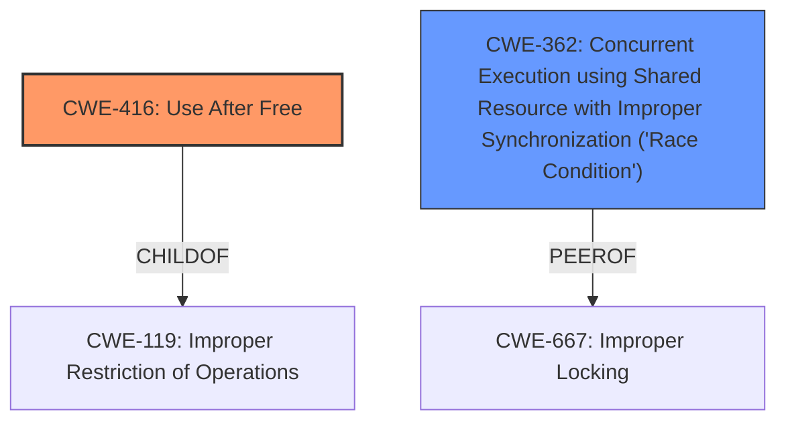

# Analysis Report for CVE-2025-37750

# Vulnerability Analysis Report: CVE-2025-37750

## Description

In the Linux kernel, the following vulnerability has been resolved smb client fix UAF in decryption with multichannel After commit f7025d861694 (smb client allocate crypto only for primary server) and commit b0abcd65ec54 (smb client fix UAF in async decryption), the channels started reusing AEAD TFM from primary channel to perform synchronous decryption, but that cant done as there could be multiple cifsd threads (one per channel) simultaneously accessing it to perform decryption. This fixes the following KASAN splat when running fstest generic/249 with vers=3.1.1,multichannel,max_channels=4,seal against Windows Server 2022 BUG KASAN slab-**use-after-free** in gf128mul_4k_lle+0xba/0x110 Read of size 8 at addr ffff8881046c18a0 by task cifsd/986 CPU 3 UID 0 PID 986 Comm cifsd Not tainted 6.15.0-rc1 #1 PREEMPT(voluntary) Hardware name QEMU Standard PC (Q35 + ICH9, 2009), BIOS 1.16.3-3.fc41 04/01/2014 Call Trace dump_stack_lvl+0x5d/0x80 print_report+0x156/0x528 ? gf128mul_4k_lle+0xba/0x110 ? __virt_addr_valid+0x145/0x300 ? __phys_addr+0x46/0x90 ? gf128mul_4k_lle+0xba/0x110 kasan_report+0xdf/0x1a0 ? gf128mul_4k_lle+0xba/0x110 gf128mul_4k_lle+0xba/0x110 ghash_update+0x189/0x210 shash_ahash_update+0x295/0x370 ? __pfx_shash_ahash_update+0x10/0x10 ? __pfx_shash_ahash_update+0x10/0x10 ? __pfx_extract_iter_to_sg+0x10/0x10 ? ___kmalloc_large_node+0x10e/0x180 ? __asan_memset+0x23/0x50 crypto_ahash_update+0x3c/0xc0 gcm_hash_assoc_remain_continue+0x93/0xc0 crypt_message+0xe09/0xec0 [cifs] ? __pfx_crypt_message+0x10/0x10 [cifs] ? _raw_spin_unlock+0x23/0x40 ? __pfx_cifs_readv_from_socket+0x10/0x10 [cifs] decrypt_raw_data+0x229/0x380 [cifs] ? __pfx_decrypt_raw_data+0x10/0x10 [cifs] ? __pfx_cifs_read_iter_from_socket+0x10/0x10 [cifs] smb3_receive_transform+0x837/0xc80 [cifs] ? __pfx_smb3_receive_transform+0x10/0x10 [cifs] ? __pfx___might_resched+0x10/0x10 ? __pfx_smb3_is_transform_hdr+0x10/0x10 [cifs] cifs_demultiplex_thread+0x692/0x1570 [cifs] ? __pfx_cifs_demultiplex_thread+0x10/0x10 [cifs] ? rcu_is_watching+0x20/0x50 ? rcu_lockdep_current_cpu_online+0x62/0xb0 ? find_held_lock+0x32/0x90 ? kvm_sched_clock_read+0x11/0x20 ? local_clock_noinstr+0xd/0xd0 ? trace_irq_enable.constprop.0+0xa8/0xe0 ? __pfx_cifs_demultiplex_thread+0x10/0x10 [cifs] kthread+0x1fe/0x380 ? kthread+0x10f/0x380 ? __pfx_kthread+0x10/0x10 ? local_clock_noinstr+0xd/0xd0 ? ret_from_fork+0x1b/0x60 ? local_clock+0x15/0x30 ? lock_release+0x29b/0x390 ? rcu_is_watching+0x20/0x50 ? __pfx_kthread+0x10/0x10 ret_from_fork+0x31/0x60 ? __pfx_kthread+0x10/0x10 ret_from_fork_asm+0x1a/0x30

## Vulnerability Description Key Phrases

- **Rootcause:** reuse of AEAD TFM from primary channel to perform synchronous decryption
- **Weakness:** use-after-free
- **Product:** Linux kernel
- **Version:** After commit f7025d861694 and b0abcd65ec54
- **Component:** smb client

## Analysis (with Relationship Data)

# Summary
| CWE ID | CWE Name | Confidence | CWE Abstraction Level | CWE Vulnerability Mapping Label | CWE-Vulnerability Mapping Notes |
|---|---|---|---|---|---|
| CWE-416 | Use After Free | 1.0 | Variant | Primary | Allowed |
| CWE-362 | Concurrent Execution using Shared Resource with Improper Synchronization ('Race Condition') | 0.7 | Class | Secondary | Allowed-with-Review |

## Evidence and Confidence

*   **Confidence Score:** 0.9
*   **Evidence Strength:** HIGH

## Relationship Analysis
The primary CWE is CWE-416 (Use After Free), which is a variant of several higher-level classes. The analysis also considers CWE-362 (Concurrent Execution using Shared Resource with Improper Synchronization ('Race Condition')) as a contributing factor.



## Vulnerability Chain
The vulnerability chain starts with **reuse of AEAD TFM from primary channel to perform synchronous decryption**. Because there could be multiple threads simultaneously accessing it to perform decryption, this leads to a **use-after-free** condition.

## Summary of Analysis
The primary weakness is a **use-after-free** (CWE-416) in the Linux kernel's SMB client. The root cause is the **reuse of AEAD TFM from the primary channel to perform synchronous decryption**, which is unsafe in a multithreaded context. This assessment relies heavily on the vulnerability description's key phrases and the KASAN report, which explicitly mentions "slab-**use-after-free**".

The selection of CWE-416 is based on the clear evidence of a **use-after-free** condition. The retriever results also strongly support this choice, with a score of 1.0. CWE-362 is included as a secondary factor because the vulnerability arises from concurrent access to a shared resource without proper synchronization.

Relevant CWE Information:

# Enhanced Context (25 CWEs)
The following CWEs were identified as potentially relevant to this vulnerability:

## CWE-667: Improper Locking
**Abstraction Level**: Class
**Similarity Score**: 0.79
**Source**: dense

**Description**:
The product does not properly acquire or release a lock on a resource, leading to unexpected resource state changes and behaviors.

**Mapping Guidance**:
- Usage: Allowed-with-Review
- Rationale: This CWE entry is a Class and might have Base-level children that would be more appropriate

## CWE-755: Improper Handling of Exceptional Conditions
**Abstraction Level**: Class
**Similarity Score**: 0.78
**Source**: dense

**Description**:
The product does not handle or incorrectly handles an exceptional condition.

**Mapping Guidance**:
- Usage: Discouraged
- Rationale: This CWE entry is a level-1 Class (i.e., a child of a Pillar). It might have lower-level children that would be more appropriate

## CWE-362: Concurrent Execution using Shared Resource with Improper Synchronization ('Race Condition')
**Abstraction Level**: Class
**Similarity Score**: 0.78
**Source**: dense

**Description**:
The product contains a concurrent code sequence that requires temporary, exclusive access to a shared resource, but a timing window exists in which the shared resource can be modified by another code sequence operating concurrently.

**Mapping Guidance**:
- Usage: Allowed-with-Review
- Rationale: This CWE entry is a Class and might have Base-level children that would be more appropriate

## CWE-125: Out-of-bounds Read
**Abstraction Level**: Base
**Similarity Score**: 0.78
**Source**: dense

**Description**:
The product reads data past the end, or before the beginning, of the intended buffer.

**Mapping Guidance**:
- Usage: Allowed
- Rationale: This CWE entry is at the Base level of abstraction, which is a preferred level of abstraction for mapping to the root causes of vulnerabilities.

## CWE-252: Unchecked Return Value
**Abstraction Level**: Base
**Similarity Score**: 0.78
**Source**: dense

**Description**:
The product does not check the return value from a method or function, which can prevent it from detecting unexpected states and conditions.

**Mapping Guidance**:
- Usage: Allowed
- Rationale: This CWE entry is at the Base level of abstraction, which is a preferred level of abstraction for mapping to the root causes of vulnerabilities.

## CWE-131: Incorrect Calculation of Buffer Size
**Abstraction Level**: Base
**Similarity Score**: 0.78
**Source**: dense

**Description**:
The product does not correctly calculate the size to be used when allocating a buffer, which could lead to a buffer overflow.

**Mapping Guidance**:
- Usage: Allowed
- Rationale: This CWE entry is at the Base level of abstraction, which is a preferred level of abstraction for mapping to the root causes of vulnerabilities.

## CWE-665: Improper Initialization
**Abstraction Level**: Class
**Similarity Score**: 0.78
**Source**: dense

**Description**:
The product does not initialize or incorrectly initializes a resource, which might leave the resource in an unexpected state when it is accessed or used.

**Mapping Guidance**:
- Usage: Discouraged
- Rationale: This CWE entry is a level-1 Class (i.e., a child of a Pillar). It might have lower-level children that would be more appropriate

## CWE-212: Improper Removal of Sensitive Information Before Storage or Transfer
**Abstraction Level**: Base
**Similarity Score**: 0.77
**Source**: dense

**Description**:
The product stores, transfers, or shares a resource that contains sensitive information, but it does not properly remove that information before the product makes the resource available to unauthorized actors.

**Mapping Guidance**:
- Usage: Allowed
- Rationale: This CWE entry is at the Base level of abstraction, which is a preferred level of abstraction for mapping to the root causes of vulnerabilities.

## CWE-203: Observable Discrepancy
**Abstraction Level**: Base
**Similarity Score**: 0.77
**Source**: dense

**Description**:
The product behaves differently or sends different responses under different circumstances in a way that is observable to an unauthorized actor, which exposes security-relevant information about the state of the product, such as whether a particular operation was successful or not.

**Mapping Guidance**:
- Usage: Allowed
- Rationale: This CWE entry is at the Base level of abstraction, which is a preferred level of abstraction for mapping to the root causes of vulnerabilities.

## CWE-346: Origin Validation Error
**Abstraction Level**: Class
**Similarity Score**: 0.77
**Source**: dense

**Description**:
The product does not properly verify that the source of data or communication is valid.

**Mapping Guidance**:
- Usage: Allowed-with-Review
- Rationale: This CWE entry is a Class and might have Base-level children that would be more appropriate

## CWE-362: Concurrent Execution using Shared Resource with Improper Synchronization ('Race Condition')
**Abstraction Level**: Class
**Similarity Score**: 556.23
**Source**: sparse

**Description**:
The product contains a concurrent code sequence that requires temporary, exclusive access to a shared resource, but a timing window exists in which the shared resource can be modified by another code sequence operating concurrently.

**Mapping Guidance**:
- Usage: Allowed-with-Review
- Rationale: This CWE entry is a Class and might have Base-level children that would be more appropriate

## CWE-667: Improper Locking
**Abstraction Level**: Class
**Similarity Score**: 523.59
**Source**: sparse

**Description**:
The product does not properly acquire or release a lock on a resource, leading to unexpected resource state changes and behaviors.

**Mapping Guidance**:
- Usage: Allowed-with-Review
- Rationale: This CWE entry is a Class and might have Base-level children that would be more appropriate

## CWE-367: Time-of-check Time-of-use (TOCTOU) Race Condition
**Abstraction Level**: Base
**Similarity Score**: 516.94
**Source**: sparse

**Description**:
The product checks the state of a resource before using that resource, but the resource's state can change between the check and the use in a way that invalidates the results of the check. This can cause the product to perform invalid actions when the resource is in an unexpected state.

**Mapping Guidance**:
- Usage: Allowed
- Rationale: This CWE entry is at the Base level


## CWE Relationship Analysis

Current CWEs represent these abstraction levels: .


### Vulnerability Chain Analysis

**Chain starting from CWE-416:**
- 416 (Use After Free) - ROOT


**Chain starting from CWE-203:**
- 203 (Observable Discrepancy) - ROOT


### CWE Relationship Diagram

```mermaid
graph TD
    classDef primary fill:#f96,stroke:#333,stroke-width:2px
    classDef secondary fill:#69f,stroke:#333
    classDef tertiary fill:#9e9,stroke:#333
```


*Report generated on 2025-07-14 21:16:16*
