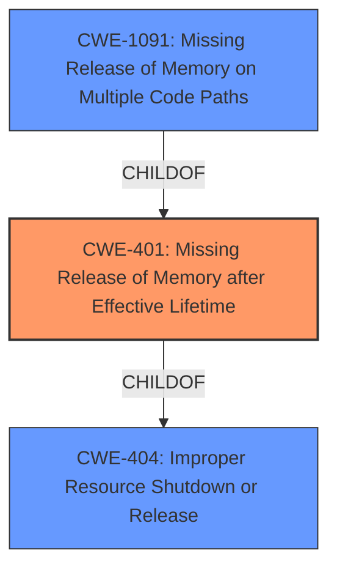

# Enhanced Analysis for CVE-2025-37757

# Summary
| CWE ID | CWE Name | Confidence | CWE Abstraction Level | CWE Vulnerability Mapping Label | CWE-Vulnerability Mapping Notes |
|---|---|---|---|---|---|
| CWE-401 | Missing Release of Memory after Effective Lifetime | 1.0 | Variant | Allowed | Primary CWE |

## Evidence and Confidence

*   **Confidence Score:** 1.0
*   **Evidence Strength:** HIGH

## Relationship Analysis
The primary relationship identified is that CWE-401 is a variant, representing a more specific type of resource management issue. It is also a child of the class CWE-404 (Improper Resource Shutdown or Release) and parent of CWE-1091 (Missing Release of Memory on Multiple Code Paths). These relationships confirm that CWE-401 is at an appropriate level of abstraction, focusing on the specific case of memory leaks due to missing releases after the memory's effective lifetime.



## Vulnerability Chain
The vulnerability chain involves the following steps:
1.  The `tipc_link_xmit()` function attempts to transmit a system-importance message.
2.  If the backlog transmit queue is overloaded, `tipc_link_xmit()` returns -ENOBUFS.
3.  The **skb list is not purged**, leading to a **memory leak**.
4.  This **memory leak** causes a failure when a skb is allocated.

Here, the **missing purge operation** is the root cause, directly leading to the **memory leak** which then results in allocation failure.

## Summary of Analysis
The vulnerability description clearly indicates a **memory leak** due to the **missing release** of memory after it is no longer needed. The phrase "**memory leak** in tipc_link_xmit. In case the backlog transmit queue for system-importance messages is overloaded, tipc_link_xmit() returns -ENOBUFS but the skb list is not purged. This leads to **memory leak** and failure when a skb is allocated" provides direct evidence.

CWE-401 (Missing Release of Memory after Effective Lifetime) aligns perfectly with this description. The CWE description states: "The product does not sufficiently track and release allocated memory after it has been used, which slowly consumes remaining memory." This is precisely what's happening in the described vulnerability.

The other CWEs from the **Retriever Results** were considered but ultimately deemed less appropriate:
*   CWE-909 (Missing Initialization of Resource): This is about uninitialized resources, not unreleased ones.
*   CWE-833 (Deadlock): This is about concurrency issues, not memory management.
*   CWE-667 (Improper Locking): Similar to CWE-833, this focuses on concurrency.
*   CWE-789 (Memory Allocation with Excessive Size Value): This is about allocating too much memory initially, not failing to release it.
*   CWE-911 (Improper Update of Reference Count): While related to resource management, the description focuses on the reference count mechanism itself, not a general memory leak.
*   CWE-125 (Out-of-bounds Read): This is about reading memory outside allocated bounds.
*   CWE-362 (Concurrent Execution using Shared Resource with Improper Synchronization ('Race Condition')): Similar to CWE-833 and CWE-667, this focuses on concurrency.
*   CWE-122 (Heap-based Buffer Overflow): This is about writing beyond the allocated buffer size.
*   CWE-772 (Missing Release of Resource after Effective Lifetime): is very close, being a parent of CWE-401, and has almost the same Description. It is not as specific as CWE-401 however, as it describes missing release of a resource in general and not necessarily memory.

CWE-401 is at the optimal level of specificity (Variant) and accurately captures the root cause of the vulnerability.


## CWE Relationship Analysis

Current CWEs represent these abstraction levels: .


### Vulnerability Chain Analysis

**Chain starting from CWE-911:**
- 911 (Improper Update of Reference Count) - ROOT


**Chain starting from CWE-404:**
- 404 (Improper Resource Shutdown or Release) - ROOT


### CWE Relationship Diagram

```mermaid
graph TD
    classDef primary fill:#f96,stroke:#333,stroke-width:2px
    classDef secondary fill:#69f,stroke:#333
    classDef tertiary fill:#9e9,stroke:#333
```