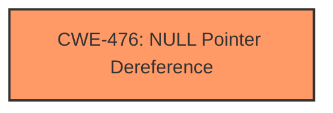

# Analysis Report for CVE-2025-37784

# Vulnerability Analysis Report: CVE-2025-37784

## Description

In the Linux kernel, the following vulnerability has been resolved net ti icss-iep Fix possible **NULL pointer dereference** for perout request The ICSS IEP driver tracks perout and pps enable state with flags. Currently when disabling pps and perout signals during icss_iep_exit(), results in **NULL pointer dereference** for perout. To fix the null pointer dereference issue, the icss_iep_perout_enable_hw function can be modified to directly clear the IEP CMP registers when disabling PPS or PEROUT, without referencing the ptp_perout_request structure, as its contents are irrelevant in this case.

## Vulnerability Description Key Phrases

- **Rootcause:** NULL pointer dereference
- **Product:** Linux kernel
- **Component:** net ti icss-iep

## Analysis (with Relationship Data)

# Summary
| CWE ID | CWE Name | Confidence | CWE Abstraction Level | CWE Vulnerability Mapping Label | CWE-Vulnerability Mapping Notes |
|---|---|---|---|---|---|
| CWE-476 | NULL Pointer Dereference | 1.0 | Base | Primary | Allowed |

## Evidence and Confidence

*   **Confidence Score:** 1.0
*   **Evidence Strength:** HIGH

## Relationship Analysis
The primary relationship is that CWE-476 [CWE-476: NULL Pointer Dereference] is a base CWE, representing a common coding error. No other relationships seem directly relevant in this case, as the description focuses on the direct dereference and not related causes or consequences.



## Vulnerability Chain
The vulnerability chain is simple: a **NULL pointer dereference** leads to a crash. The root cause is the failure to properly check the pointer before dereferencing it.

## Summary of Analysis
The vulnerability description clearly states that the issue is a **NULL pointer dereference**. This aligns directly with CWE-476 [CWE-476: NULL Pointer Dereference]. The fix involves preventing the dereference from happening when the pointer is NULL.

The evidence is the vulnerability description itself, which mentions "**NULL pointer dereference**" as the root cause.

CWE-665 [CWE-665: Improper Initialization] was considered, but the description focuses on a **NULL pointer dereference** during icss_iep_exit(), suggesting that the issue occurs because of a logic error during the disabling process, rather than a general improper initialization. Therefore, CWE-476 [CWE-476: NULL Pointer Dereference] is a more precise fit.

CWE-824 [CWE-824: Access of Uninitialized Pointer] was considered but is not appropriate because the pointer is not uninitialized, but rather becomes NULL due to a logic error in the disabling process.

The selected CWE is at the optimal level of specificity, as it directly addresses the identified weakness.


## CWE Relationship Analysis

Current CWEs represent these abstraction levels: .


### Vulnerability Chain Analysis

**Chain starting from CWE-824:**
- 824 (Access of Uninitialized Pointer) - ROOT


**Chain starting from CWE-476:**
- 476 (NULL Pointer Dereference) - ROOT


### CWE Relationship Diagram

```mermaid
graph TD
    classDef primary fill:#f96,stroke:#333,stroke-width:2px
    classDef secondary fill:#69f,stroke:#333
    classDef tertiary fill:#9e9,stroke:#333
```


*Report generated on 2025-07-14 21:24:37*
