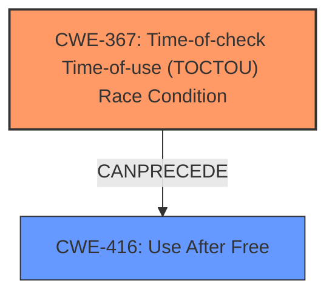

# Raw Analyzer Response for CVE-2025-37797

# Summary
| CWE ID    | CWE Name                                                                                             | Confidence | CWE Abstraction Level | CWE Vulnerability Mapping Label | CWE-Vulnerability Mapping Notes |
| :---------- | :----------------------------------------------------------------------------------------------------- | :--------- | :---------------------- | :-------------------------------- | :-------------------------------- |
| **CWE-367** | **Time-of-check Time-of-use (TOCTOU) Race Condition**                                                 | 0.9        | Base                    | Primary                           | Allowed                           |
| CWE-416     | Use After Free                                                                                       | 0.7        | Base                    | Secondary                         | Allowed                           |

## Evidence and Confidence

*   **Confidence Score:** 0.8
*   **Evidence Strength:** HIGH

## Relationship Analysis

The primary weakness is CWE-367, which describes a time-of-check time-of-use race condition. This condition leads to a state where the resource state changes between the check and its use, invalidating the check. This invalidation directly results in the **Use-After-Free** condition, represented by CWE-416. Therefore, CWE-367 can precede CWE-416. The analysis focuses on identifying the root cause (CWE-367) and a significant consequence (CWE-416).

## Vulnerability Chain

1.  **Initial Flaw:** **Time-of-check Time-of-use condition** (CWE-367) where the queue length is checked, but packets can be dropped before the queue is used.
2.  **Resulting Weakness:** The code assumes the queue is still non-empty, adding the class to vttree, breaking HFSC scheduler assumptions.
3.  **Final Impact:** **Use-After-Free** (CWE-416) occurs when the class is destroyed later.

## Summary of Analysis

The analysis is based on the provided vulnerability description, which explicitly mentions a **time-of-check/time-of-use condition** leading to a **Use-After-Free**. The description states "The issue occurs due to a **time-of-check/time-of-use condition** in hfsc_change_class() when working with certain child qdiscs like netem or codel." This is direct evidence supporting CWE-367 as the primary root cause. The subsequent **Use-After-Free** is a direct consequence of this race condition which corresponds to CWE-416.

The graph relationships confirm that CWE-367 can precede CWE-416. The retriever results also strongly suggest CWE-367 as a relevant CWE.

The selected CWEs are at the optimal level of specificity because they directly represent the root cause and the resulting weakness described in the vulnerability.

Relevant CWE Information:

# Enhanced Context (25 CWEs)
The following CWEs were identified as potentially relevant to this vulnerability:

## CWE-667: Improper Locking
**Abstraction Level**: Class
**Similarity Score**: 0.76
**Source**: dense

**Description**:
The product does not properly acquire or release a lock on a resource, leading to unexpected resource state changes and behaviors.

**Mapping Guidance**:
- Usage: Allowed-with-Review
- Rationale: This CWE entry is a Class and might have Base-level children that would be more appropriate

*Not Used:* Although locking issues can sometimes lead to race conditions, the description doesn't mention any locking mechanisms, making CWE-667 less relevant.

## CWE-703: Improper Check or Handling of Exceptional Conditions
**Abstraction Level**: Pillar
**Similarity Score**: 0.74
**Source**: dense

**Description**:
The product does not properly anticipate or handle exceptional conditions that rarely occur during normal operation of the product.

**Mapping Guidance**:
- Usage: Discouraged
- Rationale: This CWE entry is extremely high-level, a Pillar.

*Not Used:* This is too general and doesn't capture the specific nature of the vulnerability.

## CWE-696: Incorrect Behavior Order
**Abstraction Level**: Class
**Similarity Score**: 0.74
**Source**: dense

**Description**:
The product performs multiple related behaviors, but the behaviors are performed in the wrong order in ways which may produce resultant weaknesses.

**Mapping Guidance**:
- Usage: Allowed-with-Review
- Rationale: This CWE entry is a Class and might have Base-level children that would be more appropriate

*Not Used:* Although the order of operations is important in this vulnerability, it is specifically a TOCTOU issue rather than a general ordering problem.

## CWE-824: Access of Uninitialized Pointer
**Abstraction Level**: Base
**Similarity Score**: 0.74
**Source**: dense

**Description**:
The product accesses or uses a pointer that has not been initialized.

**Mapping Guidance**:
- Usage: Allowed
- Rationale: This CWE entry is at the Base level of abstraction, which is a preferred level of abstraction for mapping to the root causes of vulnerabilities.

*Not Used:* The vulnerability is not due to an uninitialized pointer but rather due to a pointer being used after the memory it points to has been freed.

## CWE-754: Improper Check for Unusual or Exceptional Conditions
**Abstraction Level**: Class
**Similarity Score**: 0.74
**Source**: dense

**Description**:
The product does not check or incorrectly checks for unusual or exceptional conditions that are not expected to occur frequently during day to day operation of the product.

**Mapping Guidance**:
- Usage: Allowed-with-Review
- Rationale: This CWE entry is a Class and might have Base-level children that would be more appropriate

*Not Used:* While the check is improper, the core issue is the timing between the check and the use, making CWE-367 a more precise fit.

## CWE-367: Time-of-check Time-of-use (TOCTOU) Race Condition
**Abstraction Level**: Base
**Similarity Score**: 0.74
**Source**: dense

**Description**:
The product checks the state of a resource before using that resource, but the resource's state can change between the check and the use in a way that invalidates the results of the check. This can cause the product to perform invalid actions when the resource is in an unexpected state.

**Mapping Guidance**:
- Usage: Allowed
- Rationale: This CWE entry is at the Base level of abstraction, which is a preferred level of abstraction for mapping to the root causes of vulnerabilities.

*Used:* This CWE accurately describes the **time-of-check/time-of-use** condition in the vulnerability. The queue length is checked, but the queue can be emptied before it is used.

## CWE-362: Concurrent Execution using Shared Resource with Improper Synchronization ('Race Condition')
**Abstraction Level**: Class
**Similarity Score**: 0.74
**Source**: dense

**Description**:
The product contains a concurrent code sequence that requires temporary, exclusive access to a shared resource, but a timing window exists in which the shared resource can be modified by another code sequence operating concurrently.

**Mapping Guidance**:
- Usage: Allowed-with-Review
- Rationale: This CWE entry is a Class and might have Base-level children that would be more appropriate

*Not Used:* While this is a race condition, the specific nature of the race condition is a TOCTOU, making CWE-367 a better fit.

## CWE-755: Improper Handling of Exceptional Conditions
**Abstraction Level**: Class
**Similarity Score**: 0.73
**Source**: dense

**Description**:
The product does not handle or incorrectly handles an exceptional condition.

**Mapping Guidance**:
- Usage: Discouraged
- Rationale: This CWE entry is a level-1 Class (i.e., a child of a Pillar). It might have lower-level children that would be more appropriate

*Not Used:* This is too general.

## CWE-665: Improper Initialization
**Abstraction Level**: Class
**Similarity Score**: 0.73
**Source**: dense

**Description**:
The product does not initialize or incorrectly initializes a resource, which might leave the resource in an unexpected state when it is accessed or used.

**Mapping Guidance**:
- Usage: Discouraged
- Rationale: This CWE entry is a level-1 Class (i.e., a child of a Pillar). It might have lower-level children that would be more appropriate

*Not Used:* This vulnerability is not related to initialization.

## CWE-404: Improper Resource Shutdown or Release
**Abstraction Level**: Class
**Similarity Score**: 0.73
**Source**: dense

**Description**:
The product does not release or incorrectly releases a resource before it is made available