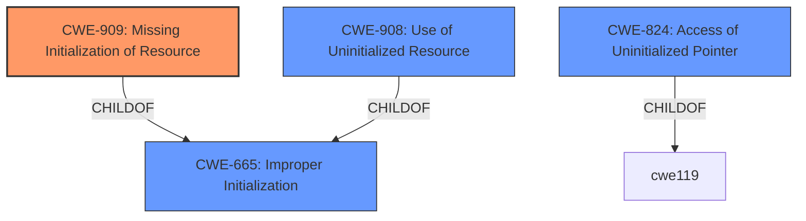

# Analysis Report for CVE-2025-37805

# Vulnerability Analysis Report: CVE-2025-37805

## Description

In the Linux kernel, the following vulnerability has been resolved sound/virtio Fix cancel_sync warnings on **uninitialized work_struct**s Betty reported hitting the following warning [ 8.709131][ T221] WARNING CPU 2 PID 221 at kernel/workqueue.c4182 ... [ 8.713282][ T221] Call trace [ 8.713365][ T221] __flush_work+0x8d0/0x914 [ 8.713468][ T221] __cancel_work_sync+0xac/0xfc [ 8.713570][ T221] cancel_work_sync+0x24/0x34 [ 8.713667][ T221] virtsnd_remove+0xa8/0xf8 [virtio_snd ab15f34d0dd772f6d11327e08a81d46dc9c36276] [ 8.713868][ T221] virtsnd_probe+0x48c/0x664 [virtio_snd ab15f34d0dd772f6d11327e08a81d46dc9c36276] [ 8.714035][ T221] virtio_dev_probe+0x28c/0x390 [ 8.714139][ T221] really_probe+0x1bc/0x4c8 ... It seems were hitting the error path in virtsnd_probe(), which triggers a virtsnd_remove() which iterates over the substreams calling cancel_work_sync() on the elapsed_period work_struct. Looking at the code, from earlier in virtsnd_probe()->virtsnd_build_devs()->virtsnd_pcm_parse_cfg() We set snd->nsubstreams, allocate the snd->substreams, and if we then hit an error on the info allocation or something in virtsnd_ctl_query_info() fails, we will exit without having initialized the elapsed_period work_struct. When that error path unwinds we then call virtsnd_remove() which as long as the substreams array is allocated, will iterate through calling cancel_work_sync() on the uninitialized work struct hitting this warning. Takashi Iwai suggested this fix, which initializes the substreams structure right after allocation, so that if we hit the error paths we avoid trying to cleanup **uninitialized data**. Note I have not yet managed to reproduce the issue myself, so this patch has had limited testing. Feedback or thoughts would be appreciated!

## Vulnerability Description Key Phrases

- **Rootcause:** uninitialized data
- **Weakness:** uninitialized work_struct
- **Impact:** cancel_sync warnings
- **Product:** Linux kernel
- **Component:** sound/virtio

## Analysis (with Relationship Data)

# Summary
| CWE ID | CWE Name | Confidence | CWE Abstraction Level | CWE Vulnerability Mapping Label | CWE-Vulnerability Mapping Notes |
|---|---|---|---|---|---|
| CWE-909 | Missing Initialization of Resource | 0.9 | Class | Primary CWE | Allowed-with-Review |
| CWE-908 | Use of Uninitialized Resource | 0.7 | Base | Secondary Candidate | Allowed |
| CWE-824 | Access of Uninitialized Pointer | 0.6 | Base | Secondary Candidate | Allowed |

## Evidence and Confidence

*   **Confidence Score:** 0.8
*   **Evidence Strength:** MEDIUM

## Relationship Analysis
The primary relationship that influenced the CWE selection is the hierarchical relationship between CWE-665 (Improper Initialization), CWE-909 (Missing Initialization of Resource), CWE-908 (Use of Uninitialized Resource), and CWE-824 (Access of Uninitialized Pointer). CWE-909 is a child of CWE-665, and CWE-908 and CWE-824 are related to missing initializations, representing more specific cases. The abstraction level also plays a role, with preference given to Base or Variant levels where appropriate.



## Vulnerability Chain
The vulnerability chain starts with the **missing initialization** of the `elapsed_period work_struct`. This leads to the attempt to `cancel_work_sync()` on the **uninitialized data**, which then results in a warning.

## Summary of Analysis
The analysis identified that the root cause of the vulnerability is the **missing initialization** of the `elapsed_period work_struct`. When an error occurs during the initialization process in `virtsnd_probe()`, the code proceeds to `virtsnd_remove()` without properly initializing the `work_struct`. This leads to `cancel_work_sync()` being called on **uninitialized data**, causing a warning. The evidence is "Looking at the code, from earlier in virtsnd_probe()->virtsnd_build_devs()->virtsnd_pcm_parse_cfg() We set snd->nsubstreams, allocate the snd->substreams, and if we then hit an error on the info allocation or something in virtsnd_ctl_query_info() fails, we will exit without having initialized the elapsed_period work_struct."

CWE-909 (Missing Initialization of Resource) is chosen as the primary CWE because it directly addresses the root cause. While CWE-665 (Improper Initialization) is a broader category, CWE-909 is more specific and accurately describes the missing initialization of a resource. The retriever results also list CWE-909 as the top candidate.

CWE-908 (Use of Uninitialized Resource) and CWE-824 (Access of Uninitialized Pointer) are considered as secondary CWEs because the description also includes an attempt to use the uninitialized data (CWE-908) and the possibility of accessing an uninitialized pointer within the work struct (CWE-824).

The selected CWEs are at the optimal level of specificity. CWE-909 captures the overall **missing initialization** problem, while CWE-908 and CWE-824 highlight potential consequences of using the **uninitialized resource**.

Relevant CWE Information:

# Enhanced Context (25 CWEs)
The following CWEs were identified as potentially relevant to this vulnerability:

## CWE-909: Missing Initialization of Resource
**Abstraction Level**: Class
**Similarity Score**: 0.76
**Source**: dense

**Description**:
The product does not initialize a critical resource.

**Mapping Guidance**:
- Usage: Allowed-with-Review
- Rationale: This CWE entry is a Class and might have Base-level children that would be more appropriate

## CWE-824: Access of Uninitialized Pointer
**Abstraction Level**: Base
**Similarity Score**: 0.72
**Source**: dense

**Description**:
The product accesses or uses a pointer that has not been initialized.

**Mapping Guidance**:
- Usage: Allowed
- Rationale: This CWE entry is at the Base level of abstraction, which is a preferred level of abstraction for mapping to the root causes of vulnerabilities.

## CWE-908: Use of Uninitialized Resource
**Abstraction Level**: Base
**Similarity Score**: 0.72
**Source**: dense

**Description**:
The product uses or accesses a resource that has not been initialized.

**Mapping Guidance**:
- Usage: Allowed
- Rationale: This CWE entry is at the Base level of abstraction, which is a preferred level of abstraction for mapping to the root causes of vulnerabilities.

## CWE-252: Unchecked Return Value
**Abstraction Level**: Base
**Similarity Score**: 0.71
**Source**: dense

**Description**:
The product does not check the return value from a method or function, which can prevent it from detecting unexpected states and conditions.

**Mapping Guidance**:
- Usage: Allowed
- Rationale: This CWE entry is at the Base level of abstraction, which is a preferred level of abstraction for mapping to the root causes of vulnerabilities.

## CWE-362: Concurrent Execution using Shared Resource with Improper Synchronization ('Race Condition')
**Abstraction Level**: Class
**Similarity Score**: 0.71
**Source**: dense

**Description**:
The product contains a concurrent code sequence that requires temporary, exclusive access to a shared resource, but a timing window exists in which the shared resource can be modified by another code sequence operating concurrently.

**Mapping Guidance**:
- Usage: Allowed-with-Review
- Rationale: This CWE entry is a Class and might have Base-level children that would be more appropriate

## CWE-457: Use of Uninitialized Variable
**Abstraction Level**: Variant
**Similarity Score**: 0.71
**Source**: dense

**Description**:
The code uses a variable that has not been initialized, leading to unpredictable or unintended results.

**Mapping Guidance**:
- Usage: Allowed
- Rationale: This CWE entry is at the Variant level of abstraction, which is a preferred level of abstraction for mapping to the root causes of vulnerabilities.

## CWE-665: Improper Initialization
**Abstraction Level**: Class
**Similarity Score**: 0.71
**Source**: dense

**Description**:
The product does not initialize or incorrectly initializes a resource, which might leave the resource in an unexpected state when it is accessed or used.

**Mapping Guidance**:
- Usage: Discouraged
- Rationale: This CWE entry is a level-1 Class (i.e., a child of a Pillar). It might have lower-level children that would be more appropriate

## CWE-667: Improper Locking
**Abstraction Level**: Class
**Similarity Score**: 0.71
**Source**: dense

**Description**:
The product does not properly acquire or release a lock on a resource, leading to unexpected resource state changes and behaviors.

**Mapping Guidance**:
- Usage: Allowed-with-Review
- Rationale: This CWE entry is a Class and might have Base-level children that would be more appropriate

## CWE-131: Incorrect Calculation of Buffer Size
**Abstraction Level**: Base
**Similarity Score**: 0.71
**Source**: dense

**Description**:
The product does not correctly calculate the size to be used when allocating a buffer, which could lead to a buffer overflow.

**Mapping Guidance**:
- Usage: Allowed
- Rationale: This CWE entry is at the Base level of abstraction, which is a preferred level of abstraction for mapping to the root causes of vulnerabilities.

## CWE-754: Improper Check for Unusual or Exceptional Conditions
**Abstraction Level**: Class
**Similarity Score**: 0.71
**Source**: dense

**Description**:
The product does not check or incorrectly checks for unusual or exceptional conditions that are not expected to occur frequently during day to day operation of the product.

**Mapping Guidance**:
- Usage: Allowed-with-Review
- Rationale: This CWE entry is a Class and might have Base-level children that would be more appropriate

## CWE-476: NULL Pointer Dereference
**Abstraction Level**: Base
**Similarity Score**: 575.33
**Source**: sparse

**Description**:
The product dereferences a pointer that it expects to be valid but is NULL.

**Mapping Guidance**:
- Usage: Allowed
- Rationale:


## CWE Relationship Analysis

Current CWEs represent these abstraction levels: .


### Vulnerability Chain Analysis

**Chain starting from CWE-457:**
- 457 (Use of Uninitialized Variable) - ROOT


**Chain starting from CWE-476:**
- 476 (NULL Pointer Dereference) - ROOT


### CWE Relationship Diagram

```mermaid
graph TD
    classDef primary fill:#f96,stroke:#333,stroke-width:2px
    classDef secondary fill:#69f,stroke:#333
    classDef tertiary fill:#9e9,stroke:#333
```


*Report generated on 2025-07-14 21:27:53*
