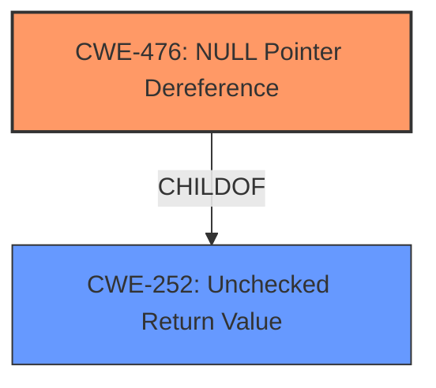

# Analysis for CVE-2025-37806

# Summary

| CWE ID  | CWE Name                        | Confidence | CWE Abstraction Level | CWE Vulnerability Mapping Label | CWE-Vulnerability Mapping Notes |
| :-------- | :------------------------------ | :--------- | :-------------------- | :------------------------------ | :------------------------------ |
| CWE-476 | NULL Pointer Dereference          | 1          | Base                  | Primary                         | Allowed                       |
| CWE-252 | Unchecked Return Value          | 0.6         | Base                  | Secondary                         | Allowed                       |

## Evidence and Confidence

*   **Confidence Score:** 0.8
*   **Evidence Strength:** HIGH

## Relationship Analysis

The primary CWE is CWE-476, which represents the **NULL pointer dereference**. Several other CWEs were considered, particularly related to resource initialization and memory allocation. The graph-based relationships suggest potential chains involving resource allocation, return value checking, and subsequent dereferences, influencing the consideration of CWE-252. The choice of CWE-476 is at the Base level, providing a specific root cause.

## Vulnerability Chain

The vulnerability chain starts with a race condition between a write operation and an ioctl call. This race condition leads to the file's compression flag being cleared prematurely. Consequently, a **NULL pointer dereference** occurs when the program incorrectly calls `ntfs_aops_cmpr`, resulting in a kernel panic.

The chain: Race Condition -> Incorrect Compression Flag Handling -> Incorrect function call -> **NULL Pointer Dereference** -> Kernel Panic

## Summary of Analysis

The primary weakness is a **NULL pointer dereference** (CWE-476) in the Linux kernel's NTFS3 file system driver. This occurs due to a race condition where a user can clear the compression flag of a file during a write operation. This premature clearing of the flag leads to an incorrect function call (`ntfs_aops_cmpr`), resulting in the dereference of a **NULL pointer**.

The vulnerability description explicitly mentions a **NULL pointer dereference**: "syzbot reported a **NULL pointer dereference** in __generic_file_write_iter". This direct evidence supports the selection of CWE-476 as the primary weakness.

CWE-252 was considered because the unhandled return value of `is_compressed()` after the ioctl can be considered a contributing factor. It could be that not checking the return value of `is_compressed()` after the ioctl is what led to the null pointer dereference.

Other CWEs like CWE-822, CWE-824, CWE-787, CWE-789, CWE-908 were considered but not selected because they didn't directly reflect the root cause as much as CWE-476.

Relevant CWE Information:

# Enhanced Context (25 CWEs)
The following CWEs were identified as potentially relevant to this vulnerability:

## CWE-476: NULL Pointer Dereference
**Abstraction Level**: Base
**Similarity Score**: 0.78
**Source**: dense

**Description**:
The product dereferences a pointer that it expects to be valid but is NULL.

**Mapping Guidance**:
- Usage: Allowed
- Rationale: This CWE entry is at the Base level of abstraction, which is a preferred level of abstraction for mapping to the root causes of vulnerabilities.

**Explanation:** The vulnerability description explicitly mentions a **NULL pointer dereference**, making this CWE a strong candidate. The description of CWE-476 perfectly aligns with the observed behavior.

## CWE-824: Access of Uninitialized Pointer
**Abstraction Level**: Base
**Similarity Score**: 0.77
**Source**: dense

**Description**:
The product accesses or uses a pointer that has not been initialized.

**Mapping Guidance**:
- Usage: Allowed
- Rationale: This CWE entry is at the Base level of abstraction, which is a preferred level of abstraction for mapping to the root causes of vulnerabilities.

**Explanation:** While a **NULL pointer dereference** is occurring, the root cause isn't necessarily that the pointer was uninitialized, but rather that it becomes NULL due to a race condition.

## CWE-822: Untrusted Pointer Dereference
**Abstraction Level**: Base
**Similarity Score**: 0.77
**Source**: dense

**Description**:
The product obtains a value from an untrusted source, converts this value to a pointer, and dereferences the resulting pointer.

**Mapping Guidance**:
- Usage: Allowed
- Rationale: This CWE entry is at the Base level of abstraction, which is a preferred level of abstraction for mapping to the root causes of vulnerabilities.

**Explanation:** The vulnerability doesn't involve obtaining a pointer from an untrusted source. Instead, the pointer becomes NULL due to a race condition.

## CWE-252: Unchecked Return Value
**Abstraction Level**: Base
**Similarity Score**: 0.75
**Source**: dense

**Description**:
The product does not check the return value from a method or function, which can prevent it from detecting unexpected states and conditions.

**Mapping Guidance**:
- Usage: Allowed
- Rationale: This CWE entry is at the Base level of abstraction, which is a preferred level of abstraction for mapping to the root causes of vulnerabilities.

**Explanation:** The **NULL pointer dereference** could be a consequence of not checking a return value from is_compressed().

## CWE-191: Integer Underflow (Wrap or Wraparound)
**Abstraction Level**: Base
**Similarity Score**: 0.74
**Source**: dense

**Description**:
The product subtracts one value from another, such that the result is less than the minimum allowable integer value, which produces a value that is not equal to the correct result.

**Mapping Guidance**:
- Usage: Allowed
- Rationale: This CWE entry is at the Base level of abstraction, which is a preferred level of abstraction for mapping to the root causes of vulnerabilities.

**Explanation:** This CWE is not relevant to the vulnerability description.

## CWE-667: Improper Locking
**Abstraction Level**: Class
**Similarity Score**: 0.74
**Source**: dense

**Description**:
The product does not properly acquire or release a lock on a resource, leading to unexpected resource state changes and behaviors.

**Mapping Guidance**:
- Usage: Allowed-with-Review
- Rationale: This CWE entry is a Class and might have Base-level children that would be more appropriate

**Explanation:** While there is a race condition, which could imply locking issues, the more direct cause is the **NULL pointer dereference**.

## CWE-909: Missing Initialization of Resource
**Abstraction Level**: Class
**Similarity Score**: 0.74
**Source**: dense

**Description**:
The product does not initialize a critical resource.

**Mapping Guidance**:
- Usage: Allowed-with-Review
- Rationale: This CWE entry is a Class and might have Base-level children that would be more appropriate

**Explanation:** The root cause is not that a resource was not initialized, but that a pointer became NULL due to a race condition.

## CWE-665: Improper Initialization
**Abstraction Level**: Class
**Similarity Score**: 0.73
**Source**: dense

**Description**:
The product does not initialize or incorrectly initializes a resource, which might leave the resource in an unexpected state when it is accessed or used.

**Mapping Guidance**:
- Usage: Discouraged
- Rationale: This CWE entry is a level-1 Class (i.e., a child of a Pillar). It might have lower-level children that would be more appropriate

**Explanation:** Similar to CWE-909, the primary issue isn't about initialization.

## CWE-170: Improper Null Termination
**Abstraction Level**: Base
**Similarity Score**: 0.72
**Source**: dense

**Description**:
The product does not terminate or incorrectly terminates a string or array with a null character or equivalent terminator.

**Mapping Guidance**:
- Usage: Allowed
- Rationale: This CWE entry is at the Base level of abstraction, which is a preferred level of abstraction for mapping to the root causes of vulnerabilities.

**Explanation:** This CWE is not relevant to the vulnerability description.

## CWE-125: Out-of-bounds Read
**Abstraction Level**: Base
**Similarity Score**: 0.72
**Source**: dense

**Description**:
The product reads data past the end, or before the beginning, of the intended buffer.

**Mapping Guidance**:
- Usage: Allowed
- Rationale: This CWE entry is at the Base level of abstraction, which is a preferred level of abstraction for mapping to the root causes of vulnerabilities.

**Explanation:** This CWE is not relevant to the vulnerability description.

## CWE-476: NULL Pointer Dereference
**Abstraction Level**: Base
**Similarity Score