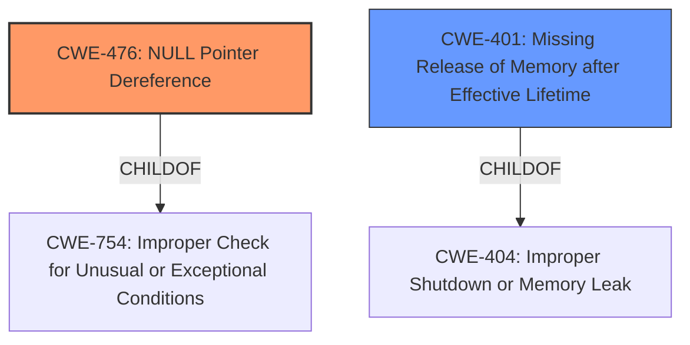

# Analysis for CVE-2025-37820

# Summary
| CWE ID | CWE Name | Confidence | CWE Abstraction Level | CWE Vulnerability Mapping Label | CWE-Vulnerability Mapping Notes |
|---|---|---|---|---|---|
| CWE-476 | NULL Pointer Dereference | 1.0 | Base | Primary | Allowed |
| CWE-401 | Missing Release of Memory after Effective Lifetime | 1.0 | Variant | Secondary | Allowed |

## Evidence and Confidence

*   **Confidence Score:** 1.0
*   **Evidence Strength:** HIGH

## Relationship Analysis
The primary weakness is a **NULL Pointer Dereference (CWE-476)**, which occurs when the code attempts to use a pointer that is unexpectedly NULL. Additionally, a **Missing Release of Memory after Effective Lifetime (CWE-401)** is also present, due to the failure to release allocated memory. Both are root causes of the vulnerability.

## Vulnerability Chain
1.  `xdp_convert_buff_to_frame()` function fails and returns NULL due to memory constraints, internal errors, or invalid data.
2.  The returned NULL value is not checked. (**Primary CWE: CWE-476 NULL Pointer Dereference**)
3.  The code attempts to dereference the NULL pointer, leading to crashes, data corruption, or undefined behavior.
4.  On XDP redirect failure, the associated page must be released explicitly if it was previously retained via get_page().
5.  Failing to release the page results in a memory leak. (**Secondary CWE: CWE-401 Missing Release of Memory after Effective Lifetime**)

## Summary of Analysis
The vulnerability description clearly indicates two distinct weaknesses: a **NULL pointer dereference** and a **memory leak**. The `xdp_convert_buff_to_frame()` function's potential to return NULL without a subsequent check leads directly to the dereference. Additionally, the failure to release the associated page on XDP redirect failure causes a memory leak. The evidence provided in the vulnerability description is strong, and the retriever results support the selection of CWE-476 and CWE-401. Both CWEs are at the appropriate level of abstraction (Base and Variant, respectively).

Relevant CWE Information:

# Enhanced Context (25 CWEs)
The following CWEs were identified as potentially relevant to this vulnerability:

## CWE-476: NULL Pointer Dereference
**Abstraction Level**: Base
**Similarity Score**: 0.77
**Source**: dense

**Description**:
The product dereferences a pointer that it expects to be valid but is NULL.

**Mapping Guidance**:
- Usage: Allowed
- Rationale: This CWE entry is at the Base level of abstraction, which is a preferred level of abstraction for mapping to the root causes of vulnerabilities.

## CWE-401: Missing Release of Memory after Effective Lifetime
**Abstraction Level**: Variant
**Similarity Score**: 0.73
**Source**: dense

**Description**:
The product does not sufficiently track and release allocated memory after it has been used, which slowly consumes remaining memory.

**Mapping Guidance**:
- Usage: Allowed
- Rationale: This CWE entry is at the Variant level of abstraction, which is a preferred level of abstraction for mapping to the root causes of vulnerabilities.

### Detailed Analysis of Selected CWEs:

*   **CWE-476 NULL Pointer Dereference:** The description states that the function `xdp_convert_buff_to_frame()` may return NULL. If this return value is not checked and subsequently dereferenced, it leads to a **NULL pointer dereference**. This aligns directly with the definition of CWE-476. This is the primary weakness because the **NULL pointer dereference** is the first point of failure leading to crashes, data corruption, or undefined behavior.
*   **CWE-401 Missing Release of Memory after Effective Lifetime:** The description indicates that on XDP redirect failure, the associated page must be released explicitly if previously retained. Failing to do so results in a memory leak, precisely matching the characteristics of CWE-401. This is a secondary weakness.

### CWEs Considered but Not Used:

*   **CWE-252 Unchecked Return Value:** While the vulnerability does involve an unchecked return value, the more specific CWE-476 captures the actual consequence of this omission. Therefore, CWE-252 is not as precise as CWE-476.
*   **CWE-665 Improper Initialization and CWE-909 Missing Initialization of Resource:** These CWEs are related to initialization issues, but the root cause is more accurately described as a **NULL pointer dereference** and a **memory leak** rather than an initialization problem.
*   **CWE-755 Improper Handling of Exceptional Conditions:** Although a NULL return could be considered an exceptional condition, the direct result is a **NULL pointer dereference**, making CWE-476 the more accurate classification.
*   **CWE-911 Improper Update of Reference Count:** While the memory leak could be indirectly related to reference counting, the description specifically points to the **missing release of memory**, making CWE-401 a more direct and appropriate fit.
*   **CWE-824 Access of Uninitialized Pointer and CWE-822 Untrusted Pointer Dereference:** These are not applicable since the pointer is becoming NULL due to a function's failure, not because it was uninitialized or derived from an untrusted source.