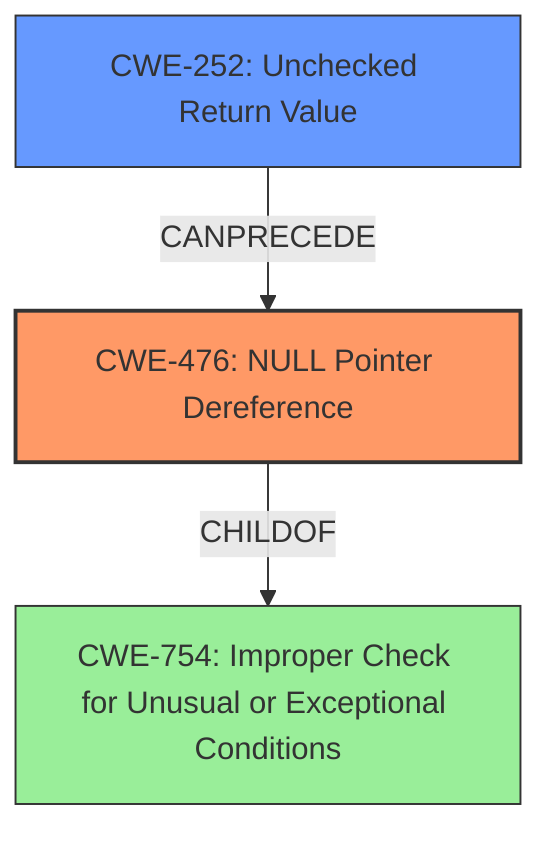

# Enhanced Analysis for CVE-2025-37831

# Summary

| CWE ID | CWE Name | Confidence | CWE Abstraction Level | CWE Vulnerability Mapping Label | CWE-Vulnerability Mapping Notes |
|---|---|---|---|---|---|
| CWE-476 | **CWE-476: NULL Pointer Dereference** | 1.0 | Base | Primary CWE | Allowed |
| CWE-252 | **CWE-252: Unchecked Return Value** | 0.7 | Base | Secondary Candidate | Allowed |

## Evidence and Confidence

*   **Confidence Score:** 0.85
*   **Evidence Strength:** HIGH

## Relationship Analysis

The primary CWE is **CWE-476: NULL Pointer Dereference**, which directly reflects the vulnerability description. **CWE-252: Unchecked Return Value** is a potential contributing factor, as the **NULL** pointer might have been caused by an unchecked return. However, the description focuses on the dereference itself, making **CWE-476: NULL Pointer Dereference** the more direct and specific root cause. **CWE-476: NULL Pointer Dereference** is a child of **CWE-754: Improper Check for Unusual or Exceptional Conditions** and can be preceded by **CWE-252: Unchecked Return Value**.



## Vulnerability Chain

The vulnerability chain starts with a function call (cpufreq_cpu_get_raw()) that can return **NULL**. This return value is then not checked (**CWE-252: Unchecked Return Value**), leading to a **NULL** pointer being dereferenced (**CWE-476: NULL Pointer Dereference**) in apple_soc_cpufreq_get_rate(). The **NULL** pointer dereference is the direct cause of the crash.

## Summary of Analysis

The vulnerability description clearly indicates a **NULL pointer dereference** in the `apple_soc_cpufreq_get_rate()` function. The phrase "**NULL pointer dereference**" is a key indicator and directly matches **CWE-476: NULL Pointer Dereference**. The function `cpufreq_cpu_get_raw()` returning **NULL** without a check in `apple_soc_cpufreq_get_rate()` function points to **CWE-252: Unchecked Return Value** as a contributing factor. The retriever results also list **CWE-476: NULL Pointer Dereference** as the top candidate.

**CWE-476: NULL Pointer Dereference** is the optimal level of specificity because it directly describes the error. While **CWE-252: Unchecked Return Value** could be a contributing factor, the immediate cause of the vulnerability is the dereference of the **NULL** pointer. The evidence is based on the vulnerability description which explicitly states "**NULL pointer dereference**".

Relevant CWE Information:

# Enhanced Context (25 CWEs)
The following CWEs were identified as potentially relevant to this vulnerability:

## CWE-476: NULL Pointer Dereference
**Abstraction Level**: Base
**Similarity Score**: 0.75
**Source**: dense

**Description**:
The product dereferences a pointer that it expects to be valid but is NULL.

**Mapping Guidance**:
- Usage: Allowed
- Rationale: This CWE entry is at the Base level of abstraction, which is a preferred level of abstraction for mapping to the root causes of vulnerabilities.

## CWE-252: Unchecked Return Value
**Abstraction Level**: Base
**Similarity Score**: 0.73
**Source**: dense

**Description**:
The product does not check the return value from a method or function, which can prevent it from detecting unexpected states and conditions.

**Mapping Guidance**:
- Usage: Allowed
- Rationale: This CWE entry is at the Base level of abstraction, which is a preferred level of abstraction for mapping to the root causes of vulnerabilities.

## CWE-690: Unchecked Return Value to NULL Pointer Dereference
**Abstraction Level**: Compound
**Similarity Score**: 418.06
**Source**: sparse

**Description**:
The product does not check for an error after calling a function that can return with a NULL pointer if the function fails, which leads to a resultant NULL pointer dereference.

**Mapping Guidance**:
- Usage: Discouraged
- Rationale: This CWE entry is a named chain, which combines multiple weaknesses.

This CWE, **CWE-690: Unchecked Return Value to NULL Pointer Dereference**, is a compound entry and is discouraged from being used.

## CWE-665: Improper Initialization
**Abstraction Level**: Class
**Similarity Score**: 0.71
**Source**: dense

**Description**:
The product does not initialize or incorrectly initializes a resource, which might leave the resource in an unexpected state when it is accessed or used.

**Mapping Guidance**:
- Usage: Discouraged
- Rationale: This CWE entry is a level-1 Class (i.e., a child of a Pillar). It might have lower-level children that would be more appropriate

This CWE, **CWE-665: Improper Initialization**, is a class entry and is discouraged from being used.

## CWE-824: Access of Uninitialized Pointer
**Abstraction Level**: Base
**Similarity Score**: 0.72
**Source**: dense

**Description**:
The product accesses or uses a pointer that has not been initialized.

**Mapping Guidance**:
- Usage: Allowed
- Rationale: This CWE entry is at the Base level of abstraction, which is a preferred level of abstraction for mapping to the root causes of vulnerabilities.

This is similar to a NULL pointer dereference, but in this case we know the pointer is NULL, not just uninitialized.

## CWE-393: Return of Wrong Status Code
**Abstraction Level**: base
**Similarity Score**: 2.33
**Source**: graph

**Description**:
CWE-393: Return of Wrong Status Code

**Mapping Guidance**:
- Usage: Allowed
- Rationale: This CWE entry is at the Base level of abstraction, which is a preferred level of abstraction for mapping to the root causes of vulnerabilities.

While a wrong status code could be returned, the primary issue is the **NULL** pointer dereference, not necessarily the status code itself.

## CWE-456: Missing Initialization of a Variable
**Abstraction Level**: Variant
**Similarity Score**: 449.82
**Source**: sparse

**Description**:
The product does not initialize critical variables, which causes the execution environment to use unexpected values.

**Mapping Guidance**:
- Usage: Allowed
- Rationale: This CWE entry is at the Variant level of abstraction, which is a preferred level of abstraction for mapping to the root causes of vulnerabilities.

The issue is not that the variable was not initialized, it is that a function can return **NULL** and is not checked.


## CWE Relationship Analysis

Current CWEs represent these abstraction levels: .


### Vulnerability Chain Analysis

**Chain starting from CWE-690:**
- 690 (Unchecked Return Value to NULL Pointer Dereference) - ROOT


**Chain starting from CWE-476:**
- 476 (NULL Pointer Dereference) - ROOT


### CWE Relationship Diagram

```mermaid
graph TD
    classDef primary fill:#f96,stroke:#333,stroke-width:2px
    classDef secondary fill:#69f,stroke:#333
    classDef tertiary fill:#9e9,stroke:#333
```