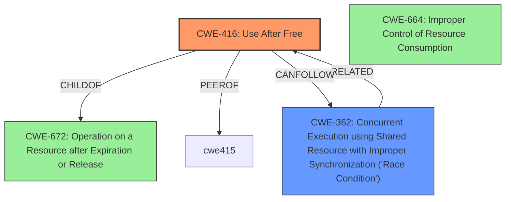

# Analysis Report for CVE-2025-37838

# Vulnerability Analysis Report: CVE-2025-37838

## Description

In the Linux kernel, the following vulnerability has been resolved HSI ssi_protocol Fix **use after free** vulnerability in ssi_protocol Driver Due to **Race Condition** In the ssi_protocol_probe() function, &ssi->work is bound with ssip_xmit_work(), In ssip_pn_setup(), the ssip_pn_xmit() function within the ssip_pn_ops structure is capable of starting the work. If we remove the module which will call ssi_protocol_remove() to make a cleanup, it will free ssi through kfree(ssi), while the work mentioned above will be used. The sequence of operations that may lead to a UAF bug is as follows CPU0 CPU1 | ssip_xmit_work ssi_protocol_remove | kfree(ssi) | | struct hsi_client *cl = ssi->cl | // use ssi Fix it by ensuring that the work is canceled before proceeding with the cleanup in ssi_protocol_remove().

## Vulnerability Description Key Phrases

- **Rootcause:** use after free
- **Weakness:** Race Condition
- **Product:** Linux kernel
- **Component:** ssi_protocol driver

## Analysis (with Relationship Data)

# Summary
| CWE ID | CWE Name | Confidence | CWE Abstraction Level | CWE Vulnerability Mapping Label | CWE-Vulnerability Mapping Notes |
|---|---|---|---|---|---|
| CWE-416 | Use After Free | 0.9 | Variant | Allowed | Primary CWE |
| CWE-362 | Concurrent Execution using Shared Resource with Improper Synchronization ('Race Condition') | 0.8 | Class | Allowed-with-Review | Secondary Candidate |

## Evidence and Confidence

*   **Confidence Score:** 0.85
*   **Evidence Strength:** HIGH

## Relationship Analysis
The primary relationship influencing my decision is the parent-child relationship where CWE-416 is a variant that falls under the broader category of memory management issues, often stemming from concurrency problems. The vulnerability description clearly states a **use after free** condition, making CWE-416 the most specific and appropriate choice. Additionally, the description mentions a **Race Condition**, which is well-represented by CWE-362, acting as a contributing factor to the memory corruption. I have not chosen any child entries of CWE-362, as the description provides sufficient detail to categorize it as a general **Race Condition** in this case.



## Vulnerability Chain
The vulnerability chain starts with a **Race Condition** (CWE-362) where a shared resource is accessed concurrently without proper synchronization. This leads to a premature freeing of the 'ssi' resource. Subsequently, another thread attempts to use the already freed 'ssi' resource, resulting in a **use after free** vulnerability (CWE-416).

CWE-362 (Race Condition) -> Premature Free (implicit) -> CWE-416 (Use After Free)

## Summary of Analysis
The vulnerability description clearly indicates a **use after free** condition due to a **Race Condition** within the Linux kernel's ssi_protocol driver. The description states, "If we remove the module which will call ssi_protocol_remove() to make a cleanup, it will free ssi through kfree(ssi), while the work mentioned above will be used." This directly supports the selection of CWE-416 (Use After Free) as the primary weakness. The **Race Condition** is the enabler for the **use after free**, so CWE-362 is also included.

The retriever results also list CWE-362 as the top candidate, further reinforcing this decision. I considered other CWEs from the retriever results, such as CWE-415 (Double Free), but the description does not mention a double free condition, so it was not selected.

I have chosen CWE-416 and CWE-362 because they are at the optimal level of specificity. CWE-416 accurately describes the type of memory corruption, and CWE-362 describes the concurrent execution issue that led to the memory corruption.

Relevant CWE Information:

# Enhanced Context (25 CWEs)
The following CWEs were identified as potentially relevant to this vulnerability:

## CWE-362: Concurrent Execution using Shared Resource with Improper Synchronization ('Race Condition')
**Abstraction Level**: Class
**Similarity Score**: 0.76
**Source**: dense

**Description**:
The product contains a concurrent code sequence that requires temporary, exclusive access to a shared resource, but a timing window exists in which the shared resource can be modified by another code sequence operating concurrently.

**Mapping Guidance**:
- Usage: Allowed-with-Review
- Rationale: This CWE entry is a Class and might have Base-level children that would be more appropriate


## CWE-667: Improper Locking
**Abstraction Level**: Class
**Similarity Score**: 0.74
**Source**: dense

**Description**:
The product does not properly acquire or release a lock on a resource, leading to unexpected resource state changes and behaviors.

**Mapping Guidance**:
- Usage: Allowed-with-Review
- Rationale: This CWE entry is a Class and might have Base-level children that would be more appropriate


## CWE-366: Race Condition within a Thread
**Abstraction Level**: Base
**Similarity Score**: 0.74
**Source**: dense

**Description**:
If two threads of execution use a resource simultaneously, there exists the possibility that resources may be used while invalid, in turn making the state of execution undefined.

**Mapping Guidance**:
- Usage: Allowed
- Rationale: This CWE entry is at the Base level of abstraction, which is a preferred level of abstraction for mapping to the root causes of vulnerabilities.


## CWE-367: Time-of-check Time-of-use (TOCTOU) Race Condition
**Abstraction Level**: Base
**Similarity Score**: 0.74
**Source**: dense

**Description**:
The product checks the state of a resource before using that resource, but the resource's state can change between the check and the use in a way that invalidates the results of the check. This can cause the product to perform invalid actions when the resource is in an unexpected state.

**Mapping Guidance**:
- Usage: Allowed
- Rationale: This CWE entry is at the Base level of abstraction, which is a preferred level of abstraction for mapping to the root causes of vulnerabilities.


## CWE-824: Access of Uninitialized Pointer
**Abstraction Level**: Base
**Similarity Score**: 0.73
**Source**: dense

**Description**:
The product accesses or uses a pointer that has not been initialized.

**Mapping Guidance**:
- Usage: Allowed
- Rationale: This CWE entry is at the Base level of abstraction, which is a preferred level of abstraction for mapping to the root causes of vulnerabilities.


## CWE-908: Use of Uninitialized Resource
**Abstraction Level**: Base
**Similarity Score**: 0.73
**Source**: dense

**Description**:
The product uses or accesses a resource that has not been initialized.

**Mapping Guidance**:
- Usage: Allowed
- Rationale: This CWE entry is at the Base level of abstraction, which is a preferred level of abstraction for mapping to the root causes of vulnerabilities.


## CWE-755: Improper Handling of Exceptional Conditions
**Abstraction Level**: Class
**Similarity Score**: 0.73
**Source**: dense

**Description**:
The product does not handle or incorrectly handles an exceptional condition.

**Mapping Guidance**:
- Usage: Discouraged
- Rationale: This CWE entry is a level-1 Class (i.e., a child of a Pillar). It might have lower-level children that would be more appropriate


## CWE-131: Incorrect Calculation of Buffer Size
**Abstraction Level**: Base
**Similarity Score**: 0.73
**Source**: dense

**Description**:
The product does not correctly calculate the size to be used when allocating a buffer, which could lead to a buffer overflow.

**Mapping Guidance**:
- Usage: Allowed
- Rationale: This CWE entry is at the Base level of abstraction, which is a preferred level of abstraction for mapping to the root causes of vulnerabilities.


## CWE-703: Improper Check or Handling of Exceptional Conditions
**Abstraction Level**: Pillar
**Similarity Score**: 0.72
**Source**: dense

**Description**:
The product does not properly anticipate or handle exceptional conditions that rarely occur during normal operation of the product.

**Mapping Guidance**:
- Usage: Discouraged
- Rationale: This CWE entry is extremely high-level, a Pillar.


## CWE-252: Unchecked Return Value
**Abstraction Level**: Base
**Similarity Score**: 0.72
**Source**: dense

**Description**:
The product does not check the return value from a method or function, which can prevent it from detecting unexpected states and conditions.

**Mapping Guidance**:
- Usage: Allowed
- Rationale: This CWE entry is at the Base level of abstraction, which is a preferred level of abstraction for mapping to the root causes of vulnerabilities.


## CWE-362: Concurrent Execution using Shared Resource with Improper Synchronization ('Race Condition')
**Abstraction Level**: Class
**Similarity Score**: 549.84
**Source**: sparse

**Description**:
The product contains a concurrent code sequence that requires temporary, exclusive access to a shared resource, but a timing window exists in which the shared resource can be modified


## CWE Relationship Analysis

Current CWEs represent these abstraction levels: .


### Vulnerability Chain Analysis

**Chain starting from CWE-672:**
- 672 (Operation on a Resource after Expiration or Release) - ROOT


**Chain starting from CWE-416:**
- 416 (Use After Free) - ROOT


### CWE Relationship Diagram

```mermaid
graph TD
    classDef primary fill:#f96,stroke:#333,stroke-width:2px
    classDef secondary fill:#69f,stroke:#333
    classDef tertiary fill:#9e9,stroke:#333
```


*Report generated on 2025-07-14 21:34:23*
