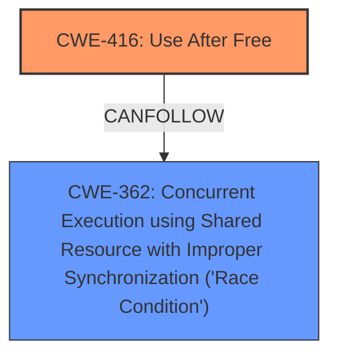

# Analysis for CVE-2025-37854

# Summary
| CWE ID | CWE Name | Confidence | CWE Abstraction Level | CWE Vulnerability Mapping Label | CWE-Vulnerability Mapping Notes |
|---|---|---|---|---|---|
| CWE-416 | Use After Free | 1.0 | Variant |  Primary CWE | Allowed |
| CWE-362 | Concurrent Execution using Shared Resource with Improper Synchronization ('Race Condition') | 0.9 | Class | Secondary Candidate CWE | Allowed-with-Review |

## Evidence and Confidence

*   **Confidence Score:** 0.95
*   **Evidence Strength:** HIGH

## Relationship Analysis
The primary weakness is CWE-416 Use After Free, which occurs due to a race condition, CWE-362. CWE-416 is a variant, while CWE-362 is a class. This relationship highlights the specific nature of the memory corruption issue (use-after-free) arising from a broader concurrency problem (race condition).

## Vulnerability Chain
The vulnerability chain starts with a **use-after-free race** condition (CWE-416) where memory is accessed after it has been freed. This occurs because of concurrent execution (CWE-362) during GPU reset. The user queues continue to access system memory after the process aborts but before the hardware reset, leading to data corruption and a driver crash.

## Summary of Analysis
The primary vulnerability is a **use-after-free race** condition (CWE-416). The vulnerability description explicitly states this. The "Retriever Results" also lists CWE-416 as the top candidate. The concurrent execution is a contributing factor, hence the inclusion of CWE-362.

*   "After process abort exit, user queues still use the GPU to access system memory before h/w is reset while KFD cleanup worker free system memory and free VRAM. There is **use-after-free race** bug that KFD allocate and reuse the freed system memory, and user queue write to the same system memory to corrupt the data structure and cause driver crash."

The selection of CWE-416 and CWE-362 provides a comprehensive view of the vulnerability, covering both the memory corruption aspect and the concurrency issue that leads to it.

Relevant CWE Information:

# Enhanced Context (25 CWEs)
The following CWEs were identified as potentially relevant to this vulnerability:

## CWE-362: Concurrent Execution using Shared Resource with Improper Synchronization ('Race Condition')
**Abstraction Level**: Class
**Similarity Score**: 0.73
**Source**: dense

**Description**:
The product contains a concurrent code sequence that requires temporary, exclusive access to a shared resource, but a timing window exists in which the shared resource can be modified by another code sequence operating concurrently.

**Mapping Guidance**:
- Usage: Allowed-with-Review
- Rationale: This CWE entry is a Class and might have Base-level children that would be more appropriate

## CWE-416: Use After Free
**Abstraction Level**: Variant
**Similarity Score**: 0.69
**Source**: dense

**Description**:
The product reuses or references memory after it has been freed. At some point afterward, the memory may be allocated again and saved in another pointer, while the original pointer references a location somewhere within the new allocation. Any operations using the original pointer are no longer valid because the memory "belongs" to the code that operates on the new pointer.

**Mapping Guidance**:
- Usage: Allowed
- Rationale: This CWE entry is at the Variant level of abstraction, which is a preferred level of abstraction for mapping to the root causes of vulnerabilities.

## CWE-416: Use After Free
**Abstraction Level**: Variant
**Similarity Score**: 2.61
**Source**: graph

**Description**:
The product reuses or references memory after it has been freed. At some point afterward, the memory may be allocated again and saved in another pointer, while the original pointer references a location somewhere within the new allocation. Any operations using the original pointer are no longer valid because the memory "belongs" to the code that operates on the new pointer.

**Mapping Guidance**:
- Usage: Allowed
- Rationale: This CWE entry is at the Variant level of abstraction, which is a preferred level of abstraction for mapping to the root causes of vulnerabilities.

**Relationships**:
- CANFOLLOW -> CWE-754
- CANFOLLOW -> CWE-364
- CANFOLLOW -> CWE-362
- CANFOLLOW -> CWE-1265
- CANPRECEDE -> CWE-123

## CWE-416 Use After Free
*Technical Explanation:* The vulnerability occurs because the KFD cleanup worker frees system memory, but user queues still use the GPU to access the same memory before the hardware is reset. This means the memory is accessed after it has been freed, leading to corruption.

*Security Implications:* This can lead to a driver crash and potentially arbitrary code execution.

*Parent-Child Relationships:* CWE-416 is a variant of more general memory corruption issues.

*Why Primary:* The vulnerability description explicitly mentions **use-after-free**.

*MITRE Mapping Guidance:* The usage is ALLOWED.

*Confidence:* 1.0

## CWE-362 Concurrent Execution using Shared Resource with Improper Synchronization ('Race Condition')
*Technical Explanation:* The **use-after-free** occurs due to a race condition between the KFD cleanup worker freeing memory and the user queues accessing it.

*Security Implications:* This allows for a **use-after-free** vulnerability.

*Parent-Child Relationships:* CWE-362 is a class of concurrency issues.

*Why Secondary:* The **use-after-free** is the direct vulnerability, and the race condition is the condition that allows it.

*MITRE Mapping Guidance:* The usage is Allowed-with-Review

*Confidence:* 0.9

## Other CWEs Considered But Not Used:

*   CWE-415 Double Free: While double free is a memory corruption issue, the description clearly indicates a **use-after-free**, not a double free.
*   CWE-667 Improper Locking: Although locking issues can lead to race conditions, the description focuses on the **use-after-free** resulting from the race, not the locking mechanism itself.
*   CWE-367 Time-of-check Time-of-use (TOCTOU) Race Condition: While TOCTOU is a type of race condition, the described vulnerability doesn't fit the TOCTOU pattern specifically.
*   CWE-123 Write-what-where Condition: This is a consequence of the **use-after-free** but not the root cause.