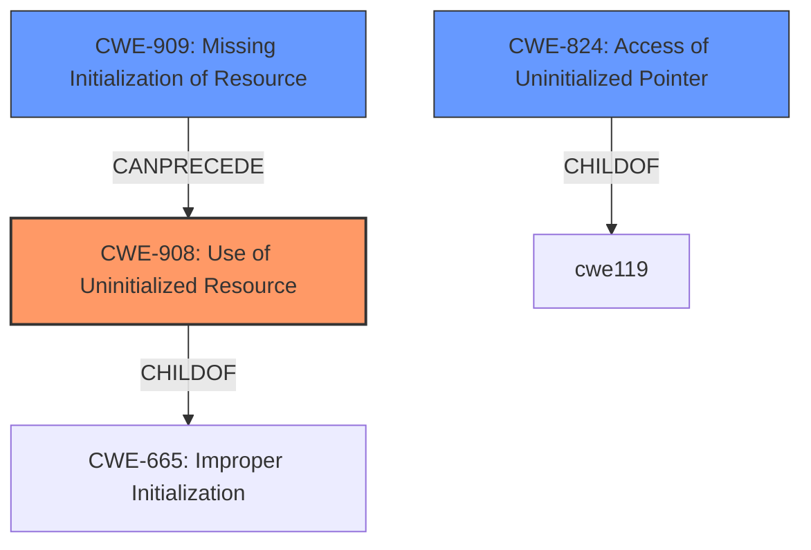

# Analysis Report for CVE-2025-37865

# Vulnerability Analysis Report: CVE-2025-37865

## Description

In the Linux kernel, the following vulnerability has been resolved net dsa mv88e6xxx fix -ENOENT when deleting VLANs and MST is unsupported Russell King reports that on the ZII dev rev B, deleting a bridge VLAN from a user port fails with -ENOENT https//lore.kernel.org/netdev/Z_lQXNP0s5-IiJzd@shell.armlinux.org.uk/ This comes from mv88e6xxx_port_vlan_leave() -> mv88e6xxx_mst_put(), which tries to find an MST entry in &chip->msts associated with the SID, but fails and returns -ENOENT as such. But we know that this chip does not support MST at all, so that is not surprising. The question is why does the guard in mv88e6xxx_mst_put() not exit early if (!sid) return 0 And the answer seems to be simple the sid comes from vlan.sid which supposedly was previously populated by mv88e6xxx_vtu_get(). But some chip->info->ops->vtu_getnext() implementations do not populate vlan.sid, for example see mv88e6185_g1_vtu_getnext(). In that case, later in mv88e6xxx_port_vlan_leave() we are using a **garbage sid** which is just residual stack memory. Testing for sid == 0 covers all cases of a non-bridge VLAN or a bridge VLAN mapped to the default MSTI. For some chips, SID 0 is valid and installed by mv88e6xxx_stu_setup(). A chip which does not support the STU would implicitly only support mapping all VLANs to the default MSTI, so although SID 0 is not valid, it would be sufficient, if we were to zero-initialize the vlan structure, to fix the bug, due to the coincidence that a test for vlan.sid == 0 already exists and leads to the same (correct) behavior. Another option which would be sufficient would be to add a test for mv88e6xxx_has_stu() inside mv88e6xxx_mst_put(), symmetric to the one which already exists in mv88e6xxx_mst_get(). But that placement means the caller will have to dereference vlan.sid, which means it will access **uninitialized memory**, which is not nice even if it ignores it later. So we end up making both modifications, in order to not rely just on the sid == 0 coincidence, but also to avoid having uninitialized structure fields which might get temporarily accessed.

## Vulnerability Description Key Phrases

- **Rootcause:** ['uninitialized memory', 'garbage sid']
- **Weakness:** uninitialized stack memory
- **Impact:** -ENOENT when deleting VLANs
- **Product:** Linux kernel
- **Component:** net dsa mv88e6xxx

## Analysis (with Relationship Data)

# Summary
| CWE ID    | CWE Name                                       | Confidence | CWE Abstraction Level | CWE Vulnerability Mapping Label | CWE-Vulnerability Mapping Notes |
| --------- | ---------------------------------------------- | ---------- | --------------------- | ------------------------------- | ------------------------------- |
| CWE-908   | Use of Uninitialized Resource                  | 0.8        | Base                  | Primary                         | Allowed                         |
| CWE-824   | Access of Uninitialized Pointer                | 0.7        | Base                  | Secondary                       | Allowed                         |
| CWE-909   | Missing Initialization of Resource             | 0.6        | Class                 | Secondary                       | Allowed-with-Review             |

## Evidence and Confidence

*   **Confidence Score:** 0.7
*   **Evidence Strength:** MEDIUM

## Relationship Analysis
The primary CWE is CWE-908, representing the **use of an uninitialized resource**. CWE-824, **access of uninitialized pointer**, and CWE-909, **missing initialization of resource**, are related. CWE-909 can precede CWE-908 as the resource is not initialized first before being used. CWE-824 is a more specific case of CWE-908 when the uninitialized resource is a pointer. CWE-908 is a child of CWE-665 (**Improper Initialization**), indicating a general failure to initialize resources.



## Vulnerability Chain
The vulnerability chain starts with a **missing initialization of a resource** (CWE-909), which leads to a **use of an uninitialized resource** (CWE-908). If the uninitialized resource is a pointer, then **access of an uninitialized pointer** (CWE-824) occurs. The final impact is an error when deleting VLANs.

## Summary of Analysis
The initial analysis focused on the **use of uninitialized memory**, specifically the `vlan.sid` field. The core issue is that some `vtu_getnext()` implementations do not populate this field, leading to the use of **garbage sid** later on. This corresponds to CWE-908 (**Use of Uninitialized Resource**), because the sid is being used while uninitialized.

CWE-824 (**Access of Uninitialized Pointer**) is also relevant, since an uninitialized pointer is being accessed. However, the code doesn't show that the sid is necessarily a pointer. It is a sid that resides in `vlan.sid`. So CWE-824 is a special case of CWE-908, since the resource is not necessarily a pointer.

CWE-909 (**Missing Initialization of Resource**) is also relevant, because the `vlan.sid` field is not being initialized in some cases. This is a prerequisite for CWE-908 since the resource must be missing initialization before it can be used uninitialized.

The evidence strongly suggests that the most accurate classification is CWE-908, as it directly addresses the **use of an uninitialized resource**. The other CWEs are related but represent either a prerequisite or a specific instance of this weakness.

The selection of CWE-908 is at the optimal level of specificity, as it captures the root cause without being overly specific (like focusing solely on pointers) or too general (like only addressing initialization issues).

Relevant CWE Information:

# Enhanced Context (25 CWEs)
The following CWEs were identified as potentially relevant to this vulnerability:

## CWE-824: Access of Uninitialized Pointer
**Abstraction Level**: Base
**Similarity Score**: 0.75
**Source**: dense

**Description**:
The product accesses or uses a pointer that has not been initialized.

**Mapping Guidance**:
- Usage: Allowed
- Rationale: This CWE entry is at the Base level of abstraction, which is a preferred level of abstraction for mapping to the root causes of vulnerabilities.

**Technical Explanation**: The vulnerability description explicitly mentions the **access of uninitialized memory**, which aligns with CWE-824. This can lead to unpredictable behavior and potential security issues.
**Mapping Decision**: Considered as a possible mapping, but the resource in question is not necessarily a pointer, it can be any kind of memory.

## CWE-665: Improper Initialization
**Abstraction Level**: Class
**Similarity Score**: 0.74
**Source**: dense

**Description**:
The product does not initialize or incorrectly initializes a resource, which might leave the resource in an unexpected state when it is accessed or used.

**Mapping Guidance**:
- Usage: Discouraged
- Rationale: This CWE entry is a level-1 Class (i.e., a child of a Pillar). It might have lower-level children that would be more appropriate

**Technical Explanation**: The vulnerability description indicates that the **vlan.sid** field is not being initialized by some implementations, which aligns with CWE-665.
**Mapping Decision**: Considered, but more general than CWE-909.

## CWE-909: Missing Initialization of Resource
**Abstraction Level**: Class
**Similarity Score**: 0.73
**Source**: dense

**Description**:
The product does not initialize a critical resource.

**Mapping Guidance**:
- Usage: Allowed-with-Review
- Rationale: This CWE entry is a Class and might have Base-level children that would be more appropriate

**Technical Explanation**: The vulnerability description indicates that the **vlan.sid** field is not being initialized by some implementations, which aligns with CWE-909.
**Mapping Decision**: Considered as a possible mapping, and more specific than CWE-665. It represents the **missing initialization** of a resource, which is a prerequisite to the eventual **use of the uninitialized resource**.

## CWE-476: NULL Pointer Dereference
**Abstraction Level**: base
**Similarity Score**: 4.33
**Source**: graph

**Description**:
CWE-476: NULL Pointer Dereference

**Mapping Guidance**:
- Usage: Allowed
- Rationale: This CWE entry is at the Base level of abstraction, which is a preferred level of abstraction for mapping to the root causes of vulnerabilities.

**Technical Explanation**: This is not the case because the uninitialized resource is not necessarily a pointer.
**Mapping Decision**: Ruled out. The vulnerability doesn't specifically involve dereferencing a NULL pointer.

## CWE-125: Out-of-bounds Read
**Abstraction Level**: base
**Similarity Score**: 4.33
**Source**: graph

**Description**:
CWE-125: Out-of-bounds Read

**Mapping Guidance**:
- Usage: Allowed
- Rationale: This CWE entry is at the Base level of abstraction, which is a preferred level of abstraction for mapping to the root causes of vulnerabilities.

**Technical Explanation**: This is not the case because the uninitialized resource is not necessarily an out-of-bounds read.
**Mapping Decision**: Ruled out. The vulnerability doesn't involve reading data past the boundaries of a buffer.

## CWE-923: Improper Restriction of Communication Channel to Intended Endpoints
**Abstraction Level**: Class
**Similarity Score**: 0.73
**Source**: dense

**Description**:
The product establishes a communication channel to (or from) an endpoint for privileged or protected operations, but it does not properly ensure that it is communicating with the correct endpoint.

**Mapping Guidance**:
- Usage: Allowed-with-Review
- Rationale: This CWE entry is a Class and might have Base-level children that would be more appropriate

**Technical Explanation**: This is not the case because the uninitialized resource is not part of establishing a communication channel.
**Mapping Decision**: Ruled out. It doesn't appear to involve any communication channel issues.

## CWE-212: Improper Removal of Sensitive Information Before Storage or Transfer
**Abstraction Level**: Class
**Similarity Score**: 0.73
**Source**: dense

**Description**:
The product stores, transfers, or shares a resource that contains sensitive information, but it does not properly remove that information before the product makes the resource available to unauthorized actors.

**Mapping Guidance**:
- Usage: Allowed-with-Review
- Rationale: This CWE entry is a Class and might have Base-level children that would be more appropriate

**Technical Explanation**: This is not the case because the uninitialized resource does not imply any sensitive information.
**Mapping Decision**: Ruled out. The vulnerability doesn't involve sensitive information


## CWE Relationship Analysis

Current CWEs represent these abstraction levels: .


### Vulnerability Chain Analysis

**Chain starting from CWE-476:**
- 476 (NULL Pointer Dereference) - ROOT


**Chain starting from CWE-125:**
- 125 (Out-of-bounds Read) - ROOT


### CWE Relationship Diagram

```mermaid
graph TD
    classDef primary fill:#f96,stroke:#333,stroke-width:2px
    classDef secondary fill:#69f,stroke:#333
    classDef tertiary fill:#9e9,stroke:#333
```


*Report generated on 2025-07-14 21:42:54*
