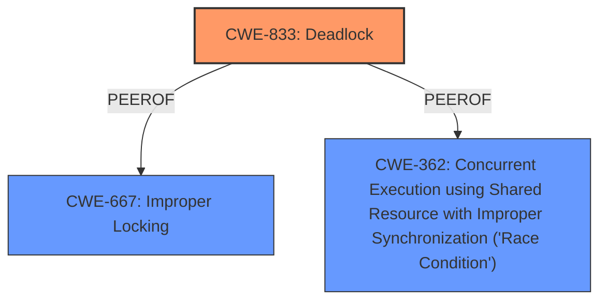

# Raw Analyzer Response for CVE-2025-37868

# Summary

| CWE ID | CWE Name | Confidence | CWE Abstraction Level | CWE Vulnerability Mapping Label | CWE-Vulnerability Mapping Notes |
|---|---|---|---|---|---|
| CWE-833 | Deadlock | 1.0 | Base | Allowed | Primary CWE.  The **deadlock** condition arises directly from the interaction between the notifier and folio locks. |
| CWE-667 | Improper Locking | 0.7 | Class | Allowed-with-Review | Secondary candidate. The root cause of the deadlock is due to **improper locking**, making this a related weakness. |
| CWE-362 | Concurrent Execution using Shared Resource with Improper Synchronization ('Race Condition') | 0.6 | Class | Allowed-with-Review | Secondary candidate.  The **deadlock** occurs during **concurrent execution**, which makes this a related weakness. |

## Evidence and Confidence

*   **Confidence Score:** 0.9
*   **Evidence Strength:** HIGH

## Relationship Analysis

The primary relationship that influenced my decision was the direct identification of a **deadlock** situation.

-   CWE-833 (Deadlock) is a Base level CWE, making it a good fit for describing the specific **deadlock** issue.
-   CWE-667 (Improper Locking) is a Class level CWE and a parent of CWE-609 (Double-Checked Locking), which is related to concurrency issues.
-   CWE-362 (Concurrent Execution using Shared Resource with Improper Synchronization ('Race Condition')) is a Class level CWE and a parent of CWE-367 (Time-of-check Time-of-use (TOCTOU) Race Condition) and CWE-368 (Context Switching Race Condition), all of which describe race conditions and concurrency.

## Vulnerability Chain

The vulnerability chain starts with concurrent access to shared resources, leading to **improper locking**, and ultimately resulting in a **deadlock**.

1.  Concurrent Access to Shared Resources: Multiple threads attempt to access the same resources.
2.  **Improper Locking** (CWE-667): The product does not properly acquire or release a lock on a resource.
3.  **Deadlock** (CWE-833): Threads wait for each other to release locks, resulting in a standstill.

## Summary of Analysis

The primary indicator of this vulnerability is the **notifier vs folio deadlock**. The vulnerability description explicitly mentions this **deadlock**, making CWE-833 the most relevant choice. Both Retriever Results and Vulnerability Description Key Phrases support this selection. The description clearly states a **deadlock** condition caused by locking conflicts between the notifier and folio mechanisms within the Linux kernel.

CWE-667 and CWE-362 are included as secondary CWEs because they are related. CWE-667 represents the **improper locking** condition that leads to the **deadlock**. CWE-362 describes the concurrent execution context in which the **deadlock** occurs.

The selection of CWE-833, CWE-667, and CWE-362 provides a comprehensive view of the vulnerability, covering the **deadlock** itself, the **improper locking** that causes it, and the concurrent execution environment where it manifests.

Relevant CWE Information:

# Enhanced Context (25 CWEs)
The following CWEs were identified as potentially relevant to this vulnerability:

## CWE-833: Deadlock
**Abstraction Level**: Base
**Similarity Score**: 0.77
**Source**: dense

**Description**:
The product contains multiple threads or executable segments that are waiting for each other to release a necessary lock, resulting in deadlock.

**Mapping Guidance**:
- Usage: Allowed
- Rationale: This CWE entry is at the Base level of abstraction, which is a preferred level of abstraction for mapping to the root causes of vulnerabilities.

**Technical Explanation:**

*   **CWE-833 (Deadlock)**: This CWE perfectly matches the vulnerability description because the core issue is a **deadlock** between the notifier and folio locks. The description states, "notifier vs folio deadlock, where migrate_pages_batch() on core kernel side is holding folio lock(s) and then interacting with the mappings of it, however those mappings are tied to some userptr, which means calling into the notifier callback and grabbing the notifier lock."
    *   **Security Implications:** A **deadlock** can cause the system to become unresponsive, leading to denial of service.
    *   **Relationship:** CWE-833 is a Base-level CWE, making it a specific and appropriate choice.
    *   **Primary Weakness:** This is the primary weakness.
    *   **Mapping Guidance:** The Usage is "Allowed," and the Rationale states that this CWE entry is at the Base level of abstraction.

## CWE-667: Improper Locking
**Abstraction Level**: Class
**Similarity Score**: 0.77
**Source**: dense

**Description**:
The product does not properly acquire or release a lock on a resource, leading to unexpected resource state changes and behaviors.

**Mapping Guidance**:
- Usage: Allowed-with-Review
- Rationale: This CWE entry is a Class and might have Base-level children that would be more appropriate

**Technical Explanation:**

*   **CWE-667 (Improper Locking)**: This CWE is related to the vulnerability because the **deadlock** is a consequence of **improper locking**. The description mentions that the folio locks are contended from the notifier/migrate_pages_batch side.
    *   **Security Implications:** **Improper locking** can lead to race conditions, data corruption, and denial of service.
    *   **Relationship:** CWE-667 is a Class-level CWE, and a parent of more specific locking-related CWEs.
    *   **Secondary Weakness:** This is a secondary weakness that contributes to the primary **deadlock**.
    *   **Mapping Guidance:** The Usage is "Allowed-with-Review," and the Rationale suggests that lower-level children might be more appropriate, but given the lack of specific details, this is a reasonable choice.

## CWE-362: Concurrent Execution using Shared Resource with Improper Synchronization ('Race Condition')
**Abstraction Level**: Class
**Similarity Score**: 0.72
**Source**: dense

**Description**:
The product contains a concurrent code sequence that requires temporary, exclusive access to a shared resource, but a timing window exists in which the shared resource can be modified by another code sequence operating concurrently.

**Mapping Guidance**:
- Usage: Allowed-with-Review
- Rationale: This CWE entry is a Class and might have Base-level children that would be more appropriate

**Technical Explanation:**

*   **CWE-362 (Concurrent Execution using Shared Resource with Improper Synchronization ('Race Condition'))**: This CWE is also related because the **deadlock** occurs due to concurrent access to the folio data structure.
    *   **Security Implications:** Race conditions can lead to unpredictable behavior, data corruption, and denial of service.
    *   **Relationship:** CWE-362 is a Class-level CWE and a parent of more specific race condition-related CWEs.
    *   **Secondary Weakness:** This is a secondary weakness, describing the environment in which the **deadlock** occurs.
    *   **Mapping Guidance:** The Usage is "Allowed-with-Review," and the Rationale suggests that lower-level children might be more appropriate, but given the lack of specific details, this is a reasonable choice.

**CWEs Considered But Not Used:**

*   CWE-367 (Time-of-check Time-of-use (TOCTOU) Race Condition): While the vulnerability involves concurrency, there's no explicit mention of a TOCTOU condition.
*   CWE-61 (UNIX Symbolic Link (Symlink) Following): This CWE is not relevant because the vulnerability does not involve symbolic links.
*   CWE-125 (Out-of-bounds Read): This CWE is not relevant because the vulnerability does not involve reading data out of bounds.
*   CWE-755 (Improper Handling of Exceptional Conditions), CWE-754 (Improper Check for Unusual or Exceptional Conditions), CWE-703 (Improper Check or Handling of Exceptional Conditions), CWE-252 (Unchecked Return Value), CWE-1285 (Improper Validation of Specified Index, Position, or Offset in Input), and CWE-404 (Improper Resource Shutdown or Release): These CWEs are not relevant to the vulnerability description.