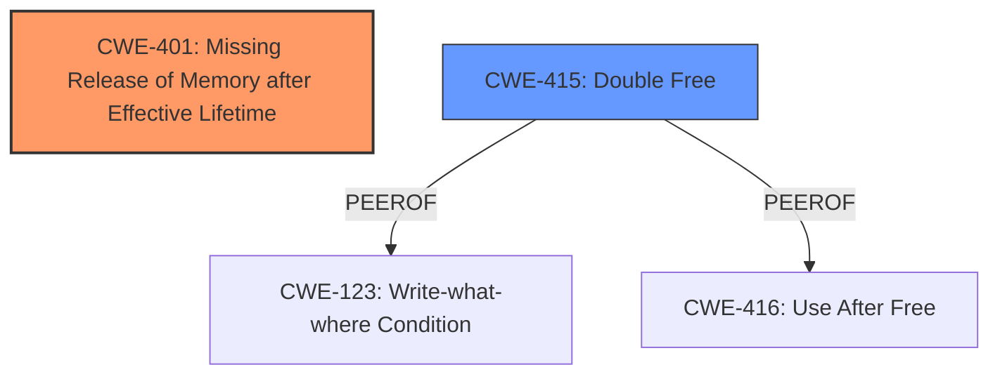

# Analysis Report for CVE-2025-37872

# Vulnerability Analysis Report: CVE-2025-37872

## Description

In the Linux kernel, the following vulnerability has been resolved net txgbe fix memory leak in txgbe_probe() error path When txgbe_sw_init() is called, memory is allocated for wx->rss_key in wx_init_rss_key(). However, in txgbe_probe() function, the subsequent error paths after txgbe_sw_init() dont free the rss_key. Fix that by freeing it in error path along with wx->mac_table. Also change the label to which execution jumps when txgbe_sw_init() fails, because otherwise, it could lead to a double free for rss_key, when the mac_table allocation fails in wx_sw_init().

## Vulnerability Description Key Phrases

- **Component:** net txgbe fix memory leak in txgbe_probe
- **Rootcause:** dont free rss_key in error path after txgbe_sw_init
- **Weakness:** memory leak, double free
- **Product:** Linux kernel
- **Impact:** memory leak

## Analysis (with Relationship Data)

# Summary

| CWE ID | CWE Name | Confidence | CWE Abstraction Level | CWE Vulnerability Mapping Label | CWE-Vulnerability Mapping Notes |
|---|---|---|---|---|---|
| CWE-401 | Missing Release of Memory after Effective Lifetime | 1.0 | Variant | Primary | Allowed |
| CWE-415 | Double Free | 0.75 | Variant | Secondary | Allowed |

## Evidence and Confidence

*   **Confidence Score:** 0.9
*   **Evidence Strength:** HIGH

## Relationship Analysis

The primary relationship influencing the CWE selection is that CWE-415 (Double Free) can occur due to a failure to properly manage memory, which is encompassed by CWE-401 (Missing Release of Memory after Effective Lifetime). While both are present, CWE-401 is the root cause. There are also peer relationships between CWE-415, CWE-123 (Write-what-where Condition), and CWE-416 (Use After Free), suggesting they can all stem from similar memory management issues.



## Vulnerability Chain

The vulnerability chain starts with the **failure to free allocated memory** in the error path (`CWE-401`). This can eventually lead to a **double free** (`CWE-415`) if the same memory is later freed again.

## Summary of Analysis

The vulnerability description clearly indicates a **memory leak** due to a **failure to free** the `rss_key` in certain error paths within the `txgbe_probe()` function. This directly aligns with `CWE-401 (Missing Release of Memory after Effective Lifetime)`. The description also mentions that without the fix, a **double free** could occur, aligning with `CWE-415 (Double Free)`.

Evidence:
- "**rootcause:** **dont free rss_key in error path after txgbe_sw_init**"
- "**weakness:** **memory leak, double free**"

`CWE-401` is selected as the primary CWE because it represents the root cause. The `rss_key` isn't freed when it should be, which then creates the possibility of a double free. `CWE-415` is a secondary CWE because the vulnerability description explicitly mentions the potential for a double free if the initial memory leak is not addressed.

The other CWEs listed in the Retriever Results were considered but not selected as primary or secondary because they did not directly align with the specific details of the vulnerability description. For example, race conditions (`CWE-362, CWE-364`) and improper locking (`CWE-667`) were not mentioned in the description. Similarly, `CWE-911 (Improper Update of Reference Count)` and `CWE-909 (Missing Initialization of Resource)` do not accurately reflect the **memory leak** and potential **double free** described. `CWE-789 (Memory Allocation with Excessive Size Value)` is also not relevant as there is no mention of excessive memory allocation. `CWE-59 (Improper Link Resolution Before File Access ('Link Following'))` does not apply since it is a file system issue. `CWE-123 (Write-what-where Condition)` is too general and doesn't specifically address the memory management issues present in the vulnerability.
The selected CWEs are at the variant level of abstraction, representing specific memory management issues, which is appropriate given the detail in the vulnerability description.

Relevant CWE Information:
*   **CWE-401:** Missing Release of Memory after Effective Lifetime
    *   **Technical Explanation:** Memory is allocated but not freed in certain error conditions, leading to a memory leak.
    *   **Security Implications:** Memory leaks can lead to resource exhaustion and system instability.
    *   **Relationship to Vulnerability:** The vulnerability description states that the `rss_key` is not freed in error paths, which is a direct instance of a missing memory release.
*   **CWE-415:** Double Free
    *   **Technical Explanation:** The same memory address is freed multiple times, leading to memory corruption.
    *   **Security Implications:** Double frees can lead to arbitrary code execution and denial of service.
    *   **Relationship to Vulnerability:** The vulnerability description mentions the potential for a double free if the memory leak is not addressed.


## CWE Relationship Analysis

Current CWEs represent these abstraction levels: .


### Vulnerability Chain Analysis

**Chain starting from CWE-123:**
- 123 (Write-what-where Condition) - ROOT


**Chain starting from CWE-416:**
- 416 (Use After Free) - ROOT


### CWE Relationship Diagram

```mermaid
graph TD
    classDef primary fill:#f96,stroke:#333,stroke-width:2px
    classDef secondary fill:#69f,stroke:#333
    classDef tertiary fill:#9e9,stroke:#333
```


*Report generated on 2025-07-14 21:44:23*
