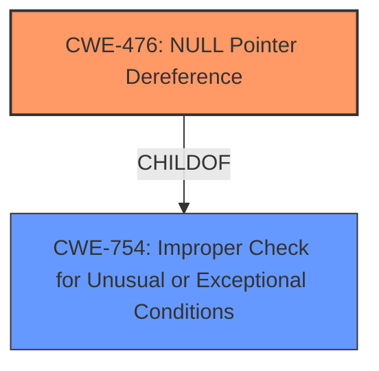

# Analysis for CVE-2025-37881

# Summary
| CWE ID | CWE Name | Confidence | CWE Abstraction Level | CWE Vulnerability Mapping Label | CWE-Vulnerability Mapping Notes |
|---|---|---|---|---|---|
| CWE-476 | NULL Pointer Dereference | 1.0 | Base | Primary CWE | Allowed |

## Evidence and Confidence

*   **Confidence Score:** 1.0
*   **Evidence Strength:** HIGH

## Relationship Analysis
The primary relationship that influenced my decision was the ChildOf relationship between CWE-476 (NULL Pointer Dereference) and CWE-754 (Improper Check for Unusual or Exceptional Conditions). CWE-476 is a specific type of improper check, but the description clearly states the issue is a potential **NULL pointer dereference**, making CWE-476 the more accurate and specific choice. Other relationships like CanFollow and CanPrecede with other CWEs such as CWE-789, CWE-362, CWE-252, and CWE-1325 did not have much bearing since the problem was directly related to a **NULL pointer dereference**.

## Vulnerability Chain
The vulnerability chain is quite simple:
1.  The `devm_kasprintf()` function may return a NULL pointer.
2.  The returned pointer `d->name` is then used without a check.
3.  If `d->name` is NULL, it will result in a **NULL pointer dereference**, leading to a crash or other undefined behavior.

## Summary of Analysis
The vulnerability description explicitly mentions a potential **NULL pointer dereference**, which aligns perfectly with CWE-476. The fix implemented was adding a pointer check to prevent this dereference, further reinforcing the choice of CWE-476. The retriever results also list CWE-476 as the top candidate with a high score, which is further supported by the graph relationships. The description is very clear and direct, providing sufficient evidence for a confident mapping to CWE-476.

Relevant CWE Information:

# Enhanced Context (25 CWEs)
The following CWEs were identified as potentially relevant to this vulnerability:

## CWE-476: NULL Pointer Dereference
**Abstraction Level**: Base
**Similarity Score**: 0.75
**Source**: dense

**Description**:
The product dereferences a pointer that it expects to be valid but is NULL.

**Mapping Guidance**:
- Usage: Allowed
- Rationale: This CWE entry is at the Base level of abstraction, which is a preferred level of abstraction for mapping to the root causes of vulnerabilities.

## CWE-252: Unchecked Return Value
**Abstraction Level**: Base
**Similarity Score**: 0.73
**Source**: dense

**Description**:
The product does not check the return value from a method or function, which can prevent it from detecting unexpected states and conditions.

**Mapping Guidance**:
- Usage: Allowed
- Rationale: This CWE entry is at the Base level of abstraction, which is a preferred level of abstraction for mapping to the root causes of vulnerabilities.

## CWE-665: Improper Initialization
**Abstraction Level**: Class
**Similarity Score**: 0.71
**Source**: dense

**Description**:
The product does not initialize or incorrectly initializes a resource, which might leave the resource in an unexpected state when it is accessed or used.

**Mapping Guidance**:
- Usage: Discouraged
- Rationale: This CWE entry is a level-1 Class (i.e., a child of a Pillar). It might have lower-level children that would be more appropriate

## CWE-824: Access of Uninitialized Pointer
**Abstraction Level**: Base
**Similarity Score**: 0.74
**Source**: dense

**Description**:
The product accesses or uses a pointer that has not been initialized.

**Mapping Guidance**:
- Usage: Allowed
- Rationale: This CWE entry is at the Base level of abstraction, which is a preferred level of abstraction for mapping to the root causes of vulnerabilities.

## CWE-822: Untrusted Pointer Dereference
**Abstraction Level**: Base
**Similarity Score**: 0.73
**Source**: dense

**Description**:
The product obtains a value from an untrusted source, converts this value to a pointer, and dereferences the resulting pointer.

**Mapping Guidance**:
- Usage: Allowed
- Rationale: This CWE entry is at the Base level of abstraction, which is a preferred level of abstraction for mapping to the root causes of vulnerabilities.

## CWE-456: Missing Initialization of a Variable
**Abstraction Level**: Variant
**Similarity Score**: 510.07
**Source**: sparse

**Description**:
The product does not initialize critical variables, which causes the execution environment to use unexpected values.

**Mapping Guidance**:
- Usage: Allowed
- Rationale: This CWE entry is at the Variant level of abstraction, which is a preferred level of abstraction for mapping to the root causes of vulnerabilities.

**CWE-476: NULL Pointer Dereference**
The product dereferences a pointer that it expects to be valid but is NULL. The vulnerability description mentions "A pointer check is added to prevent potential **NULL pointer dereference**." This directly aligns with the definition of CWE-476. The security implication is a potential crash or undefined behavior.

**CWE-252: Unchecked Return Value**
The product does not check the return value from a method or function, which can prevent it from detecting unexpected states and conditions. While this CWE is related, as the `devm_kasprintf()` function's return value isn't checked, the core issue is the **dereference** of a potentially NULL pointer, not the unchecked return itself. Therefore, CWE-476 is more precise.

**CWE-665: Improper Initialization**
The product does not initialize or incorrectly initializes a resource, which might leave the resource in an unexpected state when it is accessed or used. This is a broader class, and while it could be argued that the pointer isn't properly initialized (by checking for NULL), CWE-476 is a more specific and accurate representation of the problem.

**CWE-824: Access of Uninitialized Pointer**
The product accesses or uses a pointer that has not been initialized. This is similar to CWE-476, but in this case, the pointer is not "uninitialized" in the sense of not being assigned a value; it's potentially assigned a NULL value. CWE-476 directly addresses the **NULL pointer dereference**.

**CWE-822: Untrusted Pointer Dereference**
The product obtains a value from an untrusted source, converts this value to a pointer, and dereferences the resulting pointer. This CWE is not applicable, as the pointer value isn't coming from an "untrusted source."

**CWE-456: Missing Initialization of a Variable**
The product does not initialize critical variables, which causes the execution environment to use unexpected values. This is similar to CWE-665.