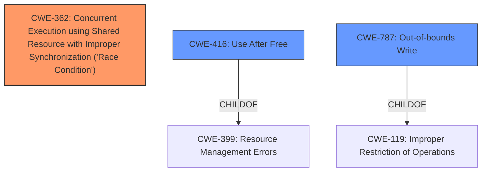

# Raw Analyzer Response for CVE-2025-37882

# Summary

| CWE ID | CWE Name | Confidence | CWE Abstraction Level | CWE Vulnerability Mapping Label | CWE-Vulnerability Mapping Notes |
|---|---|---|---|---|---|
| CWE-362 | Concurrent Execution using Shared Resource with Improper Synchronization ('**Race Condition**') | 0.9 | Class | Allowed-with-Review | Primary CWE: The vulnerability description explicitly mentions a "**race condition**" as the root cause, making this the primary CWE. |
| CWE-416 | Use After Free | 0.8 | Variant | Allowed | Secondary Candidate: The description includes "**buffer UAF**," which is a type of use-after-free vulnerability. |
| CWE-787 | Out-of-bounds Write | 0.7 | Base | Allowed | Secondary Candidate: The vulnerability can lead to memory corruption, which can manifest as an out-of-bounds write. |

## Evidence and Confidence

*   **Confidence Score:** 0.8
*   **Evidence Strength:** MEDIUM

## Relationship Analysis

The primary CWE, CWE-362, is a Class-level CWE. While more specific Base or Variant CWEs exist for race conditions, the description doesn't provide enough detail to pinpoint a more specific type of race condition.

CWE-416 and CWE-787 are related to memory corruption. CWE-416 (Use After Free) is a Variant of CWE-399 (Resource Management Errors), while CWE-787 (Out-of-bounds Write) is a Base CWE.

## Vulnerability Chain

The vulnerability chain starts with a **race condition** (CWE-362) triggered by IRQ handling delays. This **race condition** leads to missed service errors and incorrect processing of transfer descriptors (TDs). The incorrect processing can then lead to either a use-after-free (CWE-416) or out-of-bounds write (CWE-787), resulting in data loss or memory corruption.

CWE-362 (Race Condition) -> Incorrect TD processing -> CWE-416 (Use After Free) / CWE-787 (Out-of-bounds Write) -> Data Loss / Memory Corruption

## Summary of Analysis

The primary weakness is a **race condition** in the handling of USB xHCI isochronous ring events, specifically triggered by delays in IRQ handling. The "**race condition**" allows for the incorrect processing of TDs, which can then lead to memory corruption vulnerabilities like "**buffer UAF**" (CWE-416) or out-of-bounds write (CWE-787).

The selection of CWE-362 as the primary CWE is strongly supported by the vulnerability description's explicit mention of a "**race condition**" as the root cause. The retriever results also list CWE-362 as the top candidate.

CWE-416 and CWE-787 are included as secondary CWEs because they represent potential consequences of the incorrect TD processing caused by the **race condition**. The vulnerability description mentions "**buffer UAF**," making CWE-416 a relevant secondary CWE. The potential for memory corruption also makes CWE-787 a plausible secondary CWE.

The evidence for these CWEs comes directly from the vulnerability description: "I can trigger this **race** by rising interrupt moderation to increase IRQ handling delay... It could be given back prematurely, risking data loss or **buffer UAF** by the xHC."

The chosen CWEs are at an appropriate level of specificity. While more specific variants of race conditions might exist, the description doesn't provide enough detail to make that determination. CWE-416 is a Variant (Use After Free), and CWE-787 is a Base (Out-of-bounds Write).

Relevant CWE Information:
# Enhanced Context (25 CWEs)
The following CWEs were identified as potentially relevant to this vulnerability:

## CWE-362: Concurrent Execution using Shared Resource with Improper Synchronization ('Race Condition')
**Abstraction Level**: Class
**Similarity Score**: 0.77
**Source**: dense

**Description**:
The product contains a concurrent code sequence that requires temporary, exclusive access to a shared resource, but a timing window exists in which the shared resource can be modified by another code sequence operating concurrently.

**Mapping Guidance**:
- Usage: Allowed-with-Review
- Rationale: This CWE entry is a Class and might have Base-level children that would be more appropriate

## CWE-366: Race Condition within a Thread
**Abstraction Level**: Base
**Similarity Score**: 0.77
**Source**: dense

**Description**:
If two threads of execution use a resource simultaneously, there exists the possibility that resources may be used while invalid, in turn making the state of execution undefined.

**Mapping Guidance**:
- Usage: Allowed
- Rationale: This CWE entry is at the Base level of abstraction, which is a preferred level of abstraction for mapping to the root causes of vulnerabilities.

## CWE-367: Time-of-check Time-of-use (TOCTOU) Race Condition
**Abstraction Level**: Base
**Similarity Score**: 0.76
**Source**: dense

**Description**:
The product checks the state of a resource before using that resource, but the resource's state can change between the check and the use in a way that invalidates the results of the check. This can cause the product to perform invalid actions when the resource is in an unexpected state.

**Mapping Guidance**:
- Usage: Allowed
- Rationale: This CWE entry is at the Base level of abstraction, which is a preferred level of abstraction for mapping to the root causes of vulnerabilities.

## CWE-191: Integer Underflow (Wrap or Wraparound)
**Abstraction Level**: Base
**Similarity Score**: 0.75
**Source**: dense

**Description**:
The product subtracts one value from another, such that the result is less than the minimum allowable integer value, which produces a value that is not equal to the correct result.

**Mapping Guidance**:
- Usage: Allowed
- Rationale: This CWE entry is at the Base level of abstraction, which is a preferred level of abstraction for mapping to the root causes of vulnerabilities.

## CWE-667: Improper Locking
**Abstraction Level**: Class
**Similarity Score**: 0.74
**Source**: dense

**Description**:
The product does not properly acquire or release a lock on a resource, leading to unexpected resource state changes and behaviors.

**Mapping Guidance**:
- Usage: Allowed-with-Review
- Rationale: This CWE entry is a Class and might have Base-level children that would be more appropriate

## CWE-754: Improper Check for Unusual or Exceptional Conditions
**Abstraction Level**: Class
**Similarity Score**: 0.73
**Source**: dense

**Description**:
The product does not check or incorrectly checks for unusual or exceptional conditions that are not expected to occur frequently during day to day operation of the product.

**Mapping Guidance**:
- Usage: Allowed-with-Review
- Rationale: This CWE entry is a Class and might have Base-level children that would be more appropriate

## CWE-755: Improper Handling of Exceptional Conditions
**Abstraction Level**: Class
**Similarity Score**: 0.72
**Source**: dense

**Description**:
The product does not handle or incorrectly handles an exceptional condition.

**Mapping Guidance**:
- Usage: Discouraged
- Rationale: This CWE entry is a level-1 Class (i.e., a child of a Pillar). It might have lower-level children that would be more appropriate

## CWE-131: Incorrect Calculation of Buffer Size
**Abstraction Level**: Base
**Similarity Score**: 0.72
**Source**: dense

**Description**:
The product does not correctly calculate the size to be used when allocating a buffer, which could lead to a buffer overflow.

**Mapping Guidance**:
- Usage: Allowed
- Rationale: This CWE entry is at the Base level of abstraction, which is a preferred level of abstraction for mapping to the root causes of vulnerabilities.

## CWE-703: Improper Check or Handling of Exceptional Conditions
**Abstraction Level**: Pillar
**Similarity Score**: 0.72
**Source**: dense

**Description**:
The product does not properly anticipate or handle exceptional conditions that rarely occur during normal operation of the product.

**Mapping