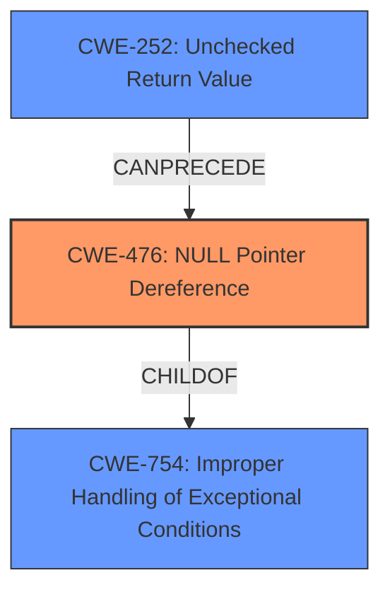

# Enhanced Analysis for CVE-2025-37910

# Summary
| CWE ID | CWE Name | Confidence | CWE Abstraction Level | CWE Vulnerability Mapping Label | CWE-Vulnerability Mapping Notes |
|---|---|---|---|---|---|
| CWE-476 | NULL Pointer Dereference | 1.0 | Base | Primary | Allowed |

## Evidence and Confidence

*   **Confidence Score:** 1.0
*   **Evidence Strength:** HIGH

## Relationship Analysis
The primary CWE is CWE-476, which is a Base level CWE. The vulnerability description explicitly mentions a **NULL pointer dereference**, making this a direct and strong match. Other CWEs like CWE-252, CWE-665, CWE-824, and CWE-908 were considered but deemed less specific. There are no significant parent-child or chain relationships that strongly influence the selection of CWE-476 in this specific context.



## Vulnerability Chain
The vulnerability chain is straightforward:
1.  **Root Cause:** **NULL** pointers `irig` and `dcf` are not initialized in the Adva board SMA sysfs operations.
2.  **Weakness:** The code attempts to dereference these **NULL** pointers.
3.  **Impact:** Kernel crash due to **NULL pointer dereference**.

## Summary of Analysis
The analysis is strongly based on the explicit mention of "NULL dereference" and "**NULL pointer dereference**" in the vulnerability description. The retriever results also highlight CWE-476 as the top candidate. The vulnerability description clearly states that the `irig` and `dcf` pointers are uninitialized, leading to a **NULL pointer dereference**.

The selected CWE, CWE-476, is at the optimal level of specificity because it directly addresses the root cause. Other CWEs considered, such as CWE-665 (Improper Initialization) and CWE-824 (Access of Uninitialized Pointer), are related but less precise than CWE-476, which specifically describes the dereferencing of a **NULL** pointer.

Relevant CWE Information:

# Enhanced Context (25 CWEs)

## CWE-476: NULL Pointer Dereference
**Abstraction Level**: Base
**Similarity Score**: 0.76
**Source**: dense

**Description**:
The product dereferences a pointer that it expects to be valid but is NULL.

**Mapping Guidance**:
- Usage: Allowed
- Rationale: This CWE entry is at the Base level of abstraction, which is a preferred level of abstraction for mapping to the root causes of vulnerabilities.

## CWE-252: Unchecked Return Value
**Abstraction Level**: Base
**Similarity Score**: 0.75
**Source**: dense

**Description**:
The product does not check the return value from a method or function, which can prevent it from detecting unexpected states and conditions.

**Mapping Guidance**:
- Usage: Allowed
- Rationale: This CWE entry is at the Base level of abstraction, which is a preferred level of abstraction for mapping to the root causes of vulnerabilities.

## CWE-665: Improper Initialization
**Abstraction Level**: Class
**Similarity Score**: 0.74
**Source**: dense

**Description**:
The product does not initialize or incorrectly initializes a resource, which might leave the resource in an unexpected state when it is accessed or used.

**Mapping Guidance**:
- Usage: Discouraged
- Rationale: This CWE entry is a level-1 Class (i.e., a child of a Pillar). It might have lower-level children that would be more appropriate

## CWE-824: Access of Uninitialized Pointer
**Abstraction Level**: Base
**Similarity Score**: 0.76
**Source**: dense

**Description**:
The product accesses or uses a pointer that has not been initialized.

**Mapping Guidance**:
- Usage: Allowed
- Rationale: This CWE entry is at the Base level of abstraction, which is a preferred level of abstraction for mapping to the root causes of vulnerabilities.

## CWE-908: Use of Uninitialized Resource
**Abstraction Level**: Base
**Similarity Score**: 0.76
**Source**: sparse

**Description**:
The product uses or accesses a resource that has not been initialized.

**Mapping Guidance**:
- Usage: Allowed
- Rationale: This CWE entry is at the Base level of abstraction, which is a preferred level of abstraction for mapping to the root causes of vulnerabilities.

CWEs Considered but Not Used:

*   CWE-252 (Unchecked Return Value): While a missing check could lead to a **NULL** pointer, the description focuses on the dereference itself, not the missing check.
*   CWE-665 (Improper Initialization): This is a broader category. While the pointers were not initialized, the core issue is the dereference of the **NULL** pointer.
*   CWE-824 (Access of Uninitialized Pointer): Similar to CWE-665, this is less specific than CWE-476, which explicitly involves dereferencing a **NULL** pointer.
*   CWE-908 (Use of Uninitialized Resource): Similar to CWE-665 and CWE-824, this is less specific than CWE-476, which explicitly involves dereferencing a **NULL** pointer.


## CWE Relationship Analysis

Current CWEs represent these abstraction levels: .


### Vulnerability Chain Analysis

**Chain starting from CWE-476:**
- 476 (NULL Pointer Dereference) - ROOT


**Chain starting from CWE-824:**
- 824 (Access of Uninitialized Pointer) - ROOT


### CWE Relationship Diagram

```mermaid
graph TD
    classDef primary fill:#f96,stroke:#333,stroke-width:2px
    classDef secondary fill:#69f,stroke:#333
    classDef tertiary fill:#9e9,stroke:#333
```