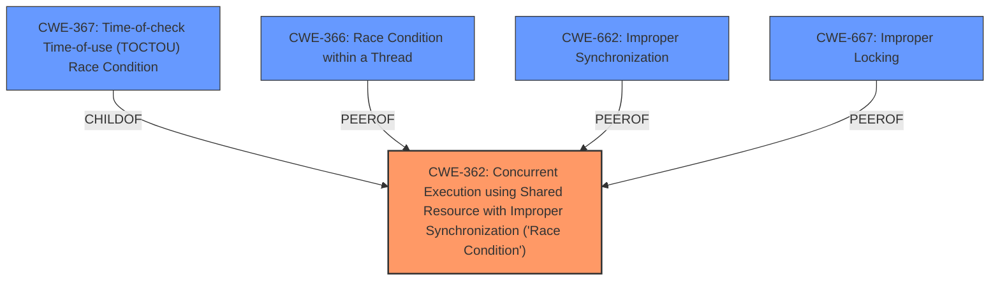

# Raw Analyzer Response for CVE-2025-37920

# Summary
| CWE ID | CWE Name | Confidence | CWE Abstraction Level | CWE Vulnerability Mapping Label | CWE-Vulnerability Mapping Notes |
|---|---|---|---|---|---|
| **CWE-362** | Concurrent Execution using Shared Resource with Improper Synchronization ('**Race Condition**') | 0.9 | Class | Primary | Allowed-with-Review |
| CWE-366 | **Race Condition** within a Thread | 0.7 | Base | Secondary Candidate | Allowed |
| CWE-662 | Improper Synchronization | 0.6 | Class | Secondary Candidate | Discouraged |
| CWE-367 | Time-of-check Time-of-use (TOCTOU) **Race Condition** | 0.5 | Base | Secondary Candidate | Allowed |
| CWE-667 | Improper Locking | 0.5 | Class | Secondary Candidate | Allowed-with-Review |

## Evidence and Confidence

*   **Confidence Score:** 0.8
*   **Evidence Strength:** HIGH

## Relationship Analysis
The primary CWE is CWE-362, which is a Class-level CWE. More specific Base-level CWEs like CWE-366, CWE-364, and CWE-367 are considered but ultimately not chosen as primary due to the evidence best aligning with the general concept of concurrent execution with improper synchronization. CWE-662 and CWE-667 are also considered because synchronization issues are related. CWE-362 is a parent of CWE-367.

## Vulnerability Chain
The vulnerability chain starts with a **race condition** in the AF_XDP generic RX path due to multiple sockets sharing a single xsk_buff_pool without proper synchronization. This leads to potential data corruption or other undefined behaviors when two CPU cores access the RX path of different sockets concurrently. The final impact is data corruption or system instability. The **root cause** is the **improper synchronization** in a concurrent execution environment.

## Summary of Analysis
The vulnerability description clearly states a **race condition** in the Linux kernel's AF_XDP generic RX path. The core issue is that multiple sockets sharing the same umem are not properly synchronized, leading to concurrent access and potential data races.

The primary CWE selected is CWE-362 Concurrent Execution using Shared Resource with Improper Synchronization ('**Race Condition**'). This aligns directly with the vulnerability description and the key phrase "**race condition**". The vulnerability occurs because multiple CPU cores can access the RX path of different sockets that share the same umem, highlighting concurrent execution with improper synchronization.

Other CWEs were considered but not selected as primary:

*   CWE-366 (**Race Condition** within a Thread): While the vulnerability does involve threads (CPU cores), it is more broadly about concurrent execution and shared resources, making CWE-362 a better fit.
*   CWE-662 Improper Synchronization: This is a related CWE, but CWE-362 is more specific in the context of a **race condition**.
*   CWE-367 Time-of-check Time-of-use (TOCTOU) **Race Condition**: This is a specific type of **race condition** that doesn't fully capture the described vulnerability. The description doesn't explicitly mention a check-then-use scenario.
*   CWE-667 Improper Locking: The fix involves acquiring a spinlock, suggesting a locking issue, but the broader problem is the lack of synchronization across concurrent executions, making CWE-362 more appropriate.

The decision to use CWE-362 is strongly supported by the vulnerability description, which explicitly mentions a **race condition** in the AF_XDP generic RX path due to shared resources and lack of synchronization. The fix of using spinlocks further indicates a synchronization issue. The retriever results also rank CWE-362 as the top candidate. The abstraction level of Class is acceptable as it captures the general weakness, and there isn't a more specific Base or Variant CWE that fully aligns with all aspects of the vulnerability.