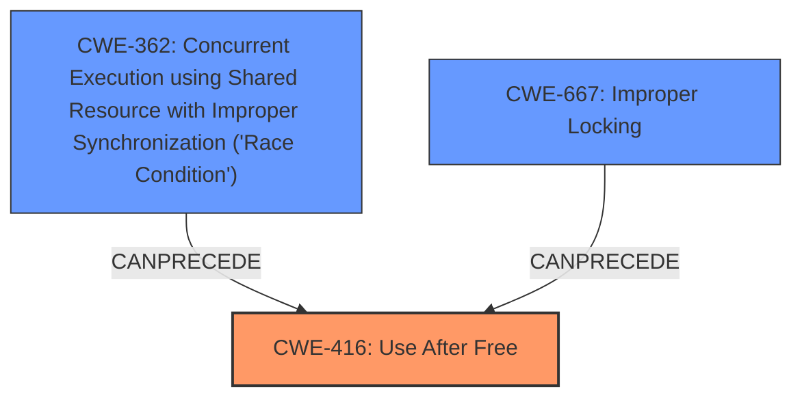

# Enhanced Analysis for CVE-2025-37926

# Summary
| CWE ID | CWE Name | Confidence | CWE Abstraction Level | CWE Vulnerability Mapping Label | CWE-Vulnerability Mapping Notes |
|---|---|---|---|---|---|
| CWE-416 | Use After Free | 0.9 | Variant |  Primary | Allowed |
| CWE-362 | Concurrent Execution using Shared Resource with Improper Synchronization ('Race Condition') | 0.8 | Class | Secondary | Allowed-with-Review |
| CWE-667 | Improper Locking | 0.7 | Class | Secondary | Allowed-with-Review |

## Evidence and Confidence

*   **Confidence Score:** 0.8
*   **Evidence Strength:** HIGH

## Relationship Analysis
The primary weakness is CWE-416 **Use After Free**. This can be caused by a race condition, which is represented by CWE-362 **Concurrent Execution using Shared Resource with Improper Synchronization ('Race Condition')**. The race condition can be a result of **improper locking**, CWE-667. Therefore, CWE-362 and CWE-667 can precede CWE-416. CWE-416 is a variant of a memory corruption issue. The abstraction levels influenced the selection, favoring the more specific variant CWE-416, while recognizing the contributing factors at the class level.



## Vulnerability Chain
The vulnerability chain starts with a **race condition** (CWE-362) that is caused by **improper locking** (CWE-667). The race condition leads to a **use-after-free** (CWE-416) vulnerability.

## Summary of Analysis
The vulnerability description clearly states a **use-after-free** (**UAF**) condition occurring due to a **race condition**. The suggested CWEs in the 'Keyphrase-Specific CWE Analysis' section pointed towards **CWE-416 Use After Free**, **CWE-362 Concurrent Execution using Shared Resource with Improper Synchronization ('Race Condition')**, and **CWE-667 Improper Locking**.

The root cause is the **race condition** (CWE-362) between `ksmbd_session_rpc_open()` and `__session_rpc_close()`. This race condition leads to a **use-after-free** vulnerability (CWE-416). The suggested fix is to "Add rpc_lock to the session to protect it", indicating **improper locking** (CWE-667) as a contributing factor to the race condition.

The final decision is to classify the vulnerability as primarily CWE-416, with secondary classifications for CWE-362 and CWE-667 to capture the full context of the vulnerability. The chosen CWEs are at the optimal level of specificity, with CWE-416 being a Variant and CWE-362 and CWE-667 being Classes.

CWEs considered but not used:

*   CWE-364 Signal Handler Race Condition: This is too specific, as the race condition isn't explicitly tied to signal handlers.
*   CWE-367 Time-of-check Time-of-use (TOCTOU) Race Condition: While a TOCTOU could be involved, the description doesn't highlight a check/use sequence. The core issue is a general race condition leading to UAF.
*   CWE-662 Improper Synchronization: This is a more general case of CWE-667 and CWE-362.
*   CWE-703, CWE-754: These are too abstract. We have more concrete CWEs available.
*   CWE-824, CWE-476: These issues may be related, but they're more about the result of UAF.

Relevant CWE Information:


## CWE Relationship Analysis

Current CWEs represent these abstraction levels: .


### Vulnerability Chain Analysis

**Chain starting from CWE-662:**
- 662 (Improper Synchronization) - ROOT


**Chain starting from CWE-416:**
- 416 (Use After Free) - ROOT


### CWE Relationship Diagram

```mermaid
graph TD
    classDef primary fill:#f96,stroke:#333,stroke-width:2px
    classDef secondary fill:#69f,stroke:#333
    classDef tertiary fill:#9e9,stroke:#333
```