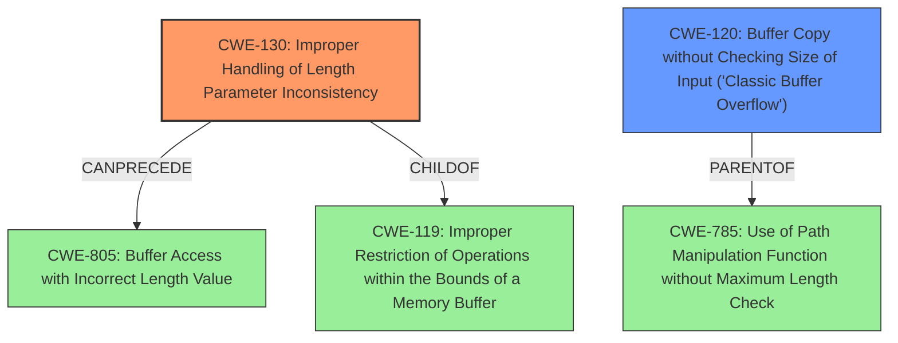

# Enhanced Analysis for CVE-2025-37927

# Summary

| CWE ID  | CWE Name                                                                 | Confidence | CWE Abstraction Level | CWE Vulnerability Mapping Label | CWE-Vulnerability Mapping Notes |
| :-------- | :----------------------------------------------------------------------- | :---------- | :-------------------- | :------------------------------ | :-------------------------------- |
| CWE-130   | Improper Handling of Length Parameter Inconsistency                    | 0.9         | Base                  | Primary                         | Allowed                           |
| CWE-120   | Buffer Copy without Checking Size of Input ('Classic Buffer Overflow') | 0.8         | Base                  | Secondary                       | Allowed-with-Review             |

## Evidence and Confidence

*   **Confidence Score:** 0.85
*   **Evidence Strength:** HIGH

## Relationship Analysis

The primary CWE is CWE-130 Improper Handling of Length Parameter Inconsistency, which can lead to buffer overflows. CWE-120 Buffer Copy without Checking Size of Input ('Classic Buffer Overflow') is a consequence of the improper handling of the length parameter. CWE-130 can precede CWE-805 and it is related to CWE-119 through the child-of relationship. CWE-120 is a parent of CWE-785.



## Vulnerability Chain

The vulnerability chain starts with a **string parsing logic error** (CWE-130), where the lengths of the hid and uid strings are not properly validated. This leads to a **buffer overflow** (CWE-120) when copying these strings into their respective buffers.

## Summary of Analysis

The initial assessment based on the vulnerability description and retriever results points to a **buffer overflow** due to a **string parsing logic error**. The primary cause is the **improper handling of length parameters** (CWE-130). The vulnerability description explicitly mentions that the check is insufficient because it doesn't take into account the lengths of individual hid and uid buffers. This aligns with CWE-130, where the product does not handle or incorrectly handles a length field.

The evidence from the vulnerability description: "Comparing ACPIID_LEN against a total string length doesnt take into account the lengths of individual hid and uid buffers so the check is insufficient in some cases. For example if the length of hid string is 4 and the length of the uid string is 260, the length of str will be equal to ACPIID_LEN + 1 but uid string will overflow uid buffer which size is 256." supports this.

CWE-130 is at the optimal level of specificity because it accurately describes the **root cause** of the vulnerability, which is the incorrect handling of length parameters during string parsing.
CWE-120 is added because the result of the incorrect handling is a **buffer overflow**, though this is a consequence of the root cause.

Relevant CWE Information:

# Enhanced Context (25 CWEs)

## CWE-131: Incorrect Calculation of Buffer Size
**Abstraction Level**: Base
**Similarity Score**: 0.76
**Source**: dense

**Description**:
The product does not correctly calculate the size to be used when allocating a buffer, which could lead to a buffer overflow.

**Mapping Guidance**:
- Usage: Allowed
- Rationale: This CWE entry is at the Base level of abstraction, which is a preferred level of abstraction for mapping to the root causes of vulnerabilities.

*   **Why it was considered but not used**: While related to buffer overflows, the issue isn't an incorrect calculation of the buffer size itself, but rather an incorrect handling of the length of the input being copied into the buffer.

## CWE-191: Integer Underflow (Wrap or Wraparound)
**Abstraction Level**: Base
**Similarity Score**: 0.76
**Source**: dense

**Description**:
The product subtracts one value from another, such that the result is less than the minimum allowable integer value, which produces a value that is not equal to the correct result.

**Mapping Guidance**:
- Usage: Allowed
- Rationale: This CWE entry is at the Base level of abstraction, which is a preferred level of abstraction for mapping to the root causes of vulnerabilities.

*   **Why it was considered but not used**: Integer underflow is not the primary issue.

## CWE-193: Off-by-one Error
**Abstraction Level**: Base
**Similarity Score**: 0.74
**Source**: dense

**Description**:
A product calculates or uses an incorrect maximum or minimum value that is 1 more, or 1 less, than the correct value.

**Mapping Guidance**:
- Usage: Allowed
- Rationale: This CWE entry is at the Base level of abstraction, which is a preferred level of abstraction for mapping to the root causes of vulnerabilities.

*   **Why it was considered but not used**: This is not the case as the logic **error** is in how the lengths are handled and it's more than one off.

## CWE-805: Buffer Access with Incorrect Length Value
**Abstraction Level**: Base
**Similarity Score**: 0.74
**Source**: dense

**Description**:
The product uses a sequential operation to read or write a buffer, but it uses an incorrect length value that causes it to access memory that is outside of the bounds of the buffer.

**Mapping Guidance**:
- Usage: Allowed
- Rationale: This CWE entry is at the Base level of abstraction, which is a preferred level of abstraction for mapping to the root causes of vulnerabilities.

*   **Why it was considered but not used**: While this is a consequence, the **root cause** is the improper handling of the length parameter inconsistency.

## CWE-119: Improper Restriction of Operations within the Bounds of a Memory Buffer
**Abstraction Level**: Class
**Similarity Score**: 0.73
**Source**: dense

**Description**:
The product performs operations on a memory buffer, but it reads from or writes to a memory location outside the buffer's intended boundary. This may result in read or write operations on unexpected memory locations that could be linked to other variables, data structures, or internal program data.

**Mapping Guidance**:
- Usage: Discouraged
- Rationale: CWE-119 is commonly misused in low-information vulnerability reports when lower-level CWEs could be used instead, or when more details about the vulnerability are available.

*   **Why it was considered but not used**: This is a general class of errors related to buffer overflows, and more specific CWEs exist.

## CWE-1285: Improper Validation of Specified Index, Position, or Offset in Input
**Abstraction Level**: Base
**Similarity Score**: 0.73
**Source**: dense

**Description**:
The product receives input that is expected to specify an index, position, or offset into an indexable resource such as a buffer or file, but it does not validate or incorrectly validates that the specified index/position/offset has the required properties.

**Mapping Guidance**:
- Usage: Allowed
- Rationale: This CWE entry is at the Base level of abstraction, which is a preferred level of abstraction for mapping to the root causes of vulnerabilities.

*   **Why it was considered but not used**: While related to validation, the primary issue is the inconsistency between the expected and actual lengths, not necessarily the validation of an index or offset.

## CWE-252: Unchecked Return Value
**Abstraction Level**: Base
**Similarity Score**: 0.73
**Source**: dense

**Description**:
The product does not check the return value from a method or function, which can prevent it from detecting unexpected states and conditions.

**Mapping Guidance**:
- Usage: Allowed
- Rationale: This CWE entry is at the Base level of abstraction, which is a preferred level of abstraction for mapping to the root causes of vulnerabilities.

*   **Why it was considered but not used**: There is no mention of unchecked return values.

## CWE-703: Improper Check or Handling of Exceptional Conditions
**Abstraction Level**: Pillar
**Similarity Score**: 0.72
**Source**: dense

**Description**:
The product does not properly anticipate or handle exceptional conditions that rarely occur during normal operation of the product.

**Mapping Guidance**:
- Usage: Disc


## CWE Relationship Analysis

Current CWEs represent these abstraction levels: .


### Vulnerability Chain Analysis

**Chain starting from CWE-130:**
- 130 (Improper Handling of Length Parameter Inconsistency) - ROOT


**Chain starting from CWE-805:**
- 805 (Buffer Access with Incorrect Length Value) - ROOT


### CWE Relationship Diagram

```mermaid
graph TD
    classDef primary fill:#f96,stroke:#333,stroke-width:2px
    classDef secondary fill:#69f,stroke:#333
    classDef tertiary fill:#9e9,stroke:#333
```