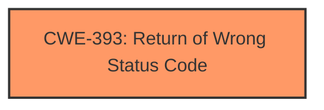

# Analysis Report for CVE-2025-37936

# Vulnerability Analysis Report: CVE-2025-37936

## Description

In the Linux kernel, the following vulnerability has been resolved **perf/x86/intel KVM Mask PEBS_ENABLE loaded for guest with vCPUs value**. **When generating the MSR_IA32_PEBS_ENABLE value that will be loaded on VM-Entry to a KVM guest, mask the value with the vCPUs desired PEBS_ENABLE value.** Consulting only the host kernels host vs. guest masks results in running the guest with PEBS enabled even when the guest doesnt want to use PEBS. Because KVM uses perf events to proxy the guest virtual PMU, simply looking at exclude_host cant differentiate between events created by host userspace, and events created by KVM on behalf of the guest. Running the guest with PEBS unexpectedly enabled typically manifests as crashes due to a near-infinite stream of #PFs. E.g. if the guest hasnt written MSR_IA32_DS_AREA, the CPU will hit page faults on address 0 when trying to record PEBS events. The issue is most easily reproduced by running `perf kvm top` from before commit 7b100989b4f6 (perf evlist Remove __evlist__add_default) (after which, `perf kvm top` effectively stopped using PEBS). The userspace side of perf creates a guest-only PEBS event, which intel_guest_get_msrs() misconstrues a guest-*owned* PEBS event. Arguably, this is a userspace bug, as enabling PEBS on guest-only events simply cannot work, and userspace can kill VMs in many other ways (there is no danger to the host). However, even if this is considered to be bad userspace behavior, theres zero downside to perf/KVM restricting PEBS to guest-owned events. Note, commit 854250329c02 (KVM x86/pmu Disable guest PEBS temporarily in two rare situations) fixed the case where host userspace is profiling KVM *and* userspace, but missed the case where userspace is profiling only KVM.

## Vulnerability Description Key Phrases

- **Rootcause:** When generating the MSR_IA32_PEBS_ENABLE value that will be loaded on VM-Entry to a KVM guest, mask the value with the vCPUs desired PEBS_ENABLE value.
- **Weakness:** perf/x86/intel KVM Mask PEBS_ENABLE loaded for guest with vCPUs value
- **Impact:** crashes
- **Vector:** near-infinite stream of #PFs
- **Product:** Linux kernel
- **Version:** before commit 7b100989b4f6
- **Component:** perf/x86/intel KVM

## Analysis (with Relationship Data)

# Summary
| CWE ID | CWE Name | Confidence | CWE Abstraction Level | CWE Vulnerability Mapping Label | CWE-Vulnerability Mapping Notes |
|---|---|---|---|---|---|
| CWE-393 | Return of Wrong Status Code | 0.75 | Base | Primary CWE | Allowed |

## Evidence and Confidence

*   **Confidence Score:** 0.75
*   **Evidence Strength:** MEDIUM

## Relationship Analysis
The primary identified CWE is CWE-393, which is a Base level CWE. There are no strong parent-child or chain relationships evident from the provided information that would suggest a more appropriate CWE. The relationships listed in the Complete CWE Specifications for CWE-393 do not strongly relate to the vulnerability description.



## Vulnerability Chain
The vulnerability chain appears to be:
1.  **Root Cause:** **Incorrect masking of the MSR\_IA32\_PEBS\_ENABLE value.** This leads to...
2.  **Weakness:** **PEBS\_ENABLE loaded for guest with vCPUs value**, resulting in...
3.  **Impact:** Crashes due to a near-infinite stream of #PFs.

The primary CWE, CWE-393, represents the root cause, where an incorrect value is used, leading to incorrect behavior.

## Summary of Analysis
The initial analysis focused on identifying the root cause of the vulnerability, which is the incorrect masking of the MSR\_IA32\_PEBS\_ENABLE value. The "Retriever Results" suggested several potential CWEs, including CWE-393, CWE-909, and CWE-754.

CWE-393, **Return of Wrong Status Code**, was selected because the **root cause** described involves generating an incorrect value that is then used, leading to the vulnerability. Although "Return of Wrong Status Code" doesn't perfectly describe the situation, it aligns better than other options in describing the **incorrect** value that caused the issue.

The selection is based primarily on the vulnerability description's statement: "When generating the MSR_IA32_PEBS_ENABLE value that will be loaded on VM-Entry to a KVM guest, mask the value with the vCPUs desired PEBS_ENABLE value."

While there may be other contributing factors or related weaknesses, the evidence available points most strongly to the use of an incorrect value as the primary cause.

Relevant CWE Information:

# Enhanced Context (25 CWEs)
The following CWEs were identified as potentially relevant to this vulnerability:

## CWE-667: Improper Locking
**Abstraction Level**: Class
**Similarity Score**: 0.71
**Source**: dense

**Description**:
The product does not properly acquire or release a lock on a resource, leading to unexpected resource state changes and behaviors.

**Mapping Guidance**:
- Usage: Allowed-with-Review
- Rationale: This CWE entry is a Class and might have Base-level children that would be more appropriate


## CWE-362: Concurrent Execution using Shared Resource with Improper Synchronization ('Race Condition')
**Abstraction Level**: Class
**Similarity Score**: 0.70
**Source**: dense

**Description**:
The product contains a concurrent code sequence that requires temporary, exclusive access to a shared resource, but a timing window exists in which the shared resource can be modified by another code sequence operating concurrently.

**Mapping Guidance**:
- Usage: Allowed-with-Review
- Rationale: This CWE entry is a Class and might have Base-level children that would be more appropriate


## CWE-1285: Improper Validation of Specified Index, Position, or Offset in Input
**Abstraction Level**: Base
**Similarity Score**: 0.70
**Source**: dense

**Description**:
The product receives input that is expected to specify an index, position, or offset into an indexable resource such as a buffer or file, but it does not validate or incorrectly validates that the specified index/position/offset has the required properties.

**Mapping Guidance**:
- Usage: Allowed
- Rationale: This CWE entry is at the Base level of abstraction, which is a preferred level of abstraction for mapping to the root causes of vulnerabilities.


## CWE-909: Missing Initialization of Resource
**Abstraction Level**: Class
**Similarity Score**: 0.70
**Source**: dense

**Description**:
The product does not initialize a critical resource.

**Mapping Guidance**:
- Usage: Allowed-with-Review
- Rationale: This CWE entry is a Class and might have Base-level children that would be more appropriate


## CWE-755: Improper Handling of Exceptional Conditions
**Abstraction Level**: Class
**Similarity Score**: 0.70
**Source**: dense

**Description**:
The product does not handle or incorrectly handles an exceptional condition.

**Mapping Guidance**:
- Usage: Discouraged
- Rationale: This CWE entry is a level-1 Class (i.e., a child of a Pillar). It might have lower-level children that would be more appropriate


## CWE-404: Improper Resource Shutdown or Release
**Abstraction Level**: Class
**Similarity Score**: 0.70
**Source**: dense

**Description**:
The product does not release or incorrectly releases a resource before it is made available for re-use.

**Mapping Guidance**:
- Usage: Allowed-with-Review
- Rationale: This CWE entry is a Class and might have Base-level children that would be more appropriate


## CWE-754: Improper Check for Unusual or Exceptional Conditions
**Abstraction Level**: Class
**Similarity Score**: 0.69
**Source**: dense

**Description**:
The product does not check or incorrectly checks for unusual or exceptional conditions that are not expected to occur frequently during day to day operation of the product.

**Mapping Guidance**:
- Usage: Allowed-with-Review
- Rationale: This CWE entry is a Class and might have Base-level children that would be more appropriate


## CWE-696: Incorrect Behavior Order
**Abstraction Level**: Class
**Similarity Score**: 0.69
**Source**: dense

**Description**:
The product performs multiple related behaviors, but the behaviors are performed in the wrong order in ways which may produce resultant weaknesses.

**Mapping Guidance**:
- Usage: Allowed-with-Review
- Rationale: This CWE entry is a Class and might have Base-level children that would be more appropriate


## CWE-252: Unchecked Return Value
**Abstraction Level**: Base
**Similarity Score**: 0.69
**Source**: dense

**Description**:
The product does not check the return value from a method or function, which can prevent it from detecting unexpected states and conditions.

**Mapping Guidance**:
- Usage: Allowed
- Rationale: This CWE entry is at the Base level of abstraction, which is a preferred level of abstraction for mapping to the root causes of vulnerabilities.


## CWE-703: Improper Check or Handling of Exceptional Conditions
**Abstraction Level**: Pillar
**Similarity Score**: 0.69
**Source**: dense

**Description**:
The product does not properly anticipate or handle exceptional conditions that rarely occur during normal operation of the product.

**Mapping Guidance**:
- Usage: Discouraged
- Rationale: This CWE entry is extremely high-level, a Pillar.


## CWE-393: Return of Wrong Status Code
**Abstraction Level**: Base
**Similarity Score**: 816.99
**Source**: sparse

**Description**:
A function or operation returns an incorrect return value or status code that does not indicate an error, but causes the product to modify its behavior based on the incorrect result.

**Mapping Guidance**:
- Usage: Allowed
- Rationale: This CWE entry is at the Base level of abstraction, which is a preferred level of abstraction for mapping to the root causes of vulnerabilities.


## CWE-754: Improper Check for Unusual or Exceptional Conditions
**Abstraction Level**: Class
**Similarity Score**: 808.03
**Source**: sparse

**Description**:
The product does not check or incorrectly checks for unusual or exceptional conditions that are not expected to occur frequently during day to day operation of the product.

**Mapping Guidance**:
- Usage: Allowed-with-Review
- Rationale: This CWE entry is a Class and might have Base-level children that would be more appropriate


## CWE-909: Missing Initialization of Resource
**Abstraction Level**: Class
**Similarity Score**: 790.79
**Source**: sparse

**Description**:
The product does not initialize a critical resource.

**Mapping Guidance**:
- Usage: Allowed-with-Review
- Rationale: This CWE entry is a Class and might have Base-level children that would be more appropriate


## CWE-362: Concurrent Execution using Shared Resource with Improper Synchronization ('Race Condition')
**Abstraction Level**: Class
**Similarity Score**: 787.45
**Source**: sparse

**Description**:
The product contains a concurrent code sequence that requires temporary, exclusive access to a shared resource, but a timing window exists in which the shared resource can be modified by another code sequence operating concurrently.

**Mapping Guidance**:
- Usage: Allowed-with-Review


## CWE Relationship Analysis

Current CWEs represent these abstraction levels: .


### Vulnerability Chain Analysis

**Chain starting from CWE-404:**
- 404 (Improper Resource Shutdown or Release) - ROOT


**Chain starting from CWE-667:**
- 667 (Improper Locking) - ROOT


### CWE Relationship Diagram

```mermaid
graph TD
    classDef primary fill:#f96,stroke:#333,stroke-width:2px
    classDef secondary fill:#69f,stroke:#333
    classDef tertiary fill:#9e9,stroke:#333
```


*Report generated on 2025-07-14 21:56:54*
