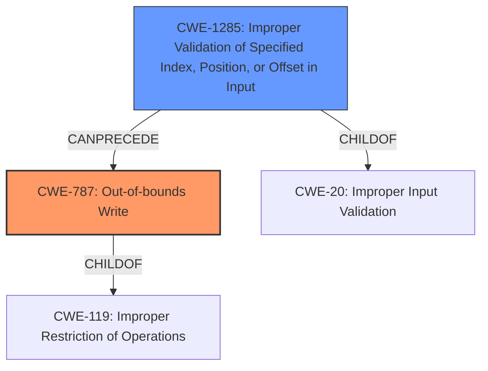

# Analysis Report for CVE-2025-37943

# Vulnerability Analysis Report: CVE-2025-37943

## Description

In the Linux kernel, the following vulnerability has been resolved wifi ath12k Fix invalid data access in ath12k_dp_rx_h_undecap_nwifi In certain cases, hardware might provide packets with a length greater than the maximum native Wi-Fi header length. This can lead to **accessing and modifying fields in the header within the ath12k_dp_rx_h_undecap_nwifi function** for DP_RX_DECAP_TYPE_NATIVE_WIFI decap type and potentially resulting in invalid data access and memory corruption. Add a sanity check before processing the SKB to prevent invalid data access in the undecap native Wi-Fi function for the DP_RX_DECAP_TYPE_NATIVE_WIFI decap type. Tested-on QCN9274 hw2.0 PCI WLAN.WBE.1.3.1-00173-QCAHKSWPL_SILICONZ-1

## Vulnerability Description Key Phrases

- **Component:** wifi ath12k
- **Rootcause:** accessing and modifying fields in the header within the ath12k_dp_rx_h_undecap_nwifi function
- **Vector:** hardware might provide packets with a length greater than the maximum native Wi-Fi header length
- **Weakness:** memory corruption, weakness
- **Product:** Linux kernel
- **Impact:** invalid data access

## Analysis (with Relationship Data)

# Summary

| CWE ID | CWE Name | Confidence | CWE Abstraction Level | CWE Vulnerability Mapping Label | CWE-Vulnerability Mapping Notes |
|---|---|---|---|---|---|
| CWE-787 | Out-of-bounds Write | 1.0 | Base | Allowed | Primary CWE |
| CWE-1285 | Improper Validation of Specified Index, Position, or Offset in Input | 0.7 | Base | Allowed | Secondary Candidate |

## Evidence and Confidence

*   **Confidence Score:** 0.85
*   **Evidence Strength:** HIGH

## Relationship Analysis
The primary relationship is that CWE-787 [CWE-787: Out-of-bounds Write] is a type of memory safety violation that can be caused by improper index validation, as suggested by the potential secondary CWE, CWE-1285 [CWE-1285: Improper Validation of Specified Index, Position, or Offset in Input]. The abstraction levels are appropriate, with CWE-787 being a Base level and CWE-1285 also being a Base level.



## Vulnerability Chain
The vulnerability chain starts with the hardware providing packets with an invalid length. This leads to **accessing and modifying fields in the header within the ath12k_dp_rx_h_undecap_nwifi function**, resulting in an **out-of-bounds write** (CWE-787) and **memory corruption**. A missing link is the specific validation mechanism that is failing, which would connect the invalid hardware input to the out-of-bounds write.

## Summary of Analysis
Based on the provided evidence, the primary weakness is CWE-787 [CWE-787: Out-of-bounds Write], due to the **accessing and modifying fields in the header**, which results in **memory corruption**. The vulnerability description clearly states this. The retriever results also list CWE-787 as the top result.

CWE-1285 [CWE-1285: Improper Validation of Specified Index, Position, or Offset in Input] is a plausible secondary weakness because the root cause involves hardware providing packets with a length greater than the maximum, which implies a failure to validate the length/size of the packet before processing it. While not explicitly stated, the vulnerability's resolution (adding a sanity check) suggests this.

CWE-119 [CWE-119: Improper Restriction of Operations within the Bounds of a Memory Buffer] was considered, but the description is too high level. While it is true that an out-of-bounds write falls under the umbrella of CWE-119, CWE-787 is more specific.

# Enhanced Context (25 CWEs)
The following CWEs were identified as potentially relevant to this vulnerability:

## CWE-1285: Improper Validation of Specified Index, Position, or Offset in Input
**Abstraction Level**: Base
**Similarity Score**: 0.76
**Source**: dense

**Description**:
The product receives input that is expected to specify an index, position, or offset into an indexable resource such as a buffer or file, but it does not validate or incorrectly validates that the specified index/position/offset has the required properties.

**Mapping Guidance**:
- Usage: Allowed
- Rationale: This CWE entry is at the Base level of abstraction, which is a preferred level of abstraction for mapping to the root causes of vulnerabilities.

## CWE-191: Integer Underflow (Wrap or Wraparound)
**Abstraction Level**: Base
**Similarity Score**: 0.74
**Source**: dense

**Description**:
The product subtracts one value from another, such that the result is less than the minimum allowable integer value, which produces a value that is not equal to the correct result.

**Mapping Guidance**:
- Usage: Allowed
- Rationale: This CWE entry is at the Base level of abstraction, which is a preferred level of abstraction for mapping to the root causes of vulnerabilities.

## CWE-131: Incorrect Calculation of Buffer Size
**Abstraction Level**: Base
**Similarity Score**: 0.74
**Source**: dense

**Description**:
The product does not correctly calculate the size to be used when allocating a buffer, which could lead to a buffer overflow.

**Mapping Guidance**:
- Usage: Allowed
- Rationale: This CWE entry is at the Base level of abstraction, which is a preferred level of abstraction for mapping to the root causes of vulnerabilities.

## CWE-755: Improper Handling of Exceptional Conditions
**Abstraction Level**: Class
**Similarity Score**: 0.74
**Source**: dense

**Description**:
The product does not handle or incorrectly handles an exceptional condition.

**Mapping Guidance**:
- Usage: Discouraged
- Rationale: This CWE entry is a level-1 Class (i.e., a child of a Pillar). It might have lower-level children that would be more appropriate

## CWE-252: Unchecked Return Value
**Abstraction Level**: Base
**Similarity Score**: 0.74
**Source**: dense

**Description**:
The product does not check the return value from a method or function, which can prevent it from detecting unexpected states and conditions.

**Mapping Guidance**:
- Usage: Allowed
- Rationale: This CWE entry is at the Base level of abstraction, which is a preferred level of abstraction for mapping to the root causes of vulnerabilities.

## CWE-134: Use of Externally-Controlled Format String
**Abstraction Level**: Base
**Similarity Score**: 0.74
**Source**: dense

**Description**:
The product uses a function that accepts a format string as an argument, but the format string originates from an external source.

**Mapping Guidance**:
- Usage: Allowed
- Rationale: This CWE entry is at the Base level of abstraction, which is a preferred level of abstraction for mapping to the root causes of vulnerabilities.

## CWE-703: Improper Check or Handling of Exceptional Conditions
**Abstraction Level**: Pillar
**Similarity Score**: 0.73
**Source**: dense

**Description**:
The product does not properly anticipate or handle exceptional conditions that rarely occur during normal operation of the product.

**Mapping Guidance**:
- Usage: Discouraged
- Rationale: This CWE entry is extremely high-level, a Pillar.

## CWE-824: Access of Uninitialized Pointer
**Abstraction Level**: Base
**Similarity Score**: 0.73
**Source**: dense

**Description**:
The product accesses or uses a pointer that has not been initialized.

**Mapping Guidance**:
- Usage: Allowed
- Rationale: This CWE entry is at the Base level of abstraction, which is a preferred level of abstraction for mapping to the root causes of vulnerabilities.

## CWE-119: Improper Restriction of Operations within the Bounds of a Memory Buffer
**Abstraction Level**: Class
**Similarity Score**: 0.73
**Source**: dense

**Description**:
The product performs operations on a memory buffer, but it reads from or writes to a memory location outside the buffer's intended boundary. This may result in read or write operations on unexpected memory locations that could be linked to other variables, data structures, or internal program data.

**Mapping Guidance**:
- Usage: Discouraged
- Rationale: CWE-119 is commonly misused in low-information vulnerability reports when lower-level CWEs could be used instead, or when more details about the vulnerability are available.

## CWE-908: Use of Uninitialized Resource
**Abstraction Level**: Base
**Similarity Score**: 0.73
**Source**: dense

**Description**:
The product uses or accesses a resource that has not been initialized.

**Mapping Guidance**:
- Usage: Allowed
- Rationale: This CWE entry is at the Base level of abstraction, which is a preferred level of abstraction for mapping to the root causes of vulnerabilities.

## CWE-1285: Improper Validation of Specified Index, Position, or Offset in Input
**Abstraction Level**: Base
**Similarity Score**: 625.32
**Source**: sparse

**Description**:
The product receives input that is expected to specify an index, position, or offset into an indexable resource such as a buffer or file, but it does not validate or incorrectly validates that the specified index/position/offset has the required properties.

**Mapping Guidance**:
- Usage: Allowed
- Rationale: This CWE entry is at the Base level of abstraction, which is a preferred level of abstraction for mapping to the root causes of vulnerabilities


## CWE Relationship Analysis

Current CWEs represent these abstraction levels: .


### Vulnerability Chain Analysis

**Chain starting from CWE-131:**
- 131 (Incorrect Calculation of Buffer Size) - ROOT


**Chain starting from CWE-787:**
- 787 (Out-of-bounds Write) - ROOT


### CWE Relationship Diagram

```mermaid
graph TD
    classDef primary fill:#f96,stroke:#333,stroke-width:2px
    classDef secondary fill:#69f,stroke:#333
    classDef tertiary fill:#9e9,stroke:#333
```


*Report generated on 2025-07-14 21:57:54*
