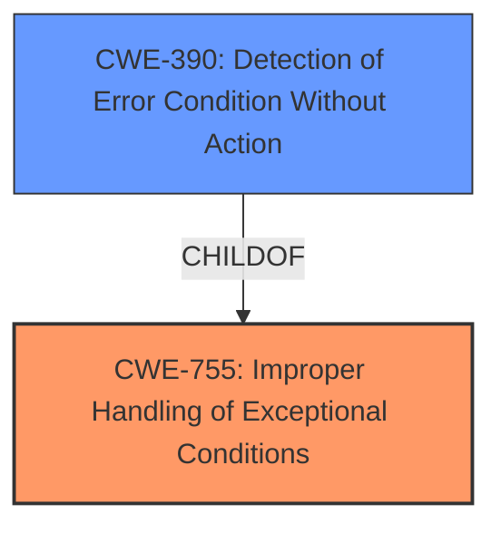

# Analysis Report for CVE-2025-37959

# Vulnerability Analysis Report: CVE-2025-37959

## Description

In the Linux kernel, the following vulnerability has been resolved bpf Scrub packet on bpf_redirect_peer When bpf_redirect_peer is used to redirect packets to a device in another network namespace, the skb isnt scrubbed. That can lead skb information from one namespace to be misused in another namespace. As one example, this is causing Cilium to drop traffic when using bpf_redirect_peer to redirect packets that just went through IPsec decryption to a container namespace. The following pwru trace shows (1) the packet path from the hosts XFRM layer to the containers XFRM layer where its dropped and (2) the number of active skb extensions at each function. NETNS MARK IFACE TUPLE FUNC 4026533547 d00 eth0 10.244.3.12435473->10.244.2.15853 xfrm_rcv_cb .active_extensions = (__u8)2, 4026533547 d00 eth0 10.244.3.12435473->10.244.2.15853 xfrm4_rcv_cb .active_extensions = (__u8)2, 4026533547 d00 eth0 10.244.3.12435473->10.244.2.15853 gro_cells_receive .active_extensions = (__u8)2, [...] 4026533547 0 eth0 10.244.3.12435473->10.244.2.15853 skb_do_redirect .active_extensions = (__u8)2, 4026534999 0 eth0 10.244.3.12435473->10.244.2.15853 ip_rcv .active_extensions = (__u8)2, 4026534999 0 eth0 10.244.3.12435473->10.244.2.15853 ip_rcv_core .active_extensions = (__u8)2, [...] 4026534999 0 eth0 10.244.3.12435473->10.244.2.15853 udp_queue_rcv_one_skb .active_extensions = (__u8)2, 4026534999 0 eth0 10.244.3.12435473->10.244.2.15853 __xfrm_policy_check .active_extensions = (__u8)2, 4026534999 0 eth0 10.244.3.12435473->10.244.2.15853 __xfrm_decode_session .active_extensions = (__u8)2, 4026534999 0 eth0 10.244.3.12435473->10.244.2.15853 security_xfrm_decode_session .active_extensions = (__u8)2, 4026534999 0 eth0 10.244.3.12435473->10.244.2.15853 kfree_skb_reason(SKB_DROP_REASON_XFRM_POLICY) .active_extensions = (__u8)2, In this case, there are no XFRM policies in the containers network namespace so the drop is unexpected. When we decrypt the IPsec packet, the XFRM state used for decryption is set in the skb extensions. This information is preserved across the netns switch. When we reach the XFRM policy check in the containers netns, __xfrm_policy_check drops the packet with LINUX_MIB_XFRMINNOPOLS because a (container-side) XFRM policy cant be found that matches the (host-side) XFRM state used for decryption. This patch fixes this by scrubbing the packet when using bpf_redirect_peer, as is done on typical netns switches via veth devices except skb->mark and skb->tstamp are not zeroed.

## Vulnerability Description Key Phrases

- **Impact:** drop traffic
- **Product:** Linux kernel
- **Component:** bpf_redirect_peer

## Analysis (with Relationship Data)

# Summary

| CWE ID  | CWE Name                                                                                         | Confidence | CWE Abstraction Level | CWE Vulnerability Mapping Label | CWE-Vulnerability Mapping Notes |
| :-------- | :------------------------------------------------------------------------------------------------- | :--------- | :---------------------- | :-------------------------------- | :-------------------------------- |
| CWE-703   | Improper Check or Handling of Exceptional Conditions                                        | 0.75      | Class                    | Primary                           | Allowed-with-Review                |
| CWE-390   | Detection of Error Condition Without Action    | 0.60      | Base                    | Secondary                           | Allowed                            |

## Evidence and Confidence

*   **Confidence Score:** 0.70
*   **Evidence Strength:** MEDIUM

## Relationship Analysis

The primary weakness is the **improper handling of exceptional conditions** (CWE-755), specifically the condition where the skb isn't scrubbed when `bpf_redirect_peer` is used. This leads to information leakage between network namespaces. The related weakness is the **detection of the error condition without taking action** (CWE-390) i.e. the Linux kernel detects that the `skb` isn't scrubbed when it should be. The abstraction levels influenced the selection, prioritizing a Class-level CWE for a broader view of the exceptional condition, complemented by a Base-level CWE for the specific lack of action.



## Vulnerability Chain

The vulnerability chain starts with the kernel failing to scrub the `skb` when using `bpf_redirect_peer`. This **missing action** leads to **sensitive information** (XFRM state) being carried over to another network namespace. In the container's network namespace, this leads to a failed XFRM policy check and ultimately traffic being dropped. Thus, CWE-755 represents the root cause as the **improper handling** and CWE-390 the **lack of action**.

## Summary of Analysis

The initial assessment focused on identifying the root cause of the vulnerability based on the provided description. The key phrase "skb isn't scrubbed" indicated a **failure to handle a necessary condition**, leading to the selection of CWE-755.

The graph relationships helped to refine the analysis, showing how `CWE-390: Detection of Error Condition Without Action` is a child of `CWE-755: Improper Handling of Exceptional Conditions`.

The final selection was based on the evidence that the kernel **detected** the need to scrub the packet, but **failed to take that action**. The selected CWEs are at an appropriate level of specificity, with `CWE-755` capturing the broad category of **improper handling** and `CWE-390` detailing the specific **lack of action**.

Relevant CWE Information:

# Enhanced Context (25 CWEs)
The following CWEs were identified as potentially relevant to this vulnerability:

## CWE-346: Origin Validation Error
**Abstraction Level**: Class
**Similarity Score**: 0.73
**Source**: dense

**Description**:
The product does not properly verify that the source of data or communication is valid.

**Mapping Guidance**:
- Usage: Allowed-with-Review
- Rationale: This CWE entry is a Class and might have Base-level children that would be more appropriate

## CWE-755: Improper Handling of Exceptional Conditions
**Abstraction Level**: Class
**Similarity Score**: 0.72
**Source**: dense

**Description**:
The product does not handle or incorrectly handles an exceptional condition.

**Mapping Guidance**:
- Usage: Discouraged
- Rationale: This CWE entry is a level-1 Class (i.e., a child of a Pillar). It might have lower-level children that would be more appropriate

## CWE-401: Missing Release of Memory after Effective Lifetime
**Abstraction Level**: Variant
**Similarity Score**: 0.72
**Source**: dense

**Description**:
The product does not sufficiently track and release allocated memory after it has been used, which slowly consumes remaining memory.

**Mapping Guidance**:
- Usage: Allowed
- Rationale: This CWE entry is at the Variant level of abstraction, which is a preferred level of abstraction for mapping to the root causes of vulnerabilities.

## CWE-362: Concurrent Execution using Shared Resource with Improper Synchronization ('Race Condition')
**Abstraction Level**: Class
**Similarity Score**: 0.72
**Source**: dense

**Description**:
The product contains a concurrent code sequence that requires temporary, exclusive access to a shared resource, but a timing window exists in which the shared resource can be modified by another code sequence operating concurrently.

**Mapping Guidance**:
- Usage: Allowed-with-Review
- Rationale: This CWE entry is a Class and might have Base-level children that would be more appropriate

## CWE-212: Improper Removal of Sensitive Information Before Storage or Transfer
**Abstraction Level**: Base
**Similarity Score**: 0.72
**Source**: dense

**Description**:
The product stores, transfers, or shares a resource that contains sensitive information, but it does not properly remove that information before the product makes the resource available to unauthorized actors.

**Mapping Guidance**:
- Usage: Allowed
- Rationale: This CWE entry is at the Base level of abstraction, which is a preferred level of abstraction for mapping to the root causes of vulnerabilities.

## CWE-1284: Improper Validation of Specified Quantity in Input
**Abstraction Level**: Base
**Similarity Score**: 0.71
**Source**: dense

**Description**:
The product receives input that is expected to specify a quantity (such as size or length), but it does not validate or incorrectly validates that the quantity has the required properties.

**Mapping Guidance**:
- Usage: Allowed
- Rationale: This CWE entry is at the Base level of abstraction, which is a preferred level of abstraction for mapping to the root causes of vulnerabilities.

## CWE-667: Improper Locking
**Abstraction Level**: Class
**Similarity Score**: 0.71
**Source**: dense

**Description**:
The product does not properly acquire or release a lock on a resource, leading to unexpected resource state changes and behaviors.

**Mapping Guidance**:
- Usage: Allowed-with-Review
- Rationale: This CWE entry is a Class and might have Base-level children that would be more appropriate

## CWE-191: Integer Underflow (Wrap or Wraparound)
**Abstraction Level**: Base
**Similarity Score**: 0.71
**Source**: dense

**Description**:
The product subtracts one value from another, such that the result is less than the minimum allowable integer value, which produces a value that is not equal to the correct result.

**Mapping Guidance**:
- Usage: Allowed
- Rationale: This CWE entry is at the Base level of abstraction, which is a preferred level of abstraction for mapping to the root causes of vulnerabilities.

## CWE-252: Unchecked Return Value
**Abstraction Level**: Base
**Similarity Score**: 0.71
**Source**: dense

**Description**:
The product does not check the return value from a method or function, which can prevent it from detecting unexpected states and conditions.

**Mapping Guidance**:
- Usage: Allowed
- Rationale: This CWE entry is at the Base level of abstraction, which is a preferred level of abstraction for mapping to the root causes of vulnerabilities.

## CWE-125: Out-of-bounds Read
**Abstraction Level**: Base
**Similarity Score**: 0.71
**Source**: dense

**Description**:
The product reads data past the end, or before the beginning, of the intended buffer.

**Mapping Guidance**:
- Usage: Allowed
- Rationale: This CWE entry is at the Base level of abstraction, which is a preferred level of abstraction for mapping to the root causes of vulnerabilities.

## CWE-1284: Improper Validation of Specified Quantity in Input
**Abstraction Level**: Base
**Similarity Score**: 771.11
**Source**: sparse

**Description**:
The product receives input that is expected to specify a quantity (such as size or length), but it does not validate or incorrectly validates that the quantity has the required properties.

**Mapping Guidance**:
- Usage: Allowed
- Rationale: This CWE entry is at the Base level of abstraction, which is a preferred level of abstraction for mapping to the root causes of vulnerabilities.

## CWE-833: Deadlock
**Abstraction Level**: Base
**Similarity Score**: 742.22
**Source**: sparse

**Description**:
The product contains multiple threads or executable segments that are waiting for each other to release a necessary lock, resulting in deadlock.

**Mapping Guidance**:
- Usage: Allowed
- Rationale: This CWE entry is at the Base level of abstraction, which is a preferred level of abstraction for mapping to the root causes of vulnerabilities.

## CWE


## CWE Relationship Analysis

Current CWEs represent these abstraction levels: .


### Vulnerability Chain Analysis

**Chain starting from CWE-390:**
- 390 (Detection of Error Condition Without Action) - ROOT


**Chain starting from CWE-1284:**
- 1284 (Improper Validation of Specified Quantity in Input) - ROOT


### CWE Relationship Diagram

```mermaid
graph TD
    classDef primary fill:#f96,stroke:#333,stroke-width:2px
    classDef secondary fill:#69f,stroke:#333
    classDef tertiary fill:#9e9,stroke:#333
```


*Report generated on 2025-07-14 22:00:34*
