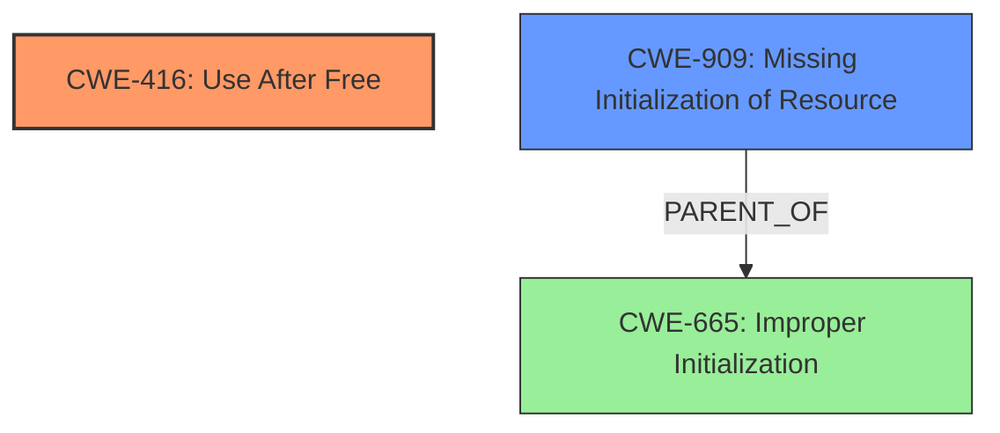

# Analysis for CVE-2025-37961

# Summary
| CWE ID | CWE Name | Confidence | CWE Abstraction Level | CWE Vulnerability Mapping Label | CWE-Vulnerability Mapping Notes |
|---|---|---|---|---|---|
| CWE-416 | Use After Free | 0.9 | Variant | Primary | Allowed |
| CWE-909 | Missing Initialization of Resource | 0.5 | Class | Secondary | Allowed-with-Review |

## Evidence and Confidence

*   **Confidence Score:** 0.7
*   **Evidence Strength:** MEDIUM

## Relationship Analysis
The primary relationship influencing the selection is the direct match of the vulnerability description to CWE-416 **Use After Free**. While CWE-909 **Missing Initialization of Resource** is considered as a potential contributing factor, the evidence primarily focuses on the **use-after-free** condition.

## Vulnerability Chain
The vulnerability chain starts with a potential **missing initialization**, which then leads to a **use-after-free** condition.
  - Root Cause: Possible **missing initialization of a resource**.
  - Weakness: **Use-after-free** when the resource is accessed after it has been freed.

## Summary of Analysis
The primary focus of the vulnerability description is on the **use-after-free** condition, making CWE-416 the most appropriate primary CWE. The description mentions an "**uninit-value**" but the report describes how the code reads the value which can prevent to connect the route. This could be from a **missing initialization**, which makes CWE-909 a secondary consideration.

Relevant CWE Information:

# Enhanced Context (25 CWEs)
The following CWEs were identified as potentially relevant to this vulnerability:

## CWE-909: Missing Initialization of Resource
**Abstraction Level**: Class
**Similarity Score**: 0.78
**Source**: dense

**Description**:
The product does not initialize a critical resource.

**Mapping Guidance**:
- Usage: Allowed-with-Review
- Rationale: This CWE entry is a Class and might have Base-level children that would be more appropriate

## CWE-416: Use After Free
**Abstraction Level**: variant
**Similarity Score**: 3.24
**Source**: graph

**Description**:
CWE-416: Use After Free

**Mapping Guidance**:
- Usage: Allowed
- Rationale: This CWE entry is at the Variant level of abstraction, which is a preferred level of abstraction for mapping to the root causes of vulnerabilities.

**Relationships**:
- CANFOLLOW -> CWE-754
- CANFOLLOW -> CWE-364
- CANFOLLOW -> CWE-362
- CANFOLLOW -> CWE-1265
- CANPRECEDE -> CWE-123

### Detailed Analysis of Selected CWEs:

*   **CWE-416: Use After Free**
    *   **Technical Explanation:** The vulnerability description explicitly mentions a **use-after-free** condition. The code attempts to use a resource (saddr) after it has been freed, leading to unpredictable behavior.
    *   **Security Implications:** **Use-after-free** vulnerabilities can lead to arbitrary code execution, denial of service, or information disclosure.
    *   **Relationship Analysis:** CWE-416 is a variant-level CWE, providing a specific description of the **use-after-free** weakness.
    *   **Mapping Guidance:** The mapping guidance allows the use of CWE-416.
    *   **Evidence:** "BUG KMSAN **uninit-value** in do_output_route4+0x42c/0x4d0 net/netfilter/ipvs/ip_vs_xmit.c147"
*   **CWE-909: Missing Initialization of Resource**
    *   **Technical Explanation:** The "**uninit-value**" suggests that a resource might not have been properly initialized before being used. This could lead to the **use-after-free** condition if the uninitialized resource is later freed and then accessed.
    *   **Security Implications:** **Missing initialization** can cause unpredictable program behavior and, in some cases, security vulnerabilities.
    *   **Relationship Analysis:** CWE-909 is a class-level CWE. While relevant, it is less specific than CWE-416 in this context.
    *   **Mapping Guidance:** The mapping guidance suggests reviewing for more appropriate base-level children. However, given the direct evidence of **use-after-free**, CWE-416 is more suitable as the primary mapping.
    *   **Evidence:** "ipvs fix **uninit-value** for saddr in do_output_route4 syzbot reports for **uninit-value** for the saddr argument"

### CWEs Considered But Not Used:

*   **CWE-665: Improper Initialization:** This is a class-level CWE and is too general. CWE-909 is a better fit for describing a **missing initialization** scenario.
*   **CWE-824: Access of Uninitialized Pointer:** While related to the "**uninit-value**" aspect, the primary issue is the **use-after-free**, making CWE-416 more relevant.
*   **CWE-476: NULL Pointer Dereference:** This is not the primary issue, as the problem is using memory after it has been freed, not necessarily dereferencing a NULL pointer.
*   **CWE-362: Concurrent Execution using Shared Resource with Improper Synchronization ('Race Condition'):** There is no indication of concurrency issues in the vulnerability description.
*   **CWE-120: Buffer Copy without Checking Size of Input ('Classic Buffer Overflow'):** This CWE is not relevant as the issue is not related to buffer overflows.