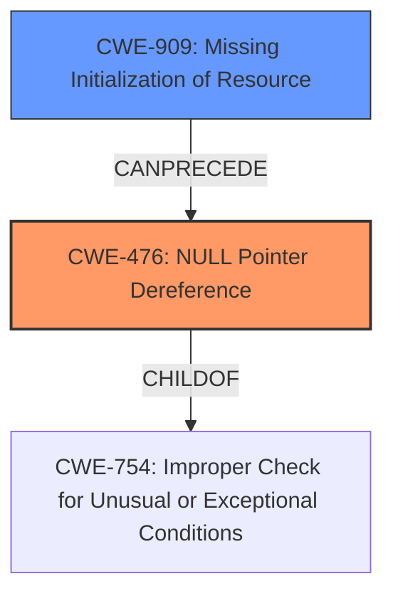

# Enhanced Analysis for CVE-2025-37971

# Summary
| CWE ID | CWE Name | Confidence | CWE Abstraction Level | CWE Vulnerability Mapping Label | CWE-Vulnerability Mapping Notes |
|---|---|---|---|---|---|
| CWE-476 | NULL Pointer Dereference | 1.0 | Base | Primary | Allowed |
| CWE-909 | Missing Initialization of Resource | 0.7 | Class | Secondary | Allowed-with-Review |

## Evidence and Confidence

*   **Confidence Score:** 0.9
*   **Evidence Strength:** HIGH

## Relationship Analysis
The primary CWE is CWE-476, which is a Base level CWE. This vulnerability could also be looked at as CWE-909 which is a Class level CWE. CWE-476 is the better choice because it's more specific and the vulnerability description explicitly states a **NULL pointer dereference**.



## Vulnerability Chain
The vulnerability chain starts with the **missing initialization** of `dev->v4l2_dev`, followed by a **NULL pointer dereference** when `dev->v4l2_dev.dev` is accessed in `vchiq_mmal_init`.

## Summary of Analysis
The vulnerability description explicitly mentions a **NULL pointer dereference**, making CWE-476 the most appropriate primary CWE. The root cause was a **missing initialization** of a resource, which could potentially be classified as CWE-909. However, since the direct result was a **NULL pointer dereference**, CWE-476 is a more accurate representation of the vulnerability. The evidence is strong and the relationship analysis supports this decision.

Relevant CWE Information:

# Enhanced Context (25 CWEs)
The following CWEs were identified as potentially relevant to this vulnerability:

## CWE-476: NULL Pointer Dereference
**Abstraction Level**: Base
**Similarity Score**: 0.72
**Source**: dense

**Description**:
The product dereferences a pointer that it expects to be valid but is NULL.

**Mapping Guidance**:
- Usage: Allowed
- Rationale: This CWE entry is at the Base level of abstraction, which is a preferred level of abstraction for mapping to the root causes of vulnerabilities.

**CWE-476 Justification:**
The vulnerability description explicitly mentions a **NULL pointer dereference**, making this CWE the most appropriate primary classification. The code attempts to use a pointer (`dev->v4l2_dev.dev`) that has not been initialized, leading to a **dereference of a NULL pointer**.

## CWE-909: Missing Initialization of Resource
**Abstraction Level**: Class
**Similarity Score**: 0.69
**Source**: dense

**Description**:
The product does not initialize a critical resource.

**Mapping Guidance**:
- Usage: Allowed-with-Review
- Rationale: This CWE entry is a Class and might have Base-level children that would be more appropriate

**CWE-909 Justification:**
The vulnerability stems from the **missing initialization** of `dev->v4l2_dev`. This represents a broader class of initialization errors. However, the direct consequence is a **NULL pointer dereference**, making CWE-476 a more specific and accurate primary classification. CWE-909 could be considered a secondary CWE, representing the underlying cause.

## CWE-824: Access of Uninitialized Pointer
**Abstraction Level**: Base
**Similarity Score**: 0.71
**Source**: dense

**Description**:
The product accesses or uses a pointer that has not been initialized.

**Mapping Guidance**:
- Usage: Allowed
- Rationale: This CWE entry is at the Base level of abstraction, which is a preferred level of abstraction for mapping to the root causes of vulnerabilities.

**CWE-824 Considered but Not Used Justification:**
While this CWE is related, CWE-476 is more specific because it explicitly states that the pointer being accessed is NULL, not just uninitialized.

## CWE-252: Unchecked Return Value
**Abstraction Level**: Base
**Similarity Score**: 0.71
**Source**: dense

**Description**:
The product does not check the return value from a method or function, which can prevent it from detecting unexpected states and conditions.

**Mapping Guidance**:
- Usage: Allowed
- Rationale: This CWE entry is at the Base level of abstraction, which is a preferred level of abstraction for mapping to the root causes of vulnerabilities.

**CWE-252 Considered but Not Used Justification:**
This CWE is not relevant because there is no mention of an unchecked return value in the vulnerability description.

## CWE-787: Out-of-bounds Write
**Abstraction Level**: base
**Similarity Score**: 4.33
**Source**: graph

**Description**:
CWE-787: Out-of-bounds Write

**Mapping Guidance**:
- Usage: Allowed
- Rationale: This CWE entry is at the Base level of abstraction, which is a preferred level of abstraction for mapping to the root causes of vulnerabilities.

**CWE-787 Considered but Not Used Justification:**
This CWE is not relevant because there is no mention of writing data out of bounds in the vulnerability description.


## CWE Relationship Analysis

Current CWEs represent these abstraction levels: .


### Vulnerability Chain Analysis

**Chain starting from CWE-476:**
- 476 (NULL Pointer Dereference) - ROOT


**Chain starting from CWE-787:**
- 787 (Out-of-bounds Write) - ROOT


### CWE Relationship Diagram

```mermaid
graph TD
    classDef primary fill:#f96,stroke:#333,stroke-width:2px
    classDef secondary fill:#69f,stroke:#333
    classDef tertiary fill:#9e9,stroke:#333
```