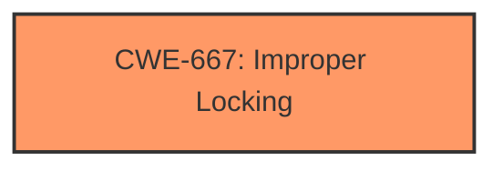

# Raw Analyzer Response for CVE-2025-37978

# Summary
| CWE ID | CWE Name | Confidence | CWE Abstraction Level | CWE Vulnerability Mapping Label | CWE-Vulnerability Mapping Notes |
|---|---|---|---|---|---|
| CWE-667 | Improper Locking | 0.75 | Class | Allowed-with-Review | Primary CWE |

## Evidence and Confidence

*   **Confidence Score:** 0.75
*   **Evidence Strength:** MEDIUM

## Relationship Analysis
The primary CWE identified is CWE-667 (Improper Locking), which is a Class-level CWE. While there might be more specific Base-level children of CWE-667, the provided information lacks the specifics to pinpoint the exact locking mechanism failure. This means we are working at a slightly higher level of abstraction due to the limited detail in the description.

## Vulnerability Chain
The vulnerability chain starts with the **improper locking** issue (CWE-667). The consequence is that calling `set_page_dirty_lock()` from an interrupt context leads to "oopses" and integrity issues. The description indicates that the locking is unnecessary in this context since the protection buffer isn't backed by a file.

## Summary of Analysis
The analysis is based on the vulnerability description, which states that calling `set_page_dirty_lock()` from interrupt context leads to "oopses". The root cause is the **improper locking** within the interrupt context, specifically the unnecessary use of `set_page_dirty_lock()`. The description "Placing multiple protection information buffers inside the same page can lead to oopses because set_page_dirty_lock() cant be called from interrupt context" points to a synchronization problem when accessing shared resources (protection buffers) concurrently.

The Retriever Results suggest CWE-667 (Improper Locking) as a potential match, which aligns with the **improper locking** root cause. Other CWEs like CWE-362 (Concurrent Execution using Shared Resource with Improper Synchronization) are related but less specific than CWE-667 in this context. The provided fix—removing the call to `set_page_dirty_lock()`—directly addresses the locking issue.

Relevant CWE Information:

# Enhanced Context (25 CWEs)
The following CWEs were identified as potentially relevant to this vulnerability:

## CWE-667: Improper Locking
**Abstraction Level**: Class
**Similarity Score**: 0.76
**Source**: dense

**Description**:
The product does not properly acquire or release a lock on a resource, leading to unexpected resource state changes and behaviors.

**Mapping Guidance**:
- Usage: Allowed-with-Review
- Rationale: This CWE entry is a Class and might have Base-level children that would be more appropriate