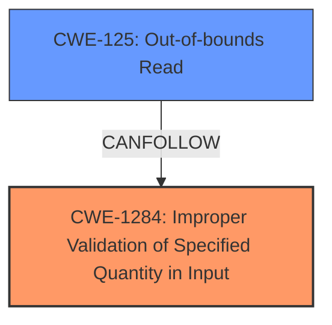

# Analysis Report for CVE-2025-37979

# Vulnerability Analysis Report: CVE-2025-37979

## Description

In the Linux kernel, the following vulnerability has been resolved ASoC qcom Fix sc7280 lpass potential **buffer overflow** Case values introduced in commit 5f78e1fb7a3e (ASoC qcom Add driver support for audioreach solution) cause out of bounds access in arrays of sc7280 driver data (e.g. in case of RX_CODEC_DMA_RX_0 in sc7280_snd_hw_params()). Redefine LPASS_MAX_PORTS to consider the maximum possible port id for q6dsp as sc7280 driver utilizes some of those values. Found by Linux Verification Center (linuxtesting.org) with SVACE.

## Vulnerability Description Key Phrases

- **Weakness:** buffer overflow
- **Impact:** out of bounds access
- **Product:** Linux kernel
- **Component:** ASoC qcom sc7280 driver

## Analysis (with Relationship Data)

# Summary
| CWE ID | CWE Name | Confidence | CWE Abstraction Level | CWE Vulnerability Mapping Label | CWE-Vulnerability Mapping Notes |
|---|---|---|---|---|---|
| CWE-1284 | Improper Validation of Specified Quantity in Input | 0.8 | Base | Allowed | Primary CWE |
| CWE-125 | Out-of-bounds Read | 0.7 | Base | Allowed | Secondary Candidate |

## Evidence and Confidence

*   **Confidence Score:** 0.75
*   **Evidence Strength:** MEDIUM

## Relationship Analysis
The primary CWE is CWE-1284, which describes the **improper validation of a specified quantity in input**. This can lead to various issues, including out-of-bounds access. CWE-125 represents the impact of the improper validation, where the software reads data past the end of the intended buffer. Both are base level CWEs.



## Vulnerability Chain
The vulnerability chain starts with **improper validation of the input quantity**, which leads to an out-of-bounds read.

1.  **Root Cause:** CWE-1284 - Improper Validation of Specified Quantity in Input
2.  **Impact:** CWE-125 - Out-of-bounds Read

## Summary of Analysis
The initial assessment considered several CWEs, including CWE-119, CWE-190, and CWE-120. However, based on the provided information and the root cause of the vulnerability, CWE-1284 (Improper Validation of Specified Quantity in Input) is the most appropriate primary CWE. The description indicates that the vulnerability occurs due to the values introduced in commit 5f78e1fb7a3e, which cause out-of-bounds access in arrays of sc7280 driver data. This suggests that the **quantity** (port ID) was not validated correctly, leading to the out-of-bounds access (CWE-125).

The **Vulnerability Description Key Phrases** section highlights the weakness as a "**buffer overflow**" and the impact as "out of bounds access." While the term "buffer overflow" is used, the root cause appears to be the improper validation of the port ID, not a classic buffer overflow scenario like CWE-120. The relationship graph also highlights the importance of considering specific input validation issues.

*Evidence:*
- "**buffer overflow**"
- "out of bounds access"
- "values introduced in commit 5f78e1fb7a3e ... cause out of bounds access in arrays of sc7280 driver data"
- "Redefine LPASS_MAX_PORTS to consider the maximum possible port id"

Other CWEs Considered:

*   **CWE-119 (Improper Restriction of Operations within the Bounds of a Memory Buffer):** This is a high-level CWE and less specific than CWE-1284 and CWE-125. The retriever results also suggest it. It's discouraged to use this.
*   **CWE-190 (Integer Overflow or Wraparound):** While integer overflow might be a contributing factor, the primary issue is the **lack of validation** of the input quantity (port ID).
*   **CWE-120 (Buffer Copy without Checking Size of Input ('Classic Buffer Overflow')):** This CWE is relevant to buffer copy operations without input size checking, which isn't the primary mechanism described in the vulnerability. The vulnerability description indicates an out-of-bounds access in arrays due to case values in commit 5f78e1fb7a3e, suggesting that an improper port id is used as an index to the array.
*   **CWE-125 (Out-of-bounds Read):** This is a direct consequence of the improper validation, where the software attempts to read data beyond the allocated buffer.
*   **CWE-193 (Off-by-one Error):** Although an off-by-one error could contribute to out-of-bounds access, the main issue seems to be the incorrect calculation or use of an invalid port ID.

CWE-1284 is the optimal level of specificity because it directly addresses the root cause of the vulnerability: the lack of proper validation of the input quantity (port ID).


## CWE Relationship Analysis

Current CWEs represent these abstraction levels: .


### Vulnerability Chain Analysis

**Chain starting from CWE-1284:**
- 1284 (Improper Validation of Specified Quantity in Input) - ROOT


**Chain starting from CWE-125:**
- 125 (Out-of-bounds Read) - ROOT


### CWE Relationship Diagram

```mermaid
graph TD
    classDef primary fill:#f96,stroke:#333,stroke-width:2px
    classDef secondary fill:#69f,stroke:#333
    classDef tertiary fill:#9e9,stroke:#333
```


*Report generated on 2025-07-14 22:05:03*
