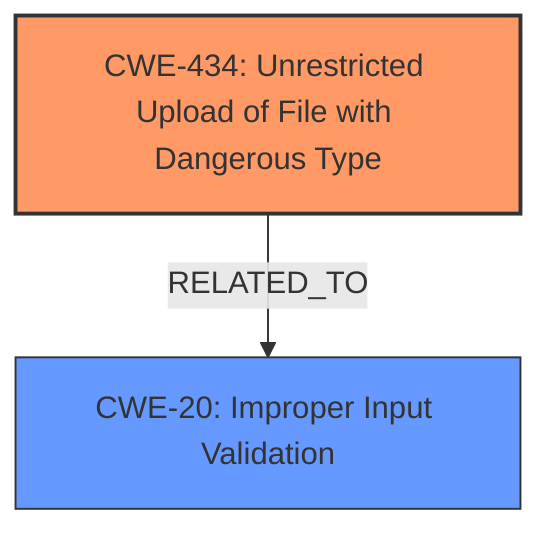

# Raw Analyzer Response for CVE-2025-3798

# Summary

| CWE ID | CWE Name | Confidence | CWE Abstraction Level | CWE Vulnerability Mapping Label | CWE-Vulnerability Mapping Notes |
|---|---|---|---|---|---|
| CWE-434 | Unrestricted Upload of File with Dangerous Type | 1.0 | Base | Allowed | Primary CWE. The vulnerability allows uploading files without proper restrictions, leading to potential execution of malicious code. |
| CWE-20 | Improper Input Validation | 0.7 | Class | Allowed-with-Review | Secondary. The **unrestricted upload** is a consequence of improper input validation. |

## Evidence and Confidence

*   **Confidence Score:** 0.9
*   **Evidence Strength:** HIGH

## Relationship Analysis
The primary CWE is CWE-434, which represents the **unrestricted upload** vulnerability. CWE-20 is considered as a secondary CWE because the root cause for **unrestricted upload** is **improper input validation**.

## Vulnerability Chain
The vulnerability chain starts with the **lack of proper input validation**, which then leads to the **unrestricted upload** of a file with a dangerous type. The impact of this is potential remote code execution if a malicious file is uploaded.
1.  **Root Cause:** **Lack of Input Validation**
2.  **Weakness:** **Unrestricted File Upload (CWE-434)**
3.  **Impact:** Remote Code Execution

## Summary of Analysis
The primary vulnerability is the **unrestricted upload** of a file with a dangerous type, which is directly stated in the description (**unrestricted upload**). The retriever results also indicated CWE-434 as a strong candidate. The vulnerability description and the analysis of CVE-2025-3798 content both point to the fact that the WCMS 11 system does not properly validate the type, extension, and content of uploaded files, which allows an attacker to upload malicious files.

CWE-434 is chosen because it directly represents the weakness. CWE-20 is a more general weakness (Improper Input Validation) but applicable because the **unrestricted upload** is possible due to a **lack of proper input validation**.

Relevant CWE Information:

# Enhanced Context (25 CWEs)
The following CWEs were identified as potentially relevant to this vulnerability:

## CWE-434: Unrestricted Upload of File with Dangerous Type
**Abstraction Level**: Base
**Similarity Score**: 0.83
**Source**: dense

**Description**:
The product allows the upload or transfer of dangerous file types that are automatically processed within its environment.

**Mapping Guidance**:
- Usage: Allowed
- Rationale: This CWE entry is at the Base level of abstraction, which is a preferred level of abstraction for mapping to the root causes of vulnerabilities.

## CWE-20: Improper Input Validation
The product does not validate or incorrectly validates input.
The input may be from a source outside of the product, or from an actor that is not explicitly trusted.

I considered CWE-79 (Improper Neutralization of Input During Web Page Generation ('Cross-site Scripting')) and CWE-89 (Improper Neutralization of Special Elements used in an SQL Command ('SQL Injection')), but these are not as applicable as CWE-434. CWE-79 is focused on XSS, which is not the primary issue here, and CWE-89 relates to SQL injection, which is not mentioned in the vulnerability description.