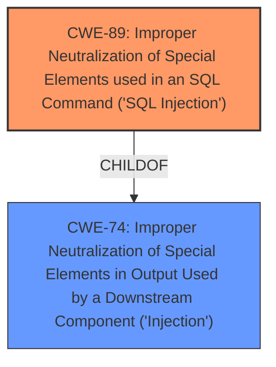

# Raw Analyzer Response for CVE-2025-3799

# Summary
| CWE ID | CWE Name | Confidence | CWE Abstraction Level | CWE Vulnerability Mapping Label | CWE-Vulnerability Mapping Notes |
|---|---|---|---|---|---|
| CWE-89 | Improper Neutralization of Special Elements used in an SQL Command ('SQL Injection') | 1.0 | Base | Allowed | Primary CWE: The **root cause** is the lack of proper neutralization of special elements in the SQL command, leading to SQL injection.|
| CWE-74 | Improper Neutralization of Special Elements in Output Used by a Downstream Component ('Injection') | 0.5 | Class | Discouraged | Secondary candidate. Considered but not used because CWE-89 is a more specific and accurate representation of the vulnerability. |

## Evidence and Confidence

*   **Confidence Score:** 1.0
*   **Evidence Strength:** HIGH

## Relationship Analysis
The primary relationship influencing my decision is the child-of relationship between CWE-89 and CWE-74. CWE-89 is a specific type of injection, focusing on SQL, while CWE-74 is a more general "Improper Neutralization" issue. Since the vulnerability description explicitly states "SQL injection", the more specific CWE-89 is a better fit.

## Vulnerability Chain
The vulnerability chain starts with **improper neutralization** of input, leading directly to **SQL injection**.

Root Cause: **Improper Neutralization** (CWE implicitly present, but not explicitly mapped) -> SQL Injection (CWE-89) -> Data Theft, Website Intrusion (Impact)

## Summary of Analysis
The analysis strongly suggests that CWE-89 is the most appropriate classification for this vulnerability. The vulnerability description explicitly mentions "SQL injection," and the provided CVE Reference Links Content Summary confirms that the **root cause** is the insufficient filtering of `email` and `username` parameters, leading to direct concatenation into SQL queries.

The selection is based on the following evidence:

*   Vulnerability Description Key Phrases: "**weakness:** **sql injection**"
*   CVE Reference Links Content Summary: "SQL injection due to insufficient filtering and the direct concatenation of user-supplied parameters into SQL queries."
*   Retriever Results: CWE-89 has the highest score and is the best match.

I considered CWE-74, "Improper Neutralization of Special Elements in Output Used by a Downstream Component ('Injection')", but it is a more general category. While technically applicable, CWE-89 provides a more precise description of the vulnerability. The mapping guidance for CWE-74 discourages its use when lower-level weaknesses are more appropriate.

The relationship graph influenced my decision by highlighting the parent-child relationship between CWE-74 and CWE-89. This reinforced the idea that CWE-89 is a more specific and preferred classification.

I am confident in this assessment because the evidence directly supports the classification of SQL injection.