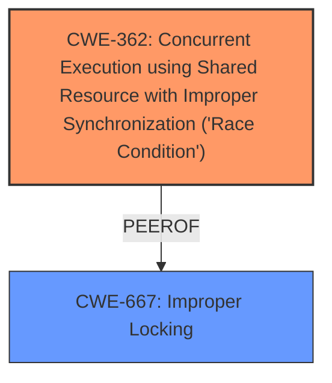

# Analysis Report for CVE-2025-38104

# Vulnerability Analysis Report: CVE-2025-38104

## Description

In the Linux kernel, the following vulnerability has been resolved drm/amdgpu Replace Mutex with Spinlock for RLCG register access to avoid Priority Inversion in SRIOV RLCG Register Access is a way for virtual functions to safely access GPU registers in a virtualized environment., including TLB flushes and register reads. When multiple threads or VFs try to access the same registers simultaneously, it can lead to **race conditions**. By using the RLCG interface, the driver can serialize access to the registers. This means that only one thread can access the registers at a time, preventing conflicts and ensuring that operations are performed correctly. Additionally, when a low-priority task holds a mutex that a high-priority task needs, ie., If a thread holding a spinlock tries to acquire a mutex, it can lead to priority inversion. register access in amdgpu_virt_rlcg_reg_rw especially in a fast code path is critical. The call stack shows that the function amdgpu_virt_rlcg_reg_rw is being called, which attempts to acquire the mutex. This function is invoked from amdgpu_sriov_wreg, which in turn is called from gmc_v11_0_flush_gpu_tlb. The [ BUG Invalid wait context ] indicates that a thread is trying to acquire a mutex while it is in a context that does not allow it to sleep (like holding a spinlock). Fixes the below [ 253.013423] ============================= [ 253.013434] [ BUG Invalid wait context ] [ 253.013446] 6.12.0-amdstaging-drm-next-lol-050225 #14 Tainted G U OE [ 253.013464] ----------------------------- [ 253.013475] kworker/01/10 is trying to lock [ 253.013487] ffff9f30542e3cf8 (&adev->virt.rlcg_reg_lock){+.+.}-{33}, at amdgpu_virt_rlcg_reg_rw+0xf6/0x330 [amdgpu] [ 253.013815] other info that might help us debug this [ 253.013827] context-{44} [ 253.013835] 3 locks held by kworker/01/10 [ 253.013847] #0 ffff9f3040050f58 ((wq_completion)events){+.+.}-{00}, at process_one_work+0x3f5/0x680 [ 253.013877] #1 ffffb789c008be40 ((work_completion)(&wfc.work)){+.+.}-{00}, at process_one_work+0x1d6/0x680 [ 253.013905] #2 ffff9f3054281838 (&adev->gmc.invalidate_lock){+.+.}-{22}, at gmc_v11_0_flush_gpu_tlb+0x198/0x4f0 [amdgpu] [ 253.014154] stack backtrace [ 253.014164] CPU 0 UID 0 PID 10 Comm kworker/01 Tainted G U OE 6.12.0-amdstaging-drm-next-lol-050225 #14 [ 253.014189] Tainted [U]=USER, [O]=OOT_MODULE, [E]=UNSIGNED_MODULE [ 253.014203] Hardware name Microsoft Corporation Virtual Machine/Virtual Machine, BIOS Hyper-V UEFI Release v4.1 11/18/2024 [ 253.014224] Workqueue events work_for_cpu_fn [ 253.014241] Call Trace [ 253.014250] [ 253.014260] dump_stack_lvl+0x9b/0xf0 [ 253.014275] dump_stack+0x10/0x20 [ 253.014287] __lock_acquire+0xa47/0x2810 [ 253.014303] ? srso_alias_return_thunk+0x5/0xfbef5 [ 253.014321] lock_acquire+0xd1/0x300 [ 253.014333] ? amdgpu_virt_rlcg_reg_rw+0xf6/0x330 [amdgpu] [ 253.014562] ? __lock_acquire+0xa6b/0x2810 [ 253.014578] __mutex_lock+0x85/0xe20 [ 253.014591] ? amdgpu_virt_rlcg_reg_rw+0xf6/0x330 [amdgpu] [ 253.014782] ? sched_clock_noinstr+0x9/0x10 [ 253.014795] ? srso_alias_return_thunk+0x5/0xfbef5 [ 253.014808] ? local_clock_noinstr+0xe/0xc0 [ 253.014822] ? amdgpu_virt_rlcg_reg_rw+0xf6/0x330 [amdgpu] [ 253.015012] ? srso_alias_return_thunk+0x5/0xfbef5 [ 253.015029] mutex_lock_nested+0x1b/0x30 [ 253.015044] ? mutex_lock_nested+0x1b/0x30 [ 253.015057] amdgpu_virt_rlcg_reg_rw+0xf6/0x330 [amdgpu] [ 253.015249] amdgpu_sriov_wreg+0xc5/0xd0 [amdgpu] [ 253.015435] gmc_v11_0_flush_gpu_tlb+0x44b/0x4f0 [amdgpu] [ 253.015667] gfx_v11_0_hw_init+0x499/0x29c0 [amdgpu] [ 253.015901] ? __pfx_smu_v13_0_update_pcie_parameters+0x10/0x10 [amdgpu] [ 253.016159] ? srso_alias_return_thunk+0x5/0xfbef5 [ 253.016173] ? smu_hw_init+0x18d/0x300 [amdgpu] [ 253.016403] amdgpu_device_init+0x29ad/0x36a0 [amdgpu] [ 253.016614] amdgpu_driver_load_kms+0x1a/0xc0 [amdgpu] [ 253.0170 ---truncated---

## Vulnerability Description Key Phrases

- **Rootcause:** race conditions
- **Impact:** priority inversion
- **Product:** Linux kernel
- **Component:** drm/amdgpu

## Analysis (with Relationship Data)

# Summary
| CWE ID | CWE Name | Confidence | CWE Abstraction Level | CWE Vulnerability Mapping Label | CWE-Vulnerability Mapping Notes |
|---|---|---|---|---|---|
| CWE-362 | Concurrent Execution using Shared Resource with Improper Synchronization ('Race Condition') | 0.9 | Class | Allowed-with-Review | Primary CWE: The vulnerability description clearly indicates a **race condition** due to concurrent access to shared resources. |
| CWE-667 | Improper Locking | 0.7 | Class | Allowed-with-Review | Secondary candidate: The description mentions mutexes and spinlocks, suggesting locking issues might contribute to the problem. |

## Evidence and Confidence

*   **Confidence Score:** 0.8
*   **Evidence Strength:** MEDIUM

## Relationship Analysis
The primary relationship influencing the CWE selection is the hierarchical structure, where CWE-362 is a Class-level CWE that broadly covers **race conditions** due to improper synchronization. CWE-667 (Improper Locking) is related but less directly supported by the provided evidence, making it a secondary consideration. The description explicitly points to **race conditions** and the potential for priority inversion when multiple threads access the same registers simultaneously.



## Vulnerability Chain
The vulnerability chain starts with concurrent execution and improper synchronization leading to **race conditions**. This then results in potential priority inversion and ultimately a system crash or unexpected behavior. The root cause is the lack of proper synchronization mechanisms when accessing shared GPU registers in a virtualized environment.

## Summary of Analysis
The initial analysis focused on identifying the root cause of the vulnerability, which the description clearly states as a **race condition**. The selection of CWE-362 is based on the explicit mention of concurrent execution and improper synchronization. The evidence includes phrases like "multiple threads or VFs try to access the same registers simultaneously, it can lead to **race conditions**" and the context of using the RLCG interface to serialize access. While locking mechanisms are involved (mutexes and spinlocks), the core issue is the unsynchronized concurrent access.

The provided evidence directly supports CWE-362 as the primary CWE. The retriever results also list CWE-362 as the top match. I've reviewed the CWE specifications, mapping guidance, and relationships to ensure accurate classification.

Relevant quote: "When multiple threads or VFs try to access the same registers simultaneously, it can lead to **race conditions**."

The selected CWEs are at an appropriate level of specificity, with CWE-362 being a Class that accurately captures the high-level nature of the **race condition** due to concurrent execution.

Relevant CWE Information:

# Enhanced Context (25 CWEs)
The following CWEs were identified as potentially relevant to this vulnerability:

## CWE-667: Improper Locking
**Abstraction Level**: Class
**Similarity Score**: 0.80
**Source**: dense

**Description**:
The product does not properly acquire or release a lock on a resource, leading to unexpected resource state changes and behaviors.

**Mapping Guidance**:
- Usage: Allowed-with-Review
- Rationale: This CWE entry is a Class and might have Base-level children that would be more appropriate

## CWE-367: Time-of-check Time-of-use (TOCTOU) Race Condition
**Abstraction Level**: Base
**Similarity Score**: 0.79
**Source**: dense

**Description**:
The product checks the state of a resource before using that resource, but the resource's state can change between the check and the use in a way that invalidates the results of the check. This can cause the product to perform invalid actions when the resource is in an unexpected state.

**Mapping Guidance**:
- Usage: Allowed
- Rationale: This CWE entry is at the Base level of abstraction, which is a preferred level of abstraction for mapping to the root causes of vulnerabilities.

## CWE-362: Concurrent Execution using Shared Resource with Improper Synchronization ('Race Condition')
**Abstraction Level**: Class
**Similarity Score**: 0.79
**Source**: dense

**Description**:
The product contains a concurrent code sequence that requires temporary, exclusive access to a shared resource, but a timing window exists in which the shared resource can be modified by another code sequence operating concurrently.

**Mapping Guidance**:
- Usage: Allowed-with-Review
- Rationale: This CWE entry is a Class and might have Base-level children that would be more appropriate

## CWE-366: Race Condition within a Thread
**Abstraction Level**: Base
**Similarity Score**: 0.78
**Source**: dense

**Description**:
If two threads of execution use a resource simultaneously, there exists the possibility that resources may be used while invalid, in turn making the state of execution undefined.

**Mapping Guidance**:
- Usage: Allowed
- Rationale: This CWE entry is at the Base level of abstraction, which is a preferred level of abstraction for mapping to the root causes of vulnerabilities.

## CWE-703: Improper Check or Handling of Exceptional Conditions
**Abstraction Level**: Pillar
**Similarity Score**: 0.75
**Source**: dense

**Description**:
The product does not properly anticipate or handle exceptional conditions that rarely occur during normal operation of the product.

**Mapping Guidance**:
- Usage: Discouraged
- Rationale: This CWE entry is extremely high-level, a Pillar.

## CWE-754: Improper Check for Unusual or Exceptional Conditions
**Abstraction Level**: Class
**Similarity Score**: 0.75
**Source**: dense

**Description**:
The product does not check or incorrectly checks for unusual or exceptional conditions that are not expected to occur frequently during day to day operation of the product.

**Mapping Guidance**:
- Usage: Allowed-with-Review
- Rationale: This CWE entry is a Class and might have Base-level children that would be more appropriate

## CWE-755: Improper Handling of Exceptional Conditions
**Abstraction Level**: Class
**Similarity Score**: 0.74
**Source**: dense

**Description**:
The product does not handle or incorrectly handles an exceptional condition.

**Mapping Guidance**:
- Usage: Discouraged
- Rationale: This CWE entry is a level-1 Class (i.e., a child of a Pillar). It might have lower-level children that would be more appropriate

## CWE-1285: Improper Validation of Specified Index, Position, or Offset in Input
**Abstraction Level**: Base
**Similarity Score**: 0.74
**Source**: dense

**Description**:
The product receives input that is expected to specify an index, position, or offset into an indexable resource such as a buffer or file, but it does not validate or incorrectly validates that the specified index/position/offset has the required properties.

**Mapping Guidance**:
- Usage: Allowed
- Rationale: This CWE entry is at the Base level of abstraction, which is a preferred level of abstraction for mapping to the root causes of vulnerabilities.

## CWE-131: Incorrect Calculation of Buffer Size
**Abstraction Level**: Base
**Similarity Score**: 0.74
**Source**: dense

**Description**:
The product does not correctly calculate the size to be used when allocating a buffer, which could lead to a buffer overflow.

**Mapping Guidance**:
- Usage: Allowed
- Rationale: This CWE entry is at the Base level of abstraction, which is a preferred level of abstraction for mapping to the root causes of vulnerabilities.

## CWE-662: Improper Synchronization
**Abstraction Level**: Class
**Similarity Score**: 0.73
**Source**: dense

**Description**:
The product utilizes multiple threads or processes to allow temporary access to a shared resource that can only be exclusive to one process at a time, but it does not properly synchronize these actions, which might cause simultaneous accesses of this resource by multiple threads or processes.

**Mapping Guidance**:
- Usage: Discouraged
- Rationale: This CWE entry is a level-1 Class (i.e., a child of a Pillar). It might have lower-level children that would be more appropriate

## CWE-253: Incorrect Check of Function Return Value
**Abstraction Level**: Base
**Similarity Score**: 1019.19
**Source**: sparse

**Description**:
The product incorrectly checks a return value from a function, which prevents it from detecting errors or exceptional conditions.

**Mapping Guidance**:
- Usage: Allowed
- Rationale: This CWE entry is at the Base level of abstraction, which is a preferred level of abstraction for mapping to the root causes of vulnerabilities.

## CWE-754: Improper Check for Unusual or Exceptional Conditions
**Abstraction Level**: Class
**Similarity Score**: 868.82
**Source**: sparse

**Description**:
The product does not check or incorrectly checks for unusual or exceptional conditions that are not expected to occur frequently during day to day operation of the product.

**Mapping


## CWE Relationship Analysis

Current CWEs represent these abstraction levels: .


### Vulnerability Chain Analysis

**Chain starting from CWE-662:**
- 662 (Improper Synchronization) - ROOT


**Chain starting from CWE-131:**
- 131 (Incorrect Calculation of Buffer Size) - ROOT


### CWE Relationship Diagram

```mermaid
graph TD
    classDef primary fill:#f96,stroke:#333,stroke-width:2px
    classDef secondary fill:#69f,stroke:#333
    classDef tertiary fill:#9e9,stroke:#333
```


*Report generated on 2025-07-14 22:11:00*
