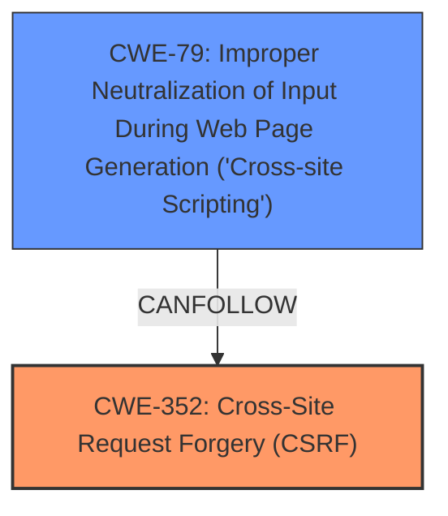

# Enhanced Analysis for CVE-2025-39419

# Summary
| CWE ID | CWE Name | Confidence | CWE Abstraction Level | CWE Vulnerability Mapping Label | CWE-Vulnerability Mapping Notes |
|---|---|---|---|---|---|
| CWE-352 | Cross-Site Request Forgery (CSRF) | 1.0 | Compound | Allowed | Primary CWE |
| CWE-79 | Improper Neutralization of Input During Web Page Generation ('Cross-site Scripting') | 0.7 | Base | Allowed | Secondary Candidate |

## Evidence and Confidence

*   **Confidence Score:** 0.85
*   **Evidence Strength:** HIGH

## Relationship Analysis
The primary weakness is CWE-352 [Cross-Site Request Forgery (CSRF)], which can lead to other vulnerabilities if successfully exploited. In this case, the CSRF vulnerability allows for Stored XSS (CWE-79 [Improper Neutralization of Input During Web Page Generation ('Cross-site Scripting')]). CWE-79 [Improper Neutralization of Input During Web Page Generation ('Cross-site Scripting')] is a consequence of the **weakness** introduced by the CSRF **vulnerability**. The relationship here is that successful exploitation of CWE-352 [Cross-Site Request Forgery (CSRF)] enables the attacker to inject malicious scripts that are then stored and executed, leading to CWE-79 [Improper Neutralization of Input During Web Page Generation ('Cross-site Scripting')]. The abstraction levels are appropriate, with CWE-352 [Cross-Site Request Forgery (CSRF)] at the Compound level (representing a combination of weaknesses) and CWE-79 [Improper Neutralization of Input During Web Page Generation ('Cross-site Scripting')] at the Base level (representing the specific input handling issue).



## Vulnerability Chain
The **vulnerability** chain starts with the **Cross-Site Request Forgery (CSRF) vulnerability (CWE-352)**. A successful CSRF attack allows the attacker to force a higher-privileged user to perform actions, which in this case, leads to injecting malicious code. This injected code is not properly neutralized, leading to **Stored XSS (CWE-79)**.

*   **Root Cause:** CWE-352 [Cross-Site Request Forgery (CSRF)] - The application does not adequately verify the origin of requests.
*   **Weakness:** CWE-79 [Improper Neutralization of Input During Web Page Generation ('Cross-site Scripting')] - Input is not properly neutralized, allowing for script injection.
*   **Impact:** Stored XSS - Malicious scripts are stored and executed, potentially compromising user accounts or data.

## Summary of Analysis
The primary **weakness** is the Cross-Site Request Forgery (CSRF) **vulnerability** (CWE-352 [Cross-Site Request Forgery (CSRF)]). The vulnerability description explicitly mentions "Cross-Site Request Forgery (CSRF) vulnerability in David Miller Revision Diet allows Stored XSS." This is direct evidence for CWE-352 [Cross-Site Request Forgery (CSRF)]. The "CVE Reference Links Content Summary" also confirms the presence of a Cross-Site Request Forgery (CSRF) vulnerability. The Stored XSS is a consequence of the CSRF **vulnerability** and should be classified as CWE-79 [Improper Neutralization of Input During Web Page Generation ('Cross-site Scripting')], making it a secondary candidate.

CWE-79 [Improper Neutralization of Input During Web Page Generation ('Cross-site Scripting')] was considered because the description mentions "Stored XSS". However, the root cause is the CSRF **vulnerability**, which allows an attacker to inject the malicious code in the first place. Therefore, CWE-79 [Improper Neutralization of Input During Web Page Generation ('Cross-site Scripting')] is a secondary effect, and CWE-352 [Cross-Site Request Forgery (CSRF)] is the more appropriate primary classification.

The selected CWEs are at the optimal level of specificity, with CWE-352 [Cross-Site Request Forgery (CSRF)] at the Compound level (representing the CSRF **vulnerability**) and CWE-79 [Improper Neutralization of Input During Web Page Generation ('Cross-site Scripting')] at the Base level (representing the XSS **vulnerability**).

Other CWEs were considered but not used:

*   CWE-425 [Direct Request ('Forced Browsing')]: While related to authorization, it does not directly address the CSRF **vulnerability**, where a legitimate user's session is exploited.
*   CWE-918 [Server-Side Request Forgery (SSRF)]: Not relevant, as the **vulnerability** involves client-side request manipulation, not server-side.
*   CWE-89 [Improper Neutralization of Special Elements used in an SQL Command ('SQL Injection')]: Not relevant, as there is no mention of SQL injection in the description.
*   CWE-434 [Unrestricted Upload of File with Dangerous Type]: Not relevant, as there is no mention of file uploads in the description.
*   CWE-565 [Reliance on Cookies without Validation and Integrity Checking]: While cookies might be involved in the CSRF attack, the core issue is the lack of request origin validation, not the cookie handling itself.
*   CWE-472 [External Control of Assumed-Immutable Web Parameter]: While hidden form fields can be manipulated in CSRF attacks, the root cause is the lack of CSRF protection, not just the modification of immutable parameters.


## CWE Relationship Analysis

Current CWEs represent these abstraction levels: .


### Vulnerability Chain Analysis

**Chain starting from CWE-89:**
- 89 (Improper Neutralization of Special Elements used in an SQL Command ('SQL Injection')) - ROOT


**Chain starting from CWE-565:**
- 565 (Reliance on Cookies without Validation and Integrity Checking) - ROOT


### CWE Relationship Diagram

```mermaid
graph TD
    classDef primary fill:#f96,stroke:#333,stroke-width:2px
    classDef secondary fill:#69f,stroke:#333
    classDef tertiary fill:#9e9,stroke:#333
```