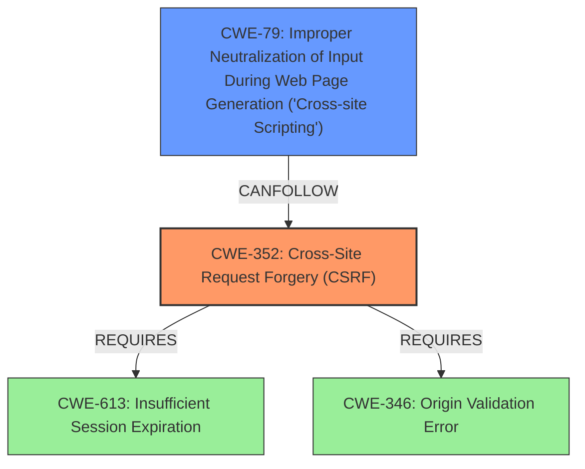

# Raw Analyzer Response for CVE-2025-39430

# Summary
| CWE ID | CWE Name | Confidence | CWE Abstraction Level | CWE Vulnerability Mapping Label | CWE-Vulnerability Mapping Notes |
|---|---|---|---|---|---|
| CWE-352 | Cross-Site Request Forgery (CSRF) | 1.0 | Compound | Primary | Allowed |
| CWE-79 | Improper Neutralization of Input During Web Page Generation ('Cross-site Scripting') | 1.0 | Base | Secondary | Allowed |

## Evidence and Confidence

*   **Confidence Score:** 1.0
*   **Evidence Strength:** HIGH

## Relationship Analysis
The primary weakness is identified as CWE-352 [Cross-Site Request Forgery (CSRF)]. The vulnerability description explicitly mentions "CSRF vulnerability" as the root cause. CSRF can lead to other vulnerabilities such as CWE-79 [Improper Neutralization of Input During Web Page Generation ('Cross-site Scripting')] since the attacker can force the user to perform actions, which in this case is Stored XSS. The relationship between CWE-352 and CWE-79 is that a successful CSRF attack can lead to the injection of malicious scripts, resulting in XSS.

## Vulnerability Chain
The vulnerability chain starts with the **CSRF vulnerability** (CWE-352), which allows an attacker to force a user to perform unwanted actions. In this case, the forced action results in Stored XSS (CWE-79), where the injected script is stored on the server and executed when other users access the affected page.
  - The root cause is CWE-352, which is the **lack of proper CSRF protection**.
  - The impact is CWE-79, which is the **Stored XSS**.

## Summary of Analysis
The primary vulnerability is clearly identified as a Cross-Site Request Forgery (CSRF) due to the explicit mention of "**CSRF vulnerability**" and "**Cross Site Request Forgery (CSRF) vulnerability**" in both the vulnerability description and the CVE reference summary. This aligns with CWE-352, which represents the **lack of sufficient verification** of a request's origin. As a result of the **CSRF vulnerability**, an attacker can induce Stored XSS in the application. This XSS vulnerability is best described by CWE-79 [Improper Neutralization of Input During Web Page Generation ('Cross-site Scripting')] because the application does not properly neutralize user-controllable input before placing it in a web page.

The retriever results also suggest CWE-79 as the top combined result and CWE-352 as the second most relevant, which supports this assessment. The graph relationships and mapping guidance further reinforce the decision to select these CWEs.

Relevant supporting evidence:
*   Vulnerability Description Key Phrases: "**rootcause: CSRF vulnerability**", "**weakness: Cross-Site Request Forgery (CSRF), XSS**"
*   CVE Reference Links Content Summary: "**Root cause of vulnerability: The mLanguage plugin is vulnerable to Cross Site Request Forgery (CSRF).**", "**Weaknesses/vulnerabilities present: Cross Site Request Forgery (CSRF) vulnerability.**", "**Impact of exploitation: A malicious actor could force higher privileged users to execute unwanted actions under their current authentication. The impact varies case by case.**"

The selected CWEs are at the optimal level of specificity, with CWE-352 being a Compound weakness and CWE-79 being a Base weakness.

Relevant CWE Information:

# Enhanced Context (25 CWEs)
The following CWEs were identified as potentially relevant to this vulnerability:

## CWE-93: Improper Neutralization of CRLF Sequences ('CRLF Injection')
**Abstraction Level**: Base
**Similarity Score**: 0.67
**Source**: dense

**Description**:
The product uses CRLF (carriage return line feeds) as a special element, e.g. to separate lines or records, but it does not neutralize or incorrectly neutralizes CRLF sequences from inputs.

**Mapping Guidance**:
- Usage: Allowed
- Rationale: This CWE entry is at the Base level of abstraction, which is a preferred level of abstraction for mapping to the root causes of vulnerabilities.

*Not Used:* This CWE is not relevant as there is no mention of CRLF injection in the vulnerability description.

## CWE-80: Improper Neutralization of Script-Related HTML Tags in a Web Page (Basic XSS)
**Abstraction Level**: Variant
**Similarity Score**: 0.67
**Source**: dense

**Description**:
The product receives input from an upstream component, but it does not neutralize or incorrectly neutralizes special characters such as "<", ">", and "&" that could be interpreted as web-scripting elements when they are sent to a downstream component that processes web pages.

**Mapping Guidance**:
- Usage: Allowed
- Rationale: This CWE entry is at the Variant level of abstraction, which is a preferred level of abstraction for mapping to the root causes of vulnerabilities.

*Not Used:* While related to XSS, CWE-80 is more specific to the neutralization of HTML tags, which isn't the primary issue. CWE-79 is a more general case of XSS.

## CWE-116: Improper Encoding or Escaping of Output
**Abstraction Level**: Class
**Similarity Score**: 0.67
**Source**: dense

**Description**:
The product prepares a structured message for communication with another component, but encoding or escaping of the data is either missing or done incorrectly. As a result, the intended structure of the message is not preserved.

**Mapping Guidance**:
- Usage: Allowed-with-Review
- Rationale: This CWE entry is a Class and might have Base-level children that would be more appropriate

*Not Used:* CWE-116 is a class-level CWE and has more specific base-level children. Since the issue is XSS, CWE-79 is a better fit.

## CWE-918: Server-Side Request Forgery (SSRF)
**Abstraction Level**: Base
**Similarity Score**: 0.67
**Source**: dense

**Description**:
The web server receives a URL or similar request from an upstream component and retrieves the contents of this URL, but it does not sufficiently ensure that the request is being sent to the expected destination.

**Mapping Guidance**:
- Usage: Allowed
- Rationale: This CWE entry is at the Base level of abstraction, which is a preferred level of abstraction for mapping to the root causes of vulnerabilities.

*Not Used:* Not Relevant, this vulnerability does not involve server-side request forgery.

## CWE-79: Improper Neutralization of Input During Web Page Generation ('Cross-site Scripting')
**Abstraction Level**: Base
**Similarity Score**: 0.67
**Source**: dense

**Description**:
The product does not neutralize or incorrectly neutralizes user-controllable input before it is placed in output that is used as a web page that is served to other users.

**Mapping Guidance**:
- Usage: Allowed
- Rationale: This CWE entry is at the Base level of abstraction, which is a preferred level of abstraction for mapping to the root causes of vulnerabilities.

*Used:* As the impact of the CSRF is Stored XSS, CWE-79 is the appropriate mapping.

## CWE-352: Cross-Site Request Forgery (CSRF)
**Abstraction Level**: Compound
**Similarity Score**: 0.67
**Source**: dense

**Description**:
The web application does not, or can not, sufficiently verify whether a well-formed, valid, consistent request was intentionally provided by the user who submitted the request.

**Mapping Guidance**:
- Usage: Allowed
- Rationale: This is a well-known Composite of multiple weaknesses that must all occur simultaneously, although it is attack-oriented in nature.

*Used:* This is the primary root cause based on the provided description.

## CWE-346: Origin Validation Error
**Abstraction Level**: Class
**Similarity Score**: 0.66
**Source**: dense

**Description**:
The product does not properly verify that the source of data or communication is valid.

**Mapping Guidance**:
- Usage: Allowed-with-Review
- Rationale: This CWE entry is a Class and might have Base-level children that would be more appropriate

*Not Used:* This could be a supporting CWE, but since the vulnerability description clearly indicates