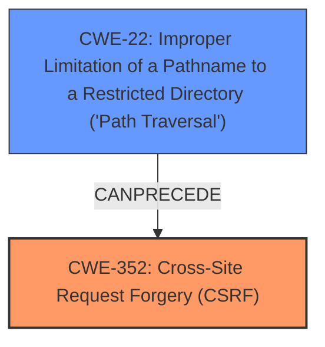

# Raw Analyzer Response for CVE-2025-39544

# Summary
| CWE ID | CWE Name | Confidence | CWE Abstraction Level | CWE Vulnerability Mapping Label | CWE-Vulnerability Mapping Notes |
|---|---|---|---|---|---|
| CWE-352 | Cross-Site Request Forgery (CSRF) | 1.0 | Compound | Primary | Allowed |
| CWE-22 | Improper Limitation of a Pathname to a Restricted Directory ('Path Traversal') | 0.7 | Base | Secondary | Allowed |

## Evidence and Confidence

*   **Confidence Score:** 0.85
*   **Evidence Strength:** MEDIUM

## Relationship Analysis
The primary weakness is CWE-352, which can lead to other vulnerabilities. One such vulnerability is CWE-22, as indicated in the vulnerability description. While CWE-352 is a Compound weakness, it directly reflects the **rootcause** identified in the description. CWE-22 represents the impact, but lacks strong evidence and is also a base level class.

## Vulnerability Chain
The vulnerability chain starts with the **lack of CSRF protection (CWE-352)**, which allows an attacker to induce a user to perform actions they did not intend to, leading to **Path Traversal (CWE-22)**.

## Summary of Analysis
The initial assessment identified CWE-352 as the primary weakness due to the explicit mention of "Cross-Site Request Forgery" as the **rootcause** in the vulnerability description and CVE reference links. The description also notes that the plugin lacks CSRF protection which led to the vulnerability. The confidence is rated as high.
The secondary weakness, CWE-22, is a consequence of the CSRF vulnerability. The vulnerability description notes a "Path Traversal" impact. The evidence is less strong as the **rootcause** is the **CSRF** not the path traversal so confidence is lower.
The retriever results list several other CWEs (SQL Injection, SSRF, Open Redirect, Unrestricted Upload, XSS). These are not applicable because the description specifically identifies CSRF as the root cause and Path Traversal as the impact.
CWE-352 is selected despite being a compound weakness because it is explicitly mentioned as a **rootcause** by the report.
CWE-22 is listed as secondary because path traversal is mentioned in the description but lacks supporting evidence.

Relevant CWE Information:

# Enhanced Context (25 CWEs)
The following CWEs were identified as potentially relevant to this vulnerability:

## CWE-352: Cross-Site Request Forgery (CSRF)
**Abstraction Level**: Compound
**Similarity Score**: 0.75
**Source**: dense

**Description**:
The web application does not, or can not, sufficiently verify whether a well-formed, valid, consistent request was intentionally provided by the user who submitted the request.

**Mapping Guidance**:
- Usage: Allowed
- Rationale: This is a well-known Composite of multiple weaknesses that must all occur simultaneously, although it is attack-oriented in nature.

## CWE-22: Improper Limitation of a Pathname to a Restricted Directory ('Path Traversal')
**Abstraction Level**: base
**Similarity Score**: 3.89
**Source**: graph

**Description**:
CWE-22: Improper Limitation of a Pathname to a Restricted Directory ('Path Traversal')

**Mapping Guidance**:
- Usage: Allowed
- Rationale: This CWE entry is at the Base level of abstraction, which is a preferred level of abstraction for mapping to the root causes of vulnerabilities.

**Relationships**:
- CANFOLLOW -> CWE-73
- PARENTOF -> CWE-36
- PARENTOF -> CWE-23
- CANFOLLOW -> CWE-20
- CANFOLLOW -> CWE-172