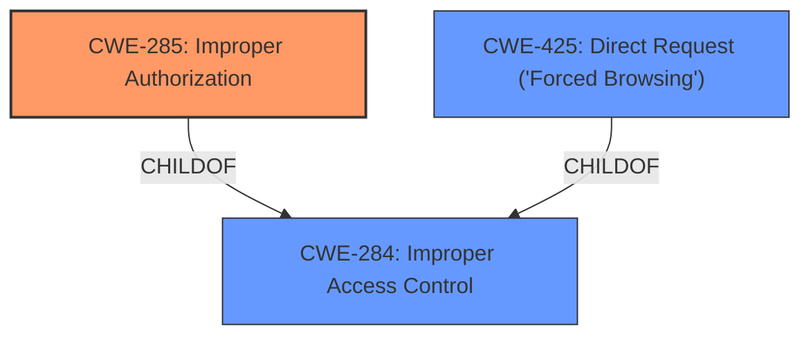

# Raw Analyzer Response for CVE-2025-3967

# Summary
| CWE ID | CWE Name | Confidence | CWE Abstraction Level | CWE Vulnerability Mapping Label | CWE-Vulnerability Mapping Notes |
|---|---|---|---|---|---|
| CWE-285 | Improper Authorization | 0.9 | Class | Primary CWE | Discouraged |
| CWE-425 | Direct Request ('Forced Browsing') | 0.6 | Base | Secondary Candidate | Allowed |

## Evidence and Confidence

*   **Confidence Score:** 0.9
*   **Evidence Strength:** HIGH

## Relationship Analysis
The primary relationship influencing the decision is the parent-child relationship between CWE-284 (Improper Access Control) and CWE-285 (Improper Authorization). While CWE-284 is a broader category, the vulnerability description explicitly mentions "**improper authorization**," making CWE-285 a more specific and appropriate choice. CWE-425 (Direct Request ('Forced Browsing')) is a child of CWE-284, and represents a scenario where authorization is not properly enforced for direct requests, which could be a potential contributing factor.

## Vulnerability Chain
The vulnerability chain starts with the **improper authorization** (CWE-285) in the Article Handler component. A potential scenario is that the application **does not properly** verify if the user has the necessary permissions to access or modify an article based on the `articleId` provided. This could lead to unauthorized access or modification of articles. Another potential scenario is that there is a **Direct Request** (CWE-425) made to the `/article/api/post` endpoint, where the system **fails to adequately enforce appropriate authorization**.

## Summary of Analysis
The initial assessment strongly points towards CWE-285 (Improper Authorization) due to the explicit mention of "**improper authorization**" in the vulnerability description. The vulnerability description states "The manipulation of the argument articleId leads to **improper authorization**." This clearly indicates an authorization issue. CWE-425 is also a strong secondary candidate.

The retriever results also support this assessment, with CWE-285 being among the top matches.

The final decision is to assign CWE-285 as the primary CWE, as it directly reflects the described weakness. CWE-425 is a secondary candidate in a scenario where a direct request is made.

The selected CWEs are at the optimal level of specificity, with CWE-285 being a Class-level CWE that accurately captures the authorization flaw, and CWE-425 being a Base-level CWE that provides more details of the request.

Relevant CWE Information:

*   **CWE-285: Improper Authorization**: The product does not perform or incorrectly performs an authorization check when an actor attempts to access a resource or perform an action. This aligns perfectly with the description of "**improper authorization**" when manipulating the `articleId` argument.
*   **CWE-425: Direct Request ('Forced Browsing')**: The web application does not adequately enforce appropriate authorization on all restricted URLs, scripts, or files. This could be a contributing factor if the system allows direct requests to the affected endpoint without proper authorization checks.

CWEs considered but not used:

*   CWE-284: Improper Access Control - While related, it is a more general term. Since the description specifically mentions authorization, CWE-285 is more appropriate.
*   CWE-306: Missing Authentication for Critical Function - This is about missing authentication, but the vulnerability description focuses on authorization after a user is presumably authenticated, so it is not as relevant.
*   CWE-862: Missing Authorization - It is similar to CWE-285. However, the description is more general and does not specify if authorization is missing or incorrect.