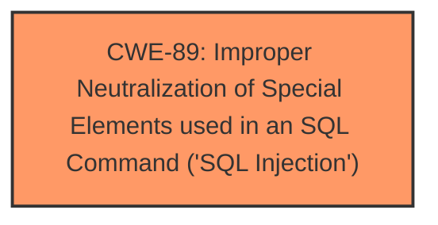

# Analysis Report for CVE-2025-3971

# Vulnerability Analysis Report: CVE-2025-3971

## Description

A vulnerability classified as critical was found in PHPGurukul COVID19 Testing Management System 1.0. Affected by this vulnerability is an unknown functionality of the file /add-phlebotomist.php. The manipulation of the argument empid leads to **sql injection**. The attack can be launched remotely. The exploit has been disclosed to the public and may be used.

## Vulnerability Description Key Phrases

- **Weakness:** sql injection
- **Product:** PHPGurukul COVID19 Testing Management System
- **Version:** 1.0
- **Component:** /add-phlebotomist.php

## Analysis (with Relationship Data)

# Summary
| CWE ID | CWE Name | Confidence | CWE Abstraction Level | CWE Vulnerability Mapping Label | CWE-Vulnerability Mapping Notes |
|---|---|---|---|---|---|
| CWE-89 | Improper Neutralization of Special Elements used in an SQL Command ('SQL Injection') | 1.0 | Base | Allowed | Primary CWE. The vulnerability description explicitly mentions "sql injection" in the context of manipulating the 'empid' argument.|

## Evidence and Confidence

*   **Confidence Score:** 1.0
*   **Evidence Strength:** HIGH

## Relationship Analysis
The primary identified weakness is CWE-89, which is a Base level CWE. No child CWEs were identified that would provide a more specific classification. The retriever results provided several potential candidates, but the explicit mention of "sql injection" strongly supports the selection of CWE-89 as the most appropriate classification.



## Vulnerability Chain
The vulnerability chain consists of a single CWE:

1.  CWE-89 (**Improper Neutralization of Special Elements used in an SQL Command ('SQL Injection')**): The application **fails to neutralize** special elements in the 'empid' argument, leading to SQL injection.

## Summary of Analysis
The analysis is based on the vulnerability description, which clearly states that the vulnerability is due to **sql injection**. The manipulation of the 'empid' argument in the `/add-phlebotomist.php` file leads to this **weakness**. The retriever results confirm that CWE-89 is the most relevant CWE for this type of vulnerability.

The CWE-89 is at the optimal level of specificity because the vulnerability description directly refers to "**sql injection**," which is precisely what CWE-89 describes.
Relevant CWE Information:

# Enhanced Context (25 CWEs)
The following CWEs were identified as potentially relevant to this vulnerability:

## CWE-89: Improper Neutralization of Special Elements used in an SQL Command ('SQL Injection')
**Abstraction Level**: Base
**Similarity Score**: 0.77
**Source**: dense

**Description**:
The product constructs all or part of an SQL command using externally-influenced input from an upstream component, but it does not neutralize or incorrectly neutralizes special elements that could modify the intended SQL command when it is sent to a downstream component. Without sufficient removal or quoting of SQL syntax in user-controllable inputs, the generated SQL query can cause those inputs to be interpreted as SQL instead of ordinary user data.

**Mapping Guidance**:
- Usage: Allowed
- Rationale: This CWE entry is at the Base level of abstraction, which is a preferred level of abstraction for mapping to the root causes of vulnerabilities.


## CWE Relationship Analysis

Current CWEs represent these abstraction levels: .


### Vulnerability Chain Analysis

**Chain starting from CWE-89:**
- 89 (Improper Neutralization of Special Elements used in an SQL Command ('SQL Injection')) - ROOT


### CWE Relationship Diagram

```mermaid
graph TD
    classDef primary fill:#f96,stroke:#333,stroke-width:2px
    classDef secondary fill:#69f,stroke:#333
    classDef tertiary fill:#9e9,stroke:#333
```


*Report generated on 2025-07-14 22:31:25*
