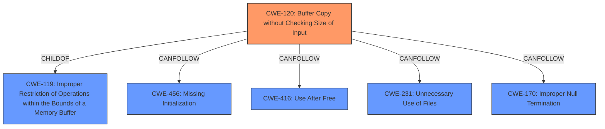

# Raw Analyzer Response for CVE-2025-3992

# Summary

| CWE ID | CWE Name | Confidence | CWE Abstraction Level | CWE Vulnerability Mapping Label | CWE-Vulnerability Mapping Notes |
|---|---|---|---|---|---|
| CWE-120 | Buffer Copy without Checking Size of Input ('Classic Buffer Overflow') | 0.9 | Base | Allowed-with-Review | Primary CWE |

## Evidence and Confidence

*   **Confidence Score:** 0.9
*   **Evidence Strength:** MEDIUM

## Relationship Analysis
The primary CWE selected is CWE-120, which is a base-level CWE. It is related to CWE-119, a class-level CWE, through a ChildOf relationship. CWE-120 can also precede CWE-456, CWE-416, CWE-231, and CWE-170. The relationship analysis helps confirm that CWE-120 is a suitable choice given the vulnerability description, as it directly addresses the **buffer overflow** due to the absence of input size validation before the copy operation.

## Vulnerability Chain
The vulnerability chain starts with the **improper** handling of the `submit-url` argument, which leads to a **buffer overflow** because the size of the input is not checked before copying it to a buffer. The root cause is the **missing** size check, resulting in a potential overflow.

## Summary of Analysis
The initial analysis identified the **buffer overflow** as the key weakness. The retriever results also highlighted CWE-120 as a potential candidate. The vulnerability description clearly indicates the **lack** of input size validation, which is a core characteristic of CWE-120. The description mentions the manipulation of the `submit-url` argument leading to a **buffer overflow**.

The selection of CWE-120 is based on the evidence that the product copies data into a buffer without validating the size of the input. This directly aligns with the definition of CWE-120: "The product copies an input buffer to an output buffer without verifying that the size of the input buffer is less than the size of the output buffer, leading to a **buffer overflow**."

Other CWEs like CWE-119 (Improper Restriction of Operations within the Bounds of a Memory Buffer) were considered but were too general. CWE-120 is a more specific, base-level CWE that better describes the vulnerability. CWE-121 (Stack-based Buffer Overflow) and CWE-122 (Heap-based Buffer Overflow) would require more information about where the buffer is allocated.

Relevant CWE Information:
# Enhanced Context (25 CWEs)
The following CWEs were identified as potentially relevant to this vulnerability:

## CWE-790: Improper Filtering of Special Elements
**Abstraction Level**: Class
**Similarity Score**: 0.76

## CWE-121: Stack-based Buffer Overflow
**Abstraction Level**: Variant
**Similarity Score**: 0.74

## CWE-78: Improper Neutralization of Special Elements used in an OS Command ('OS Command Injection')
**Abstraction Level**: Base
**Similarity Score**: 0.72

## CWE-294: Authentication Bypass by Capture-replay
**Abstraction Level**: Base
**Similarity Score**: 0.72

## CWE-425: Direct Request ('Forced Browsing')
**Abstraction Level**: Base
**Similarity Score**: 0.72

## CWE-191: Integer Underflow (Wrap or Wraparound)
**Abstraction Level**: Base
**Similarity Score**: 0.71

## CWE-134: Use of Externally-Controlled Format String
**Abstraction Level**: Base
**Similarity Score**: 0.71

## CWE-259: Use of Hard-coded Password
**Abstraction Level**: Variant
**Similarity Score**: 0.71

## CWE-472: External Control of Assumed-Immutable Web Parameter
**Abstraction Level**: Base
**Similarity Score**: 0.71

## CWE-131: Incorrect Calculation of Buffer Size
**Abstraction Level**: Base
**Similarity Score**: 0.71

## CWE-190: Integer Overflow or Wraparound
**Abstraction Level**: Base
**Similarity Score**: 563.47

## CWE-125: Out-of-bounds Read
**Abstraction Level**: Base
**Similarity Score**: 539.58

## CWE-89: Improper Neutralization of Special Elements used in an SQL Command ('SQL Injection')
**Abstraction Level**: Base
**Similarity Score**: 511.11

## CWE-122: Heap-based Buffer Overflow
**Abstraction Level**: Variant
**Similarity Score**: 490.82

## CWE-120: Buffer Copy without Checking Size of Input ('Classic Buffer Overflow')
**Abstraction Level**: Base
**Similarity Score**: 486.90

## CWE-128: Wrap-around Error
**Abstraction Level**: base
**Similarity Score**: 5.03

## CWE-190: Integer Overflow or Wraparound
**Abstraction Level**: base
**Similarity Score**: 5.03

## CWE-89: Improper Neutralization of Special Elements used in an SQL Command ('SQL Injection')
**Abstraction Level**: base
**Similarity Score**: 3.89

## CWE-120: Buffer Copy without Checking Size of Input ('Classic Buffer Overflow')
**Abstraction Level**: base
**Similarity Score**: 3.65

## CWE-79: Improper Neutralization of Input During Web Page Generation ('Cross-site Scripting')
**Abstraction Level**: base
**Similarity Score**: 3.16

## CWE-1339: Insufficient Precision or Accuracy of a Real Number
**Abstraction Level**: base
**Similarity Score**: 2.91

## CWE-123: Write-what-where Condition
**Abstraction Level**: base
**Similarity Score**: 2.87

## CWE-822: Untrusted Pointer Dereference
**Abstraction Level**: base
**Similarity Score**: 2.87

## CWE-823: Use of Out-of-range Pointer Offset
**Abstraction Level**: base
**Similarity Score**: 2.87

## CWE-825: Expired Pointer Dereference
**Abstraction Level**: base
**Similarity Score**: 2.87