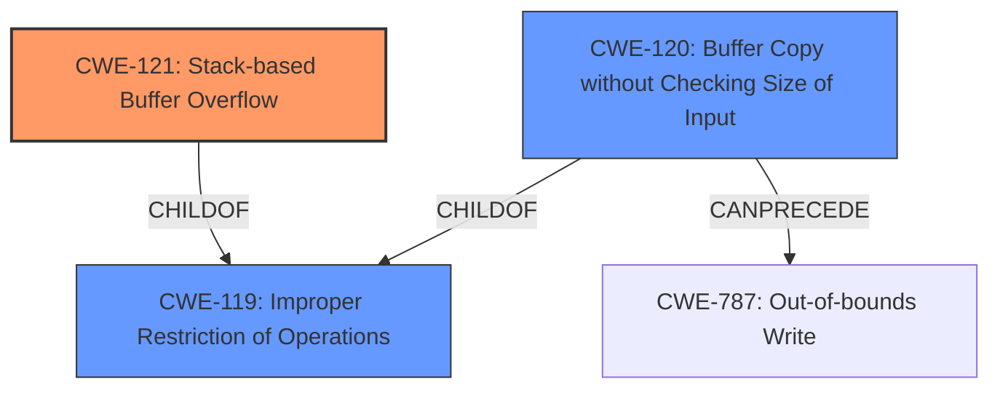

# Raw Analyzer Response for CVE-2025-4007

# Summary

| CWE ID  | CWE Name                                                                                                | Confidence | CWE Abstraction Level | CWE Vulnerability Mapping Label | CWE-Vulnerability Mapping Notes |
| :-------- | :------------------------------------------------------------------------------------------------------- | :---------- | :----------------------- | :--------------------------------- | :----------------------------------- |
| CWE-121 | Stack-based Buffer Overflow                                                                            | 1.0         | Variant                 |                                     | Allowed - Primary CWE               |
| CWE-120 | Buffer Copy without Checking Size of Input ('Classic Buffer Overflow')                                | 0.7        | Base                 |                                     | Allowed-with-Review - Secondary Candidate              |
| CWE-119 | Improper Restriction of Operations within the Bounds of a Memory Buffer                               | 0.6         | Class                   |                                     | Discouraged - Secondary Candidate              |

## Evidence and Confidence

*   **Confidence Score:** 0.9
*   **Evidence Strength:** HIGH

## Relationship Analysis

The primary CWE is CWE-121 **Stack-based Buffer Overflow**. CWE-121 is a variant of the class-level CWE-119 **Improper Restriction of Operations within the Bounds of a Memory Buffer**. CWE-120 **Buffer Copy without Checking Size of Input ('Classic Buffer Overflow')** is also a child of CWE-119. CWE-120 can precede CWE-787 **Out-of-bounds Write**.

## Vulnerability Chain

The vulnerability chain starts with a **stack-based buffer overflow** due to the manipulation of the `json` argument in the `cgidhcpsCfgSet` function, which leads to remote code execution. The chain is:

1.  **Root Cause:** CWE-121 **Stack-based Buffer Overflow** due to insufficient input validation.
2.  Impact: Remote Code Execution (RCE).

## Summary of Analysis

The vulnerability is a **stack-based buffer overflow** in the `cgidhcpsCfgSet` function of the `/goform/modules` component. The manipulation of the `json` argument leads to this overflow. This aligns directly with CWE-121 **Stack-based Buffer Overflow**, which is a variant-level CWE, making it a specific and appropriate choice. The detailed analysis of CVE-2025-4007 content confirms the root cause as a stack overflow due to a lack of length validation on input parameters. The provided exploit code further solidifies this classification.

CWE-119 **Improper Restriction of Operations within the Bounds of a Memory Buffer** is a more general class-level CWE. While technically accurate, it is less specific than CWE-121. The MITRE mapping guidance discourages the use of CWE-119 when more specific CWEs are available.

CWE-120 **Buffer Copy without Checking Size of Input ('Classic Buffer Overflow')** is relevant because the vulnerability involves a buffer overflow. However, CWE-121 is more precise because it specifies that the buffer is on the stack.

Based on the evidence and the principle of selecting the most specific CWE, CWE-121 is the primary and most appropriate choice.

Relevant CWE Information:

# Enhanced Context (25 CWEs)

## CWE-121: Stack-based Buffer Overflow
**Abstraction Level**: Variant
**Similarity Score**: 0.77
**Source**: dense

**Description**:
A stack-based buffer overflow condition is a condition where the buffer being overwritten is allocated on the stack (i.e., is a local variable or, rarely, a parameter to a function).

**Mapping Guidance**:
- Usage: Allowed
- Rationale: This CWE entry is at the Variant level of abstraction, which is a preferred level of abstraction for mapping to the root causes of vulnerabilities.

## CWE-121: Stack-based Buffer Overflow
**Abstraction Level**: Variant
**Similarity Score**: 992.95
**Source**: sparse

**Description**:
A stack-based buffer overflow condition is a condition where the buffer being overwritten is allocated on the stack (i.e., is a local variable or, rarely, a parameter to a function).

**Mapping Guidance**:
- Usage: Allowed
- Rationale: This CWE entry is at the Variant level of abstraction, which is a preferred level of abstraction for mapping to the root causes of vulnerabilities.