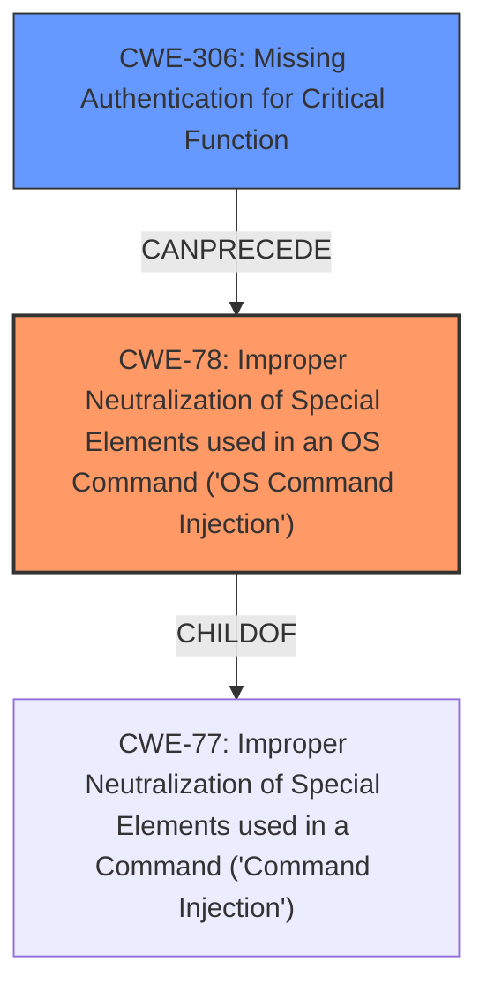

# Enhanced Analysis for CVE-2025-4009

# Summary
| CWE ID    | CWE Name                                                                                                | Confidence | CWE Abstraction Level | CWE Vulnerability Mapping Label | CWE-Vulnerability Mapping Notes |
| --------- | ------------------------------------------------------------------------------------------------------- | ---------- | --------------------- | ------------------------------- | --------------------------------- |
| CWE-78    | Improper Neutralization of Special Elements used in an OS Command ('OS Command Injection')              | 1          | Base                  | Primary CWE                     | Allowed                           |
| CWE-306   | Missing Authentication for Critical Function                                                              | 1          | Base                  | Secondary Candidate             | Allowed                           |

## Evidence and Confidence

*   **Confidence Score:** 1
*   **Evidence Strength:** HIGH

## Relationship Analysis
The primary CWE is CWE-78 [Improper Neutralization of Special Elements used in an OS Command ('OS Command Injection')], which is a base CWE and a child of CWE-77 [Improper Neutralization of Special Elements used in a Command ('Command Injection')]. The secondary CWE is CWE-306 [Missing Authentication for Critical Function], which is a base CWE. The vulnerability chain starts with CWE-306 [Missing Authentication for Critical Function], allowing an attacker to bypass authentication, followed by CWE-78 [Improper Neutralization of Special Elements used in an OS Command ('OS Command Injection')] which allows the attacker to execute arbitrary commands due to the lack of input sanitization.



## Vulnerability Chain
The vulnerability chain starts with **CWE-306** [Missing Authentication for Critical Function], allowing an attacker to bypass authentication, followed by **CWE-78** [Improper Neutralization of Special Elements used in an OS Command ('OS Command Injection')] which allows the attacker to execute arbitrary commands due to the **lack of input sanitization**. The final impact is arbitrary command execution with elevated privileges.
  - Root Cause: CWE-306, CWE-78
  - Impact: Arbitrary command execution with elevated privileges

## Summary of Analysis
The primary vulnerability is **CWE-78** [Improper Neutralization of Special Elements used in an OS Command ('OS Command Injection')] because the root cause of the arbitrary command execution is the **lack of input sanitization** in the `feature-transfer-import.php` and `feature-transfer-export.php` files. The vulnerability description and the CVE Reference Links Content Summary clearly indicate that the commands are constructed using user-controlled parameters without proper validation, leading to arbitrary command injection. "The vulnerability stems from a **lack of input sanitization** in the `feature-transfer-import.php` and `feature-transfer-export.php` files. These files construct commands using user-controlled parameters (`action`, `filename`, and `slot`) without proper validation, leading to arbitrary command injection.". The secondary vulnerability is **CWE-306** [Missing Authentication for Critical Function] because of a **flawed implementation of preauthorized users**, allowing unauthenticated users to gain access as administrators. "An authentication bypass exists in `usr/htdocs/login.php` due to a **flawed implementation of preauthorized users**, allowing unauthenticated users to gain access as administrators by crafting a valid base64 encoded JSON structure.".
CWE-77 [Improper Neutralization of Special Elements used in a Command ('Command Injection')] was considered but CWE-78 [Improper Neutralization of Special Elements used in an OS Command ('OS Command Injection')] was a better fit since the commands being injected are OS commands.
CWE-287 [Improper Authentication] was considered but CWE-306 [Missing Authentication for Critical Function] was a better fit since the authentication mechanism has a flaw leading to authentication bypass.
CWE-20 [Improper Input Validation] was considered but it is too high level and **CWE-78** [Improper Neutralization of Special Elements used in an OS Command ('OS Command Injection')] is a more specific cause of the vulnerability.

Relevant CWE Information:

**CWE-78**: Improper Neutralization of Special Elements used in an OS Command ('OS Command Injection')
*   The vulnerability stems from a **lack of input sanitization** in the `feature-transfer-import.php` and `feature-transfer-export.php` files. These files construct commands using user-controlled parameters (`action`, `filename`, and `slot`) without proper validation, leading to arbitrary command injection.
*   Remote unauthenticated attackers can gain arbitrary command execution with elevated privileges (root) on affected devices.

**CWE-306**: Missing Authentication for Critical Function
*   An authentication bypass exists in `usr/htdocs/login.php` due to a **flawed implementation of preauthorized users**, allowing unauthenticated users to gain access as administrators by crafting a valid base64 encoded JSON structure.
*   Remote unauthenticated attackers can gain arbitrary command execution with elevated privileges (root) on affected devices.


## CWE Relationship Analysis

Current CWEs represent these abstraction levels: .


### Vulnerability Chain Analysis

**Chain starting from CWE-77:**
- 77 (Improper Neutralization of Special Elements used in a Command ('Command Injection')) - ROOT


**Chain starting from CWE-306:**
- 306 (Missing Authentication for Critical Function) - ROOT


### CWE Relationship Diagram

```mermaid
graph TD
    classDef primary fill:#f96,stroke:#333,stroke-width:2px
    classDef secondary fill:#69f,stroke:#333
    classDef tertiary fill:#9e9,stroke:#333
```