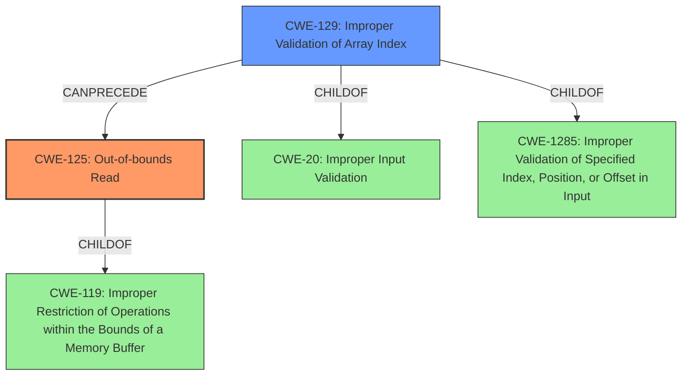

# Analysis Report for CVE-2025-40114

# Vulnerability Analysis Report: CVE-2025-40114

## Description

In the Linux kernel, the following vulnerability has been resolved iio light Add check for array bounds in veml6075_read_int_time_ms The array contains only 5 elements, but the index calculated by veml6075_read_int_time_index can range from 0 to 7, which could lead to out-of-bounds access. The check prevents this issue. Coverity Issue CID 1574309 (#1 of 1) **Out-of-bounds read** (OVERRUN) overrun-local Overrunning array veml6075_it_ms of 5 4-byte elements at element index 7 (byte offset 31) using index int_index (which evaluates to 7) This is hardening against potentially broken hardware. Good to have but not necessary to backport.

## Vulnerability Description Key Phrases

- **Weakness:** ['array bounds check', 'Out-of-bounds read']
- **Impact:** out-of-bounds access
- **Product:** Linux kernel

## Analysis (with Relationship Data)

# Summary
| CWE ID    | CWE Name                                             | Confidence | CWE Abstraction Level | CWE Vulnerability Mapping Label | CWE-Vulnerability Mapping Notes |
| :-------- | :--------------------------------------------------- | :--------- | :-------------------- | :------------------------------ | :------------------------------ |
| CWE-125   | Out-of-bounds Read                                   | 1.0        | Base                  | Primary                         | Allowed                       |
| CWE-129   | Improper Validation of Array Index                   | 0.9        | Variant               | Secondary                       | Allowed                       |

## Evidence and Confidence

*   **Confidence Score:** 0.95
*   **Evidence Strength:** HIGH

## Relationship Analysis
The primary weakness is an out-of-bounds read (CWE-125). This occurs because the array index is not properly validated (CWE-129) before being used to access the array. Therefore, CWE-129 can precede CWE-125. CWE-125 is a child of CWE-119 (Improper Restriction of Operations within the Bounds of a Memory Buffer). CWE-129 is a child of CWE-20 (Improper Input Validation) and CWE-1285 (Improper Validation of Specified Index, Position, or Offset in Input).



## Vulnerability Chain
The vulnerability chain starts with **improper** index calculation or **improper validation** of the calculated index, which leads to an out-of-bounds access, and finally an **out-of-bounds read**.
  - The **root cause** is the **improper validation** of the calculated index (CWE-129)
  - This leads to an **out-of-bounds read** (CWE-125)

## Summary of Analysis
The vulnerability is an **out-of-bounds read** due to a missing array bounds check. The `veml6075_read_int_time_index` function calculates an index that can range from 0 to 7, but the array `veml6075_it_ms` only contains 5 elements. This can lead to an **out-of-bounds access**.

The primary CWE is CWE-125 (Out-of-bounds Read), as it directly describes the **weakness** where the product reads data past the end of the intended buffer. The evidence is the vulnerability description stating "***Out-of-bounds read** (OVERRUN) overrun-local Overrunning array veml6075_it_ms of 5 4-byte elements at element index 7 (byte offset 31) using index int_index (which evaluates to 7)".

CWE-129 (Improper Validation of Array Index) is a secondary CWE. The vulnerability occurs because the index `int_index` is not validated to ensure it is within the bounds of the array `veml6075_it_ms`. The description states that the index can range from 0 to 7, while the array only contains 5 elements. This **lack of validation** is the reason an out-of-bounds read can occur.

I considered other CWEs, such as CWE-193 (Off-by-one Error), CWE-823 (Use of Out-of-range Pointer Offset), CWE-191 (Integer Underflow (Wrap or Wraparound)), and CWE-1285 (Improper Validation of Specified Index, Position, or Offset in Input), but these are not as directly relevant as CWE-125 and CWE-129. CWE-193 is not applicable because the issue is not an off-by-one error. CWE-823 is not applicable because the issue is not related to pointer arithmetic. CWE-191 is not applicable because there is no integer underflow. CWE-1285 is related, but less specific than CWE-129.

The selected CWEs are at the optimal level of specificity. CWE-125 is a Base CWE, and CWE-129 is a Variant CWE. These are both preferred levels of abstraction for mapping to the root causes of vulnerabilities.


## CWE Relationship Analysis

Current CWEs represent these abstraction levels: .


### Vulnerability Chain Analysis

**Chain starting from CWE-823:**
- 823 (Use of Out-of-range Pointer Offset) - ROOT


**Chain starting from CWE-125:**
- 125 (Out-of-bounds Read) - ROOT


### CWE Relationship Diagram

```mermaid
graph TD
    classDef primary fill:#f96,stroke:#333,stroke-width:2px
    classDef secondary fill:#69f,stroke:#333
    classDef tertiary fill:#9e9,stroke:#333
```


*Report generated on 2025-07-14 22:41:19*
