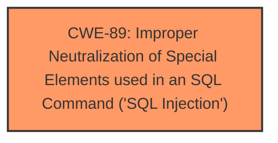

# Analysis Report for CVE-2025-4013

# Vulnerability Analysis Report: CVE-2025-4013

## Description

A vulnerability was found in PHPGurukul Art Gallery Management System 1.0. It has been classified as critical. Affected is an unknown function of the file /admin/aboutus.php. The manipulation of the argument pagetitle leads to **sql injection**. It is possible to launch the attack remotely. The exploit has been disclosed to the public and may be used.

## Vulnerability Description Key Phrases

- **Weakness:** sql injection
- **Vector:** manipulation of the argument pagetitle
- **Product:** PHPGurukul Art Gallery Management System
- **Version:** 1
- **Component:** /admin/aboutus.php

## Analysis (with Relationship Data)

# Summary
| CWE ID | CWE Name | Confidence | CWE Abstraction Level | CWE Vulnerability Mapping Label | CWE-Vulnerability Mapping Notes |
|---|---|---|---|---|---|
| CWE-89 | Improper Neutralization of Special Elements used in an SQL Command ('SQL Injection') | 1.0 | Base | Allowed | Primary CWE. The vulnerability description clearly states that the manipulation of the 'pagetitle' argument leads to **SQL injection**. |

## Evidence and Confidence

*   **Confidence Score:** 1.0
*   **Evidence Strength:** HIGH

## Relationship Analysis
The primary relationship impacting the decision is the direct match of the vulnerability description to the characteristics of CWE-89. The description explicitly states that the vulnerability involves **SQL injection** due to improper handling of the 'pagetitle' argument. There is no need to consider parent or child relationships in this case, as the provided information directly maps to the base CWE.



## Vulnerability Chain
The vulnerability chain is straightforward:

1.  **Root Cause:** Improper handling of user input ('pagetitle' argument) leading to **SQL injection** (CWE-89).
2.  **Impact:** Remote attacker can manipulate SQL queries, potentially leading to data exfiltration, modification, or deletion.

## Summary of Analysis
The analysis is based on the clear and direct statement in the vulnerability description that the manipulation of the 'pagetitle' argument leads to **SQL injection**. The "Vulnerability Description Key Phrases" section also confirms this with the entry "**weakness:** **sql injection**".

The evidence provided is sufficient to confidently assign CWE-89 as the primary CWE. The retriever results also strongly support this, with CWE-89 having the highest score. There is no need to consider more specific child CWEs, as the base CWE adequately describes the vulnerability.

Other CWEs considered but not used:

*   CWE-79 (Improper Neutralization of Input During Web Page Generation ('Cross-site Scripting')): While input is involved, the vulnerability is specifically **SQL injection**, not XSS.
*   CWE-434 (Unrestricted Upload of File with Dangerous Type): This is not related to file uploads.
*   CWE-1336 (Improper Neutralization of Special Elements Used in a Template Engine): This is not related to template engines.
*   CWE-96 (Improper Neutralization of Directives in Statically Saved Code ('Static Code Injection')): This is related to **SQL injection**, not static code injection.
*   CWE-73 (External Control of File Name or Path): This is not related to file name or path manipulation.

The selection of CWE-89 is at the optimal level of specificity, as it directly addresses the root cause of the vulnerability, which is **SQL injection**.


## CWE Relationship Analysis

Current CWEs represent these abstraction levels: .


### Vulnerability Chain Analysis

**Chain starting from CWE-89:**
- 89 (Improper Neutralization of Special Elements used in an SQL Command ('SQL Injection')) - ROOT


**Chain starting from CWE-79:**
- 79 (Improper Neutralization of Input During Web Page Generation ('Cross-site Scripting')) - ROOT


### CWE Relationship Diagram

```mermaid
graph TD
    classDef primary fill:#f96,stroke:#333,stroke-width:2px
    classDef secondary fill:#69f,stroke:#333
    classDef tertiary fill:#9e9,stroke:#333
```


*Report generated on 2025-07-14 22:41:34*
