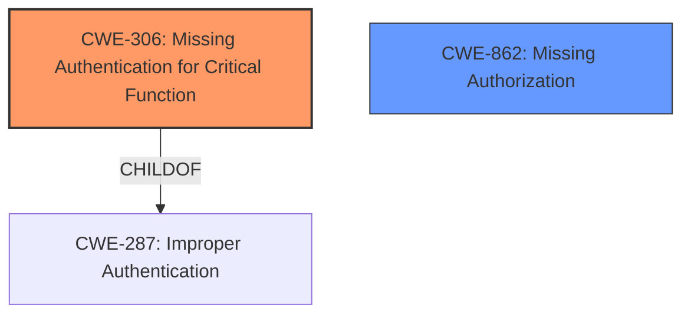

# Analysis Report for CVE-2025-4015

# Vulnerability Analysis Report: CVE-2025-4015

## Description

A vulnerability was found in 20120630 Novel-Plus up to 0e156c04b4b7ce0563bef6c97af4476fcda8f160. It has been rated as critical. Affected by this issue is the function list of the file novel-system/src/main/java/com/java2nb/system/controller/SessionController.java. The manipulation leads to **missing authentication**. The attack may be launched remotely. The exploit has been disclosed to the public and may be used. The vendor was contacted early about this disclosure but did not respond in any way.

## Vulnerability Description Key Phrases

- **Weakness:** missing authentication
- **Product:** 20120630 Novel-Plus
- **Version:** up to 0e156c04b4b7ce0563bef6c97af4476fcda8f160
- **Component:** novel-system/src/main/java/com/java2nb/system/controller/SessionController.java

## Analysis (with Relationship Data)

# Summary

| CWE ID | CWE Name | Confidence | CWE Abstraction Level | CWE Vulnerability Mapping Label | CWE-Vulnerability Mapping Notes |
|---|---|---|---|---|---|
| CWE-306 | Missing Authentication for Critical Function | 1.0 | Base | Primary CWE | Allowed |
| CWE-862 | Missing Authorization | 0.8 | Class | Secondary | Allowed-with-Review |

## Evidence and Confidence

*   **Confidence Score:** 0.9
*   **Evidence Strength:** HIGH

## Relationship Analysis

The primary relationship influencing the CWE selection is the hierarchical relationship between CWE-287 (Improper Authentication) and CWE-306 (Missing Authentication for Critical Function), where CWE-306 is a child of CWE-287. However, the vulnerability description explicitly states "**missing authentication**", making CWE-306 a more precise and appropriate choice. Additionally, there's a relationship between Authentication, Authorization and Access Control, which helped refine the selection between CWE-306 and CWE-862. Since the endpoint completely lacks authentication, CWE-306 is preferred.



## Vulnerability Chain

The vulnerability chain starts with the **missing authentication** (CWE-306) for the `list` function, leading to potential unauthorized access to sensitive data.
  - Root Cause: CWE-306 Missing Authentication for Critical Function.
  - Impact: Potential for unauthorized access to sensitive data.

## Summary of Analysis

The initial analysis focused on identifying the root cause of the vulnerability based on the provided description and CVE reference. The key phrase "**missing authentication**" strongly suggested CWE-306, which is further supported by the CVE reference indicating a **lack of access control** on the `/edit` endpoint. The relationship analysis confirmed that CWE-306 is a more specific child of the broader CWE-287. The Zeus guidance also helped differentiate between Authentication, Authorization and Access Control issues. The retriever results showed CWE-306 as a strong candidate.

The final decision is based on direct evidence from the vulnerability description, which explicitly mentions "**missing authentication**". This, coupled with the CVE reference's detail about **lack of access control**, makes CWE-306 the most accurate and specific classification.

Relevant CWE Information:

*   **CWE-306: Missing Authentication for Critical Function**
    *   **Description**: The product does not perform any authentication for functionality that requires a provable user identity or consumes a significant amount of resources.
    *   **Relevance**: The vulnerability description explicitly states "**missing authentication**" for a function, directly aligning with the CWE description.
    *   **Security Implications**: Allows unauthorized users to access and manipulate critical functions, potentially leading to data breaches, system compromise, or other severe consequences.
*   **CWE-862: Missing Authorization**
    *   **Description**: The product does not perform an authorization check when an actor attempts to access a resource or perform an action.
    *   **Relevance**: The CVE reference link content summary mentions a **lack of access control** on the `/edit` endpoint, which is related to authorization.
    *   **Security Implications**: Allows users to perform actions or access resources that they are not authorized to, potentially leading to privilege escalation, data modification, or other unauthorized activities.

The other CWEs were not selected because they did not align as closely with the root cause of the vulnerability, which is a **missing authentication** check.


## CWE Relationship Analysis

Current CWEs represent these abstraction levels: .


### Vulnerability Chain Analysis

**Chain starting from CWE-306:**
- 306 (Missing Authentication for Critical Function) - ROOT


**Chain starting from CWE-287:**
- 287 (Improper Authentication) - ROOT


### CWE Relationship Diagram

```mermaid
graph TD
    classDef primary fill:#f96,stroke:#333,stroke-width:2px
    classDef secondary fill:#69f,stroke:#333
    classDef tertiary fill:#9e9,stroke:#333
```


*Report generated on 2025-07-14 22:42:11*
