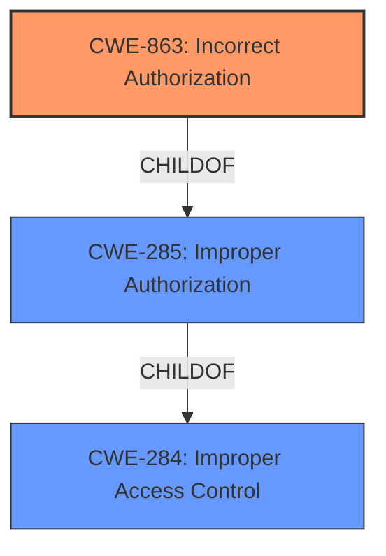

# Raw Analyzer Response for CVE-2025-4017

# Summary
| CWE ID | CWE Name | Confidence | CWE Abstraction Level | CWE Vulnerability Mapping Label | CWE-Vulnerability Mapping Notes |
|---|---|---|---|---|---|
| CWE-863 | Incorrect Authorization | 1.0 | Class | Primary | Allowed-with-Review |

## Evidence and Confidence

*   **Confidence Score:** 1.0
*   **Evidence Strength:** HIGH

## Relationship Analysis
The primary relationship that influenced the decision was the hierarchical relationship between CWE-285 (Improper Authorization), CWE-863 (Incorrect Authorization), and CWE-284 (Improper Access Control). CWE-863 is more specific than CWE-285 and CWE-284, fitting the vulnerability description more accurately. The guidance provided explicitly recommends considering CWE-863 when an authorization check exists but is flawed.

## Vulnerability Chain
The vulnerability chain is as follows:
1.  **Root Cause:** **Improper Authorization** (CWE-863) - The application performs an authorization check, but it's done incorrectly.
2.  **Impact:** Unauthorized system log read, leading to potential information disclosure or further exploitation.

## Summary of Analysis
The initial assessment strongly points to an authorization issue, specifically **improper authorization**. The vulnerability description clearly states that the manipulation leads to **improper authorization**. The CVE Reference Links Content Summary confirms unauthorized system log read due to accessing the endpoint GET /common/log/list.

The CWE Classification Guidance emphasizes distinguishing between authentication and authorization issues. Since the description points to a flaw in how authorization is handled, CWE-863 (Incorrect Authorization) is the most appropriate choice. This decision is further supported by the retriever results and the provided guidance that recommends using CWE-863 when an authorization check exists but is flawed.

The selected CWE is at the optimal level of specificity because it accurately reflects the **root cause** of the vulnerability, which is an incorrect implementation of authorization logic.

Relevant CWE Information:

# Enhanced Context (25 CWEs)
The following CWEs were identified as potentially relevant to this vulnerability:

## CWE-863: Incorrect Authorization
**Abstraction Level**: Class
**Similarity Score**: 1343.79
**Source**: sparse

**Description**:
The product performs an authorization check when an actor attempts to access a resource or perform an action, but it does not correctly perform the check.

**Mapping Guidance**:
- Usage: Allowed-with-Review
- Rationale: This CWE entry is a Class and might have Base-level children that would be more appropriate

## CWE-863: Incorrect Authorization
CWE-863 is chosen because the **root cause** is **improper authorization**. The application performs an authorization check, but it does not correctly perform the check. This directly aligns with the vulnerability description and the guidance provided. The security implication is that an attacker can gain unauthorized access to sensitive resources, such as system logs, potentially leading to further exploitation.